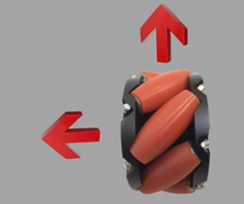

# 第三課

## 簡介 

歡迎參加Micro：bit 智能小車課程！在本課程中，我們將探索Micro：bit並學習如何在編程中如何控制Micro：bit智能小車。

## 教學目標

讓學生清楚掌握Micro：bit 智能小車的麥克納姆輪的移動原理，並了解如何利用控制馬達控制小車左右或前後移動。

## 認識麥克納姆輪

麥克納姆輪由多個滾軸所組成，而滾軸的分佈將車輪分成兩對。對角的車輪有相同的滾軸分佈。

當車輪轉動時，滾軸會帶動車輪往向水平方向移動。而另一個方向的滾輪會帶動車輪到另一則。

4個麥克納姆輪會接駁到4個不同的馬達，而4個車輪不同的轉動方向決定車子的移動方向。

## 車輪的原理

1.	4個車輪向前，車子將會向前移動。

2.	2組對角的車輪相反轉動，車子將會向左右平移。

3.	只有1組對角的車輪轉動，車子將會向斜角移動。

4.	只有1邊 (左或右) 的車輪轉動，車子會向另一方轉。

5.	2邊 (左和右) 的車輪轉動方向相反，車子會原地自轉。

6.	2邊 (左和右) 前面的車輪轉動方向相反，車子會以車尾為中心自轉。

