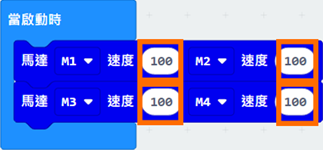
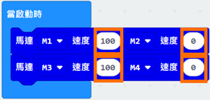
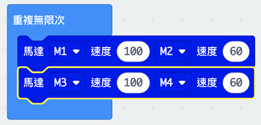

# 第四課

## 馬達的分佈

## 控制馬達的積木模塊

黃框選擇馬達 
橙框設置速度，由-100到100，負數 
代表車輪向後，正數代表車輪向前 

### 前進

當四個輪子向前，車子便會向前移動。

 
### 後退

更改積木內橙框的數字為-100(車輪全部向後)

### 左轉

更改 “M1”和 “M3” 的速度為0，“M2” 和 “M4” 的速度為100， 
車子就會向左轉 

### 右轉

相反地，更改 “M1”和 “M3” 的速度為100，“M2” 和 “M4” 的速度為0，車子就會向右轉。

 
### 左旋轉

更改 “M1”和 “M3” 的速度為-100，“M2” 和 “M4” 的速度為100。

### 右旋轉

更改 “M1”和 “M3” 的速度為100，“M2” 和 “M4” 的速度為-100。

## 總結

只要變更每個馬達的速度，小車就能進行不同的移動。

## 練習1: 車子的水平移動

設計程式使車子能夠往左和右水平移動。
提示：只要將對角的馬達設置成不同的轉動方向，就能做到水平移動

## 練習2: 小車的斜向移動

設計程序，使小車能夠斜向移動

提示：只有1組對角的車輪轉動，車子將會向斜角移動。 

## 練習3: 小車的不同方式的行駛

設計小車正方形繞圈、圓形繞圈和M字形路線行駛的編程。

### 正方形繞圈行駛:

提示：每當行駛到轉角位，先轉左90度，再前進。

### 圓形繞圈行駛:

提示：見示範"右旋轉"

### M字型行駛： 

提示：車子轉的角度與轉的秒數有關

## 答案
### 練習1:

只要將對角的馬達設置成不同的轉動方向，就能做到水平移動

將 “M2” 和 “M3” 的速度設置為100，而 “M1”和 “M4” 的速度則設置為-100，車子便會往左水平移動。

   
相反將 “M1” 和 “M4” 的速度設置為100，而 “M2”和 “M3” 的速度則設置為-100，車子便會往右水平移動。

### 練習2:

向右上方向移動:

更改 “M1”和 “M4” 的速度為60，“M2” 和 “M3” 的速度為0。

	
向左上方向移動:

更改 “M2”和 “M3” 的速度為60，“M1” 和 “M4” 的速度為0。

向右下方向移動:

更改 “M2”和 “M3” 的速度為-60，“M1” 和 “M4” 的速度為0。

向左下方向移動:

更改 “M1”和 “M4” 的速度為-60，“M2” 和 “M3” 的速度為0。

### 練習3:
#### 正方形繞圈行駛:

（1） 更改所有馬達的速度為100並暫停2000毫秒，車子會往前移動2秒。 
（2） 然後把“M2”和”M4“的速度設為0，“M1”和“M3”保持一樣，並暫停1000毫秒，車子會往左轉1秒（大約-90度，因車而異）。 
（3 - 8）把1 - 2重複3次，車子將繞完一個正方形。 

#### 圓形繞圈行駛:

把“M1”和”M3“的速度設為100，以及把“M2”和”M4“的速度設為60（比“M1”和”M3“的速度低但大於0即可，因車而異）並無限重複，車子將繞出一個圓形。

#### M字型行駛：

程式分為兩個種類(直行、拐彎) 
留意！(2)和(6)拐彎的秒數是2.5秒，比(4)多因爲(2)和(6)轉的角度比(4)大 
**車子轉的角度取決於轉的秒數，秒數可因車而異** 

