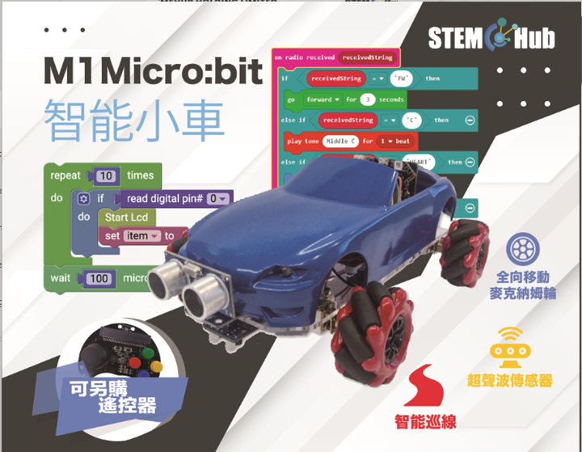
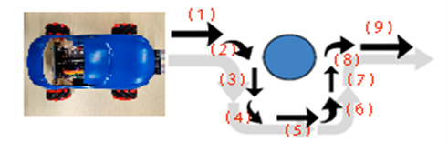

# 第五至六課

## 簡介: 

歡迎參加Micro：bit 智能小車課程！在本課程中，我們將探索Micro：bit並學習如何在編程中如何控制Micro：bit智能小車。

## 教學目標: 

讓學生清楚掌握Micro：bit 智能小車的超聲波傳感器的原理及其功用，並了解超聲波傳感器的測距/避障功能。

## 超聲波避障

超聲波傳感器位於車子的正前方, 而超聲波傳感器只能探測正前方的障礙物。

### 超聲波模塊的原理

超聲波模塊不受光線所影響，正如蝙蝠一樣，他們幾乎盲但仍能在黑暗中閃避障礙物。

超聲波模塊透過發射一段超聲波往前方，當該超聲波接觸到物件後會反彈，然後感應器接收該超聲波。而發射及接收到信號之間的時間會用作計算距離。

### 計算公式如下:

距離 (cm) = 

小車的七彩(RGB)燈，可以在程序中控制顏色，但每種顏色需要在程序中先下定義，沒有定義的顏色不能在七彩燈中顯示。

這模組有效的探測距離為2~400cm

## Stemhub:bit 超聲波

在Stemhub:bit > 超聲波（Ultrasonic）中，有三個主要的模組：

輸出會是利用超聲波讀取的距離（默認腳位：P2)(輸出：數字)

功能與上面一樣，但自定腳位

設置超聲波燈(左或右)和顏色(紅、橙、黃、綠、藍...)

## 練習1:

設計程式把擴展板上的燈和超聲波的燈順序地開

提示：還記得如何操控擴展板上的燈和亮度嗎？

## 練習2: 設計程式令超聲波讀取的距離顯示在micro:bit板上

提示：

## 練習3: 設計程式把超聲波讀取的距離轉換成歌曲，並顯示不同顔色的燈

提示1：自行定義不同距離代表的音效和顔色

提示2：每次播放音效後，需要短暫停止以防Micro:bit板故障

(可先以中音CDEFG音及紅橙黃綠藍色作嘗試)

## 練習4:

設計程序使小車遇到障礙物時 (例子：<15cm)，小車會左轉/右轉。

## 練習5:

設計程序使小車跟著手掌移動並保持在的10cm的距離。

提示：拆分為三部分

## 練習6:

設計程序使小車遇到障礙物時，小車會180度調頭。

## 練習7:

設計程序使小車遇到障礙物時，會向右避開障礙物然後前進

提示：小車會直行和拐彎多少次？

## 練習 8: 簡易版迷宮

小車要成功沒有撞到障礙物，並由起點走到終點

提示：程式分為三大個部分(遇到障礙物轉左，遇到障礙物轉右，繼續往前)

## 思考

超聲波感應器可以用作量度身高，你同意嗎？

如果可以，超聲波感應器應該放在哪裏？

## 答案
### 練習1:

前大部分(紅框)見Ch.2 練習1

後面設置超音波燈為藍色

### 練習2:

由於讀取的距離是數值，所以顯示數字模組會被使用

### 練習3: 

障礙物距離|音階|超聲波燈顔色
---|---|---
1-4|中音C|紅
5-8|中音D|橙
9-12|中音E|黃
13-16|中音F|綠
17-20|中音G|藍
>20|無|黑（無）

### 練習4:

設計程序使小車遇到障礙物時 (例子：<15cm)，小車會左轉/右轉。

設定條件：障礙物距離少於15cm，便左轉或右轉，否則就直行

### 練習5:

設計程序使小車跟著手掌移動並保持在的10cm的距離。

程式分為三個部分：

1. 如果障礙物（手）和車子距離超過10cm，車子會繼續直行

2. 如果障礙物（手）和車子距離少於10cm，車子會倒退

3. 如果障礙物（手）和車子距離等於10cm，車子會暫停，以免距離過多或少

### 練習6:

設計程序使小車遇到障礙物時，小車會180度調頭。

如果車子沒有遇到障礙物(障礙物距離超過10cm便假設前面暫時沒有障礙物)，車子會一直直行

如果車子遇到了障礙物(10cm或10cm內)，停止行動，然後向右旋轉180度

（**旋轉角度與旋轉的時間有關**）

### 練習 7:

設計程序使小車遇到障礙物時，會向右避開障礙物然後前進

**小車會直行5次，拐右2次和拐左2次**

小車路線：直行，拐右，直行，拐左，直行，拐左，直行，拐右

**秒數可因車而異**

### 練習 8:

首先設置感應距離為12

整個程式分為三大個部分(遇到障礙物轉左，遇到障礙物轉右，繼續往前)

**留意如果...否則的用法，如果符合不到如果的條件，便會到否則的模組的條件裡。**

### 附錄：

Micro：bit本來不具備Stemhub:bit中的超聲波積木模塊，操作超聲波傳感器需要使用引腳積木模塊進行編程.

寫入數位信號(0 或 1)至引腳。

1是啓動引腳，開始發射信號。

0是關閉引腳，停止發射信號。

計算發射及接收到信號之間的時間。

## 超聲波傳感器測距編程

（1）先初始化引腳的數字為0，等待2微秒。

（2）寫入信號1至引腳，開始發射超聲波，等待10微秒。

（3）寫入信號0至引腳，停止發射超聲波。

（4）建立變數“距離”並設爲引腳P14發射及接收到信號之間的時間除以58，測量出障礙物的距離。

（5）將距離顯示在Micro:bit的屏幕上。

（6）最後將程序設置為函式。

