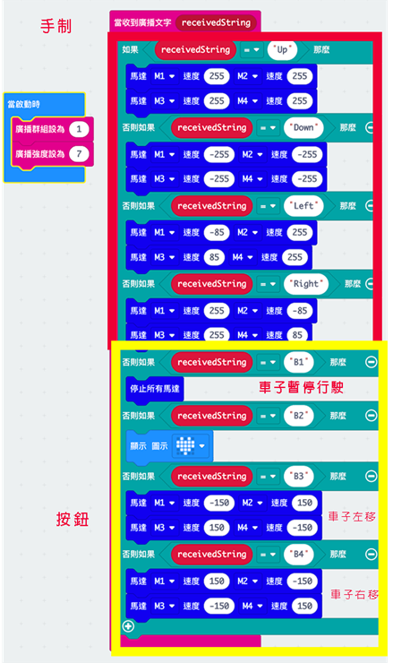
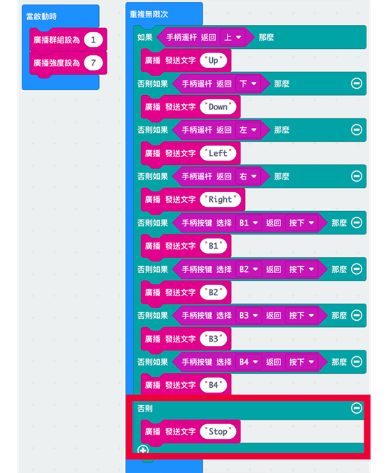

# 第九至十課

## 簡介 

歡迎參加Micro：bit 智能小車課程！在本課程中，我們將探索Micro：bit並學習如何在編程中如何控制Micro：bit智能小車。

## 教學目標

讓學生清楚掌握Micro：bit 智能小車與遙控器的配合及操縱，並了解如何運用無線電波令手制與小車可作通信連絡。

## 遙控器

Micro:bit遙控手制的介紹:

這款手制需要接合Micro:bit 才能使用。手柄上有多個功能，分別有一個操縱杆、4個可編程按鈕、一個鋒鳴器和一個震動馬達。

1)	操縱杆有上下左右的偵測功能，還可以按下作為另一個按鈕。

2)	4個不同顏色的按鈕分別為紅色X、綠色Y、藍色A、黃色B。它們分別對應p13、p14、p15、p16接口。

3)	蜂鳴器和震動馬達有一個開關連接，開關在左邊它們會連接到p0，而開關在右邊時，每次按下4個可編程按鈕都會使鋒鳴器發聲及震動。

## 無綫電與我們的日常生活

無線電通信是一種利用電磁信號代替電線、光纖等介質跨空間傳輸信息的一種通信方式。現時，手機、WiFi 甚至衛星中常見的無線通信通過無線電波傳播數據。

micro:bit 無線電通信的原理是基於無線電波。 micro:bit 背面有一個天線，可以在兩個 micro:bit 板之間進行數據傳輸

## 無綫電的程式模組
### 下載手制擴展包:

1)	在黃框內輸入以下連結  <a href="https://github.com/lzty634158/GHBit">https://github.com/lzty634158/GHBit</a>

2)	將GHBit 加至makecode內

如要使用手制控制小車，需要在手制及小車各安裝一塊Micro:bit，並載入各自的程序

手制與小車使用無線電波作通信連絡，所以兩塊Micro:bit需要設立一個無線電群組連結。

### 設立無線電的積木: (在廣播分類中)

設置無線電群組，在黃框內輸入數字(0~255)

設置無線電的強度(1-7)

(在空曠且附近沒有太多電腦的地區，廣播的區域範圍可達70m) 

無線電發射字串信號

當收到文字(string)，做{...}

(接收字串信號，積木內的程序只會在接收到字串信號才會開始)

### 範例1: 雙向無線電

顯示由廣播發來的數字

## 遙控器和小車的程式模組
### 手制的積木:

操縱杆的積木，在黃框內選擇操縱杆上、下、左、右及按下的動作

按鈕的積木，在黃框內選擇B1~B4的按鈕，並在藍框內選擇按下或放開按鈕的動作

(由於無線電波沒有指向性，所以不同的小車和手制需要獨自設立一組無線電避免干擾)

### 手制的編程:(GHBit)

(操縱杆)   

紅框是操縱杆，黃框是按鈕

### 小車的編程:

紅框是操縱杆，黃框是按鈕

    B1: 暫停行駛	
    B2: 顯示心型圖案	
    B3: 車子向左移		
    B4:車子向右移                                  

## 練習1: 

試在其中1個按鈕添加令擴展版上的LED燈能亮著發出不同顏色的功能

提示1：改動小車的程式，手制的程式不用更改

提示2：使用函式

## 練習2:

試改變練習1的答案，取消“B1”按鈕的功能，讓它自動暫停車子

提示：可使用...否則

## 答案
### 練習1:

控制桿的編程參考上面

車子的編程：

### 練習2:

控制桿

車子

