# 第一課

## 簡介

歡迎參加Micro：bit 智能小車課程！在本課程中，我們將探索Micro：bit並學習如何在編程中如何控制Micro：bit智能小車。

## 教學目標

讓學生清楚掌握Micro：bit 智能小車的AI鏡頭原理及其功用，並了解如何透過設計編程令AI鏡頭幫助智能小車實現更多功能。

## 認識HuskyLens
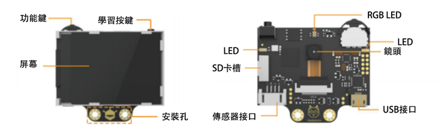

Huskylens 是一款易於使用的AI機器視覺傳感器，內置 7 項功能。

除了以下6項功能，還有物件分類功能可學習不同物件的差別自動進行分類。

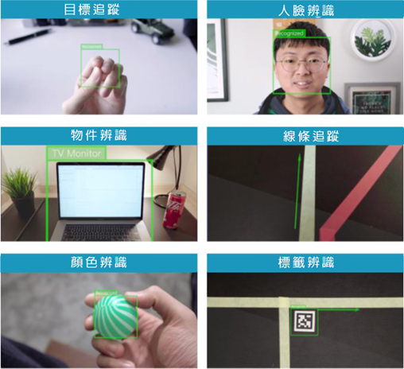

### 使用方法
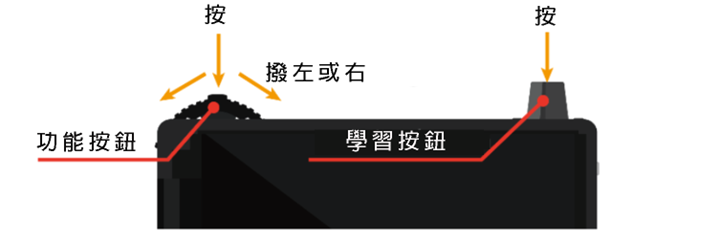

Huskylens主要有兩個按鈕，功能按鈕和學習按鈕。

+ 向左或右撥功能按鈕能切換功能/模式
+ 單擊功能按鈕能叫出功能菜單
+ 長按功能按鈕後，您可以設置是否學習多個目標：
+ 再按一次功能按鈕，可以拖移滾動條至右啓動「學習多個」

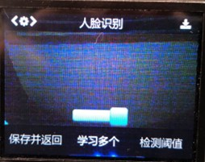

撥向保存並返回，按下功能按鈕可叫出確認視窗，再按下功能按鈕便進行保存

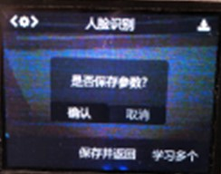

+ 單擊學習按鈕能學習新的物件，物件的ID 會顯示在螢幕上。
+ 長按學習按鈕能從不同角度和距離學習識別新的物件。
+ 在每次學習目標後，需要在4秒内再次按學習按鈕一下以繼續學習（否則4秒後停止學習，必須先遺忘目標後再重新學習）	 

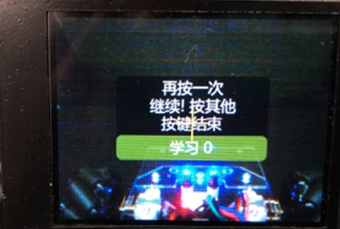

+ 在停止學習後，再按兩次學習按鈕能夠遺忘已學習的物件

### 安裝HuskyLens到車子

零件：

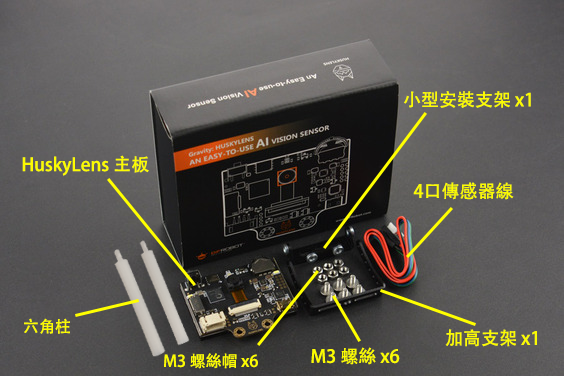

1）先用兩顆螺絲把小型安裝支架和加高支架連接起來。

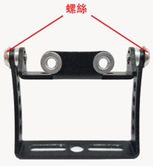

2）用兩顆螺絲把HuskyLens主板裝到小型安裝支架上。

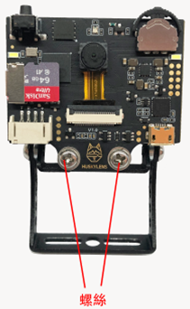

3）使用兩根六角（塑膠）柱、兩顆螺絲以及螺絲帽將AI鏡頭裝到車尾的孔。

  

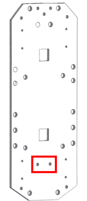
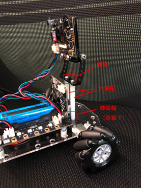

4）按下圖用4色線將HuskyLens接上micro:bit 擴展板。

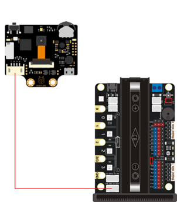

完成圖：

 

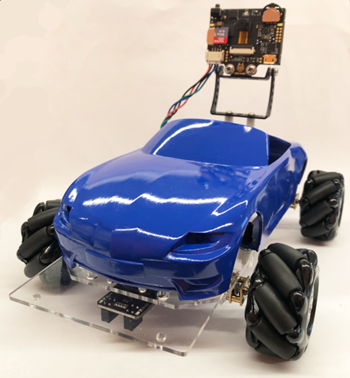
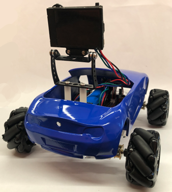

### HuskyLens擴展包

在進階分類中選擇擴展，並搜索”huskylens”，加入DFRobot_HuskyLens擴展包：

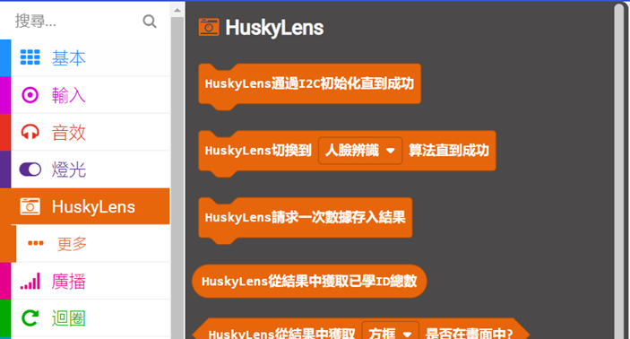

### HuskyLens積木模塊

進行I2C初始化通信協議， **必需放在“當啟動時”積木中執行

切換到其他功能模式（車子一次只能運行一個模式）

向HuskyLens發出一次性請求，將讀取的數據儲存在“結果”（位於記憶體的變數），令其得以被其他HuskyLens積木讀取（每一次請求都會刷新一次“結果”中的數據）

從“結果”中獲取已被學習的目標ID總數

邏輯條件：檢查從“結果”中獲取的目標ID是否出現在畫面之中

（可選擇目標為方框或箭頭，箭頭一般只用於線條追蹤）

我們先熟習一下上面介紹的HuskyLens最基本的積木。

## 練習1
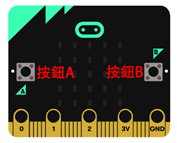

設計程序，運用HuskyLens、Micro:bit板A按鈕、B按鈕完成任務：

    1）程序開始時，自動切換到物體分類模式
    2）使用HuskyLens學習5種物件（ID）
    3）按下A按鈕：顯示學習物件數量——(a)
    4）按下B按鈕：清除學習物件數據
    5）再按下A按鈕，顯示學習物件數量——(b)
  

提示：使用HuskyLens >> 更多 >> ”遺忘積木“清除學習物件數據  

位置|數字
---|---
(a)|
(b)|

**嘗試一下在學習了物件之後重新打開HuskyLens，再按下A按鈕顯示數量，看看會出現什麽數字？從中可以得出什麽結論？那你的程序能否做出改良？

## 練習2

設計程序，運用HuskyLens、Micro:bit板顯示燈、板載LED完成任務。

先加入stemhub:bit擴展包：<a href="https://github.com/stemhub/pxt-Stemhubbit">https://github.com/stemhub/pxt-Stemhubbit</a>

任務：

    1）程序開始時，自動切換到物體分類模式
    2）使用HuskyLens學習數件物件
    3）如果有已學習物件在屏幕之内，Micro:bit板顯示最接近屏幕中心的物件ID，並將全部板載LED亮起為綠色，否則亮起紅色

如果沒有學習物件在屏幕内，Micro:bit板會顯示什麽數字？

答：

   
**提示：如果在學習物件後無法返回沒有任何學習物件在屏幕内的狀態（例如非學習物件被辨認為ID 1），可以按兩次學習按鈕遺忘所有學習數據

最後，你可以在不同模式之間切換嘗試練習一步驟（2-3），你會發現每一個模式得到的學習物件數量是獨立計算的。

## 答案
### 練習1
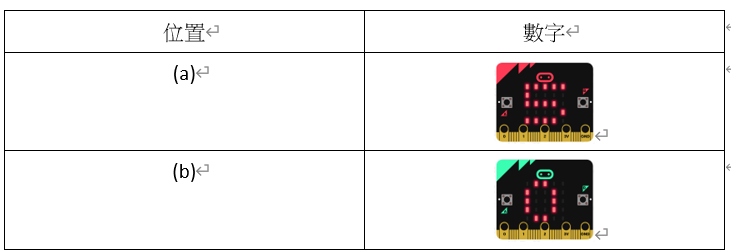

在學習物件之後重新打開HuskyLens，按下A按鈕顯示的數字會是0，再按多一下才會是實際ID數量。

由此可見HuskyLens在每次啓動後並首次接收到「數據傳入結果」請求時都不會讀取實際學習數據，而是先將結果初次化為0，在此之後接收請求才會真正讀取學習數據。因此最後的程序：

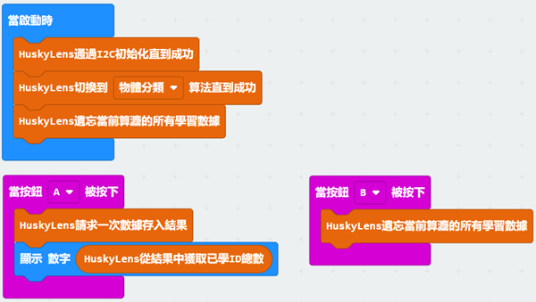
  
### 練習2

如果沒有學習物件在屏幕内，Micro:bit板會顯示 -1

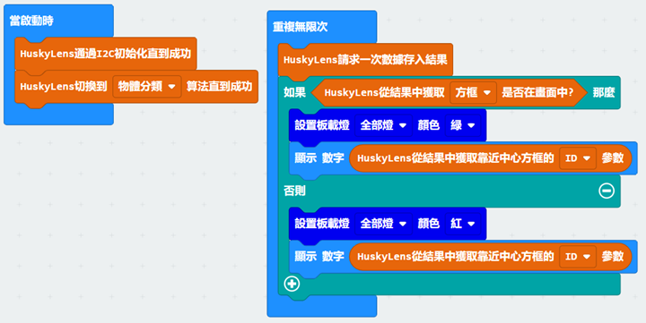
