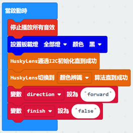

# 第三課

## 簡介

歡迎參加Micro：bit 智能小車課程！在本課程中，我們將探索Micro：bit並學習如何在編程中如何控制Micro：bit智能小車。

## 教學目標

讓學生清楚掌握Micro：bit 智能小車的AI鏡頭原理及其功用，並了解如何透過設計編程令AI鏡頭幫助智能小車實現更多功能。

## HuskyLens 顏色識別功能
### 顏色識別是什麽？

在HuskyLens裏的顔色識別功能，Huskylens能學習新的顔色，及透過輸入不同的顔色名字，而在下一次當Huskylens 感應到同一個顏色的時候，便會顯示顔色的ID。

### 顏色識別的應用

無障礙服務: 幫助色弱人士理解不同事物的顔色差別，或將顔色轉化為色盲人士認識能夠分辨的顔色

攝像監控系統：可透過顔色追踪罪犯逃走使用的車子

物流管理：很方便地對貨物類型或型號進行自動識別，成本低，操作方便。

### Huskylens 的顏色識別

而HuskyLens的顏色識別功能可以分爲偵測顏色、學習顏色及識別顏色三個部分。

#### 偵測顏色:

將屏幕中央的十字對準目標色塊，屏幕上會出現白色方框將其框選，調整角度和距離以令白色框盡量框住整個目標色塊。

#### 學習顏色:

偵測到顏色後，按下“學習按鍵”學習顏色，並鬆開以結束學習。在倒計時的消息結束前按下“學習按鍵”，可以繼續學習下一種顏色。如果不再需要學習其他顏色，則在倒計時結束前按下”功能按鍵”，或等待倒計時結束。 

#### 識別顏色:

如遇到相同的顏色，屏幕上會有彩色邊框選出色塊，並顯示該顏色ID。邊框會自動跟踪色塊，其大小會隨色塊的面積變化。HuskyLens可以同時識別並追踪多種不同的顏色，而不同顏色對應著不同的邊框顏色。

#### 調節識別框閾值

在識別相近顏色的色塊時，通過設置閾值可以調節識別的精度。比如在下圖中，顏色相近的黃色氣球沒被識別到，就是閾值設置過高。在顏色識別功能的二級菜單參數設置界面中，有“識別框閥值”參數，該參數的數值越低，精度越低，但識別的相近色塊就越多。

以下圖爲例，當閾值為20時，HuskyLens只能識別到一個黃色球，閾值為0時，3個黃色球都可以識別到。

## 練習1：

先熟識一下HuskyLens的顏色識別功能，先學習幾種顔色，讓不同顔色ID和方框顯示在屏幕上。

(如圖片太小，請將圖片放大或使用課程最後的附錄)

然後設計程序，以其中一種顔色ID爲目標，用Micro:bit板指示燈顯示該顔色色塊的數量。

例如左上圖紅色色塊數量 = 2，Micro:bit板顯示：

提示：使用以下積木

## 練習2：

設計程序，學習其中一種顔色後（假設為ID1），當按下A按鈕，計算該顔色方形色塊的總面積並用Micro:bit板指示燈顯示結果。

（結果單位為HuskyLens眼中的 平方單位） 

 
提示：

+ 使用以下Huskylens積木獲取每一個色塊的高闊，面積 = (長)高度 × 闊度

+ 建立儲存
+ 建立儲存增加後的面積，使用迴圈將色塊面積逐個增加 

## 練習3：

設計程序，車子根據HuskyLens看到的不同顔色亮起該顔色RGB板載燈，並看到任何已學習的顔色時後退，否則停下並關上RGB燈。		

+ ID 1 亮起紅色
+ ID 2 亮起黃色
+ ID 3 亮起藍色
+ ID 4 亮起綠色

## 練習4（挑戰）：

（如非列印版本，觀測車子動作即可）

設計程序令車子在彩色道路（見下頁）上進行移動：

    1）當Huskylens偵測到紅色最接近屏幕中心時，車子開始前進
    2）直至Huskylens偵測到紫色格子最接近屏幕中心，車子短暫停下並開始後退
    3）一直後退直至Huskylens再次偵測到紅色格子最接近屏幕中心，車子停下

在車子前進時，當HuskyLens分別偵測到紅、黃、綠、紫色最接近屏幕中心，microbit板播放中音C、E、G及高音C音色，並分別亮起一個該顔色的RGB板載燈。（在到達紫色格子時全部RGB板載燈應該已經亮起）

在車子後退時，當HuskyLens分別偵測到以上四種顔色最接近屏幕中心，播放同樣音色，但關起該顔色RGB板載燈，最後停止繼續播放任何音色。

提示：

+ 先調校Huskylens角度望住紅色格子		
+ 建立變數記錄車子移動方向，以決定車子動作
+ 建立變數判定車子是否已回到紅色格子
+ 未回到（”false“）播放中音C一秒，並將finish設爲“true”
+ finish爲”true“時停止繼續播放音色

## 答案
### 練習1

### 練習2

當A按鈕被按下，將面積設爲0，將number設為色塊數量，並在迴圈呼叫計算面積函式。

每一次在函式計算面積，先把高和闊初始化才能將供取得高度和闊度的函式（getWidth, getHeight）使用，而這兩條函式則將number設為最後一個色塊取得其高度和闊度。

計算的方式是透迴圈過把目前的色塊面積加上當前的總色塊面積，並number減少1，最後得出結果。

### 練習3

### 練習4

程序開始時，先初始化所有變數、音效和板載LED燈。

當有任何( 已學習顔色 )方框在畫面，視乎direction( 方向 )呼叫forward( 前進 )和backward( 後退 )的程序。如沒有任何方框，關閉車子馬達、音效和板載LED燈。

#### 前進的程序

先檢查顔色ID是否不等於4，是則繼續檢查顔色ID是否等於1、2、3

1則開始車子前進，亮起紅燈，播放中音C。2和3則分別亮起黃及綠燈，播放中音E和G

如ID等於4，亮起紫燈，播放高音C，停下車子一秒，direction( 方向 )改爲backward(後退)

#### 後退的程序

先檢查車子是否未完成任務（finish=”false”），否則檢查車子是否未到紅色格子(ID=1?)。

是則車子後退，然後檢查顔色ID是否等於4、3、2，是則關上相應RGB燈並播放音色。

如果車子重新走到紅色格子，關上最後一個RGB燈，車子停下，播放一秒中音C

finish設爲“true”，因而車子停止播放任何音色。

