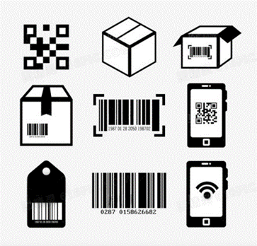

# 第四課

## 簡介

歡迎參加Micro：bit 智能小車課程！在本課程中，我們將探索Micro：bit並學習如何在編程中如何控制Micro：bit智能小車。

## 教學目標

讓學生清楚掌握Micro：bit 智能小車的AI鏡頭原理及其功用，並了解如何透過設計編程令AI鏡頭幫助智能小車實現更多功能。

## HuskyLens 標籤識別功能
### 標籤識別是什麽？

標籤識別技術是指對商品進行編碼和識別的技術方法，是一種有效和標準化的方式， 在我們的日常生活中有很多種標籤，例如條形碼和二維碼。

在Huskylens裏, 它透過學習新的標簽然而辨別不同的標簽, 並會在下一次當Huskylens 感應到同一個標簽的時候，便會顯示顔色的ID。

### 標簽識別的應用

物流：物流過程中的貨物追踪，信息自動採集，倉儲應用，港口應用，快遞。

零售：商品的銷售數據實時統計，補貨，防盜。

製造業：生產數據的實時監控，質量追踪，自動化生產。

服裝業：自動化生產，倉儲管理，品牌管理，單品管理，渠道管理。

醫療：醫療器械管理，病人身份識別，嬰兒防盜。

### Huskylens 的標籤識別

而HuskyLens的標籤識別功能可以分爲偵測標籤、學習標籤及識別標籤三個部分。

#### 偵測標籤

當HuskyLens檢測到標籤時，屏幕上會用白色框自動框選出檢測到的所有標籤。

#### 學習標籤

將HuskyLens屏幕中央的“+”字對準需要學習的標籤，短按或長按“學習按鍵”完成第一個標籤的學習。鬆開”學習按鍵“後，屏幕上會提示：”再按一次按鍵繼續！按其他按鍵結束“。

如要繼續學習下一個標籤，則在倒計時結束前按下“學習按鍵”，然後將HuskyLens屏幕中央的“+”字對準需要學習的下一個標籤，短按或長按“學習按鍵”完成第二個標籤的學習。

如果不再需要學習其他標籤了，則在倒計時結束前按下”功能按鍵”即可，或者不操作任何按鍵，等待倒計時結束。

#### 識別標籤

HuskyLens再次遇到學習過的標籤時，在屏幕上會有彩色的邊框框選出這些標籤，並顯示其ID。邊框的大小會隨著標籤的大小進行變化，邊框自動追踪這些標籤。

### AprilTag

什麼是 AprilTag ？

AprilTags 是一個出自密歇根大學項目團隊的視覺基準系統，主要用於 AR，機器人和相機校準等領域。標籤的作用類似於條形碼，存儲少量信息（標籤 ID），同時還可以對標籤進行簡單而準確的 6D（x，y，z，滾動，俯仰，偏航）姿勢估算。

而Huskylens 僅支持內置的 AprilTag 視覺基準庫，如下圖：

## 練習1:

先熟悉一下HuskyLens標籤識別功能，學習五個標籤。設計程序，當HuskyLens識別到不同標籤時，分別前進、後退、轉左、轉右及停止。可使用以下標籤：

可將標籤與路牌佈置成下圖的樣子，以分辨標籤對應的方向/動作。

## 練習2:

改良練習1的程序，讓車子到達標籤一定距離時才進行識別並改變移動方式。自行佈置簡單的路綫並讓車子完成。

提示：利用標籤的高度計算距離

概念圖：

## 練習3: 自助超市收銀機
### 任務一：識別商品

HuskyLens 學習並識別貼在三個不同商品上的標籤，編寫程序讓 Micro:bit 的點陣顯示燈顯示對應的商品名。(例子：水瓶、餅乾、美工刀)

### 任務二：開始與結束掃碼

改良任務一的程序，讓顧客按下Micro:bit 的 A 鍵進入商品掃描程序。在按下B鍵後，microbit 板便顯示HuskyLens識別到的所有商品名，並結束掃描程序。下一個顧客按下A 鍵重新開始掃描。

### 任務三：商品結算

當要購買的商品都在HuskyLens屏幕範圍内，按下B鍵，便會將所有商品的售價加起來成爲總價，並結束掃碼，點陣燈會顯示該顧客購買的所有商品名稱以及總價。

提示：建立變數儲存B按鍵的狀態，並以該變數決定是否結束掃描程序。

## 答案
### 練習1

### 練習2

在識別到標籤高度少於50 （約畫面高度五分一），程序才判斷車子走到適合距離改變動作。

### 練習3

新建一個“total”變量，用於存儲商品的總價。每次按下A鍵開始識別商品後，將上一個客戶的商戶總價清零。

