# 第六課

## 簡介

歡迎參加Micro：bit 智能小車課程！在本課程中，我們將探索Micro：bit並學習如何在編程中如何控制Micro：bit智能小車。

## 教學目標

讓學生清楚掌握Micro：bit 智能小車的AI鏡頭原理及其功用，並了解如何透過設計編程令AI鏡頭幫助智能小車實現更多功能。

## 循線功能
### 循線功能是什麽？

還記得Micro:bit智能小車本身配備了黑白感應器，讓其能夠進行巡線移動嗎？HuskyLens的巡線追踪也能實現類似的功能。然而除了黑白色之外，HuskyLens亦能識別不同指定顔色的線條，並進行路徑預測。

還記得以前教過如何使用黑白感應器實現巡線移動功能嗎? 使用HuskyLens的巡線功能雖然沒有辦法直接探測車子出界，但卻配備著辨認線條的功能。這令車子不但可以在線條範圍外直接找到線條，也可以在多於一條道路的情況選擇出正確路線。

### 循線功能的應用 

自動車：防止車子衝出道路造成事故

機器人：

+ 在商場或博物館等公衆場所用於導航
+ 用於工業運輸，比起傳統輸送帶節省大量空間
+ 餐廳運送食物至客人身邊

### Huskylens 的循線功能

而HuskyLens的循線功能可以分爲學習與追踪兩個部分。

#### 學習線條

（建議HuskyLens屏幕內只有一條需要學習的線條，並且沒有與其他條交叉）

將屏幕上的十字對準目標線條，并將鏡頭與線條保持平行。HuskyLens會自動檢測線條，並顯示白色箭頭。然後單擊“學習按鍵”，白色箭頭變成了藍色（或其他非白色的顔色），代表已學習了線條。

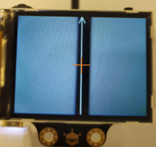

#### 巡線追踪

當HuskyLens檢測到已學習的線條時，屏幕上會顯示藍色的箭頭，箭頭指的方向代表路徑預測的方向。

## 練習1

學習以下兩種線條後進行識別，設計程序在micro:bit版指示燈顯示最接近HuskyLens屏幕中心的線條ID，順便觀察一下HuskyLens路徑預測的特性。

提示：在學習線條後，需要結束學習以免大量白色箭頭影響顯示結果。

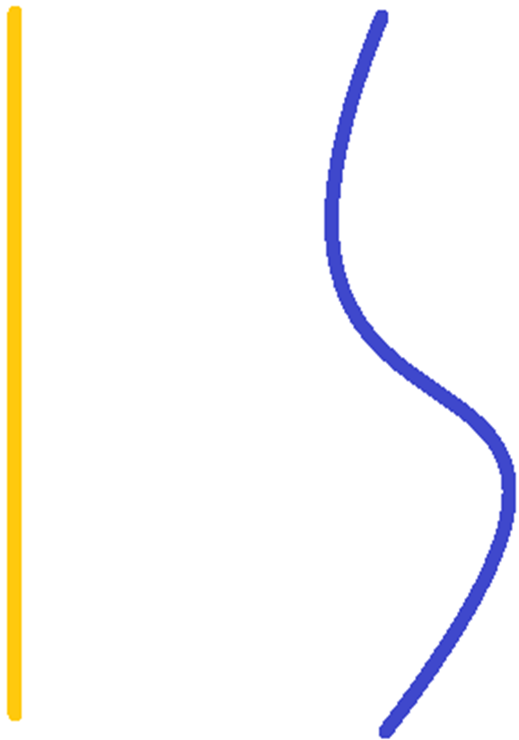

## 練習2

HuskyLens學習直線後設計程序，把車子放在直線上進行巡線前進，到達盡頭時停下。(假設車子不會出界至HuskyLens完全丟失直線)

**Husky畫面中不要有其他與線條相同顔色的物件在，效果更好

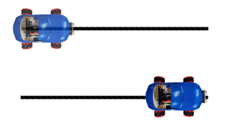

提示：

+ 以不同的X起點決定車子應該前進、轉左還是轉右

+ X坐標範圍：0 - 320
+ Y坐標範圍：0 - 240

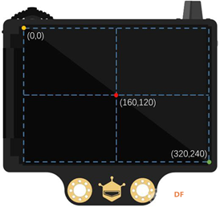

## 練習3

設計程序讓車子巡以下形狀路線前進。

**Husky畫面中不要有其他與線條相同顔色的物件在，效果更好

提示：

相比起走直線，車子在轉彎時會走的較不順暢，該如何改善這個問題？  

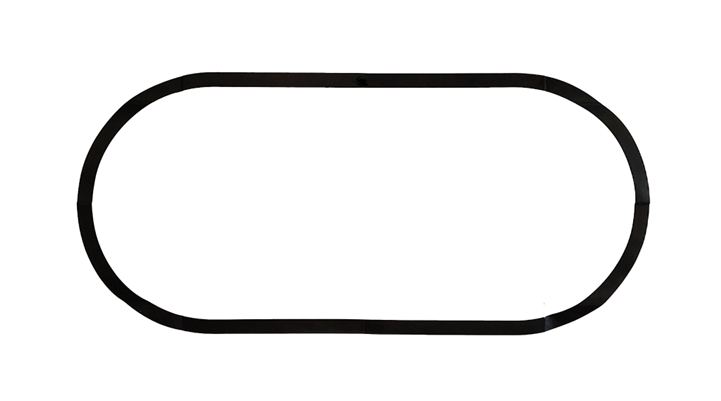

## 練習4：巡線自動車

自動車除了能夠自動前進，也能夠探測障礙物避免撞上。

集合超聲波傳感器，改良練習2的程序。讓車子巡直線前進，並在遇上障礙物時停下。當沒有障礙物時重新巡線前進，直至到達終點（線外）。

沒有遇上障礙物時，打開綠色車頭燈。遇上障礙物時，打開紅色車頭燈，響鳴一次。到達終點後，打開黃色車頭燈，播放一次任務完成的音效。

	
## 答案
### 練習1
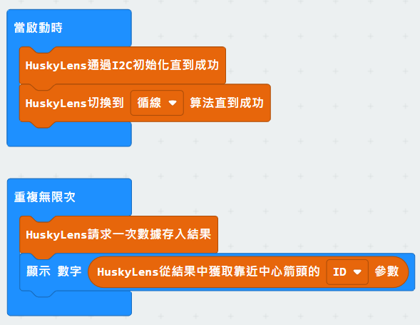

### 練習2

箭頭終點為箭嘴尖端。當箭頭Y終點少於120（畫面一半），車子停下。

否則，當X起點大於170，車子轉右；當X起點少於150，車子轉左。

（160為畫面一半；170=160+10，150=160-10）

否則，當X起點介乎於150至170之間，車子前進。

箭頭不可能停留在畫面正中間，因此設立一個較大的前進數值範圍。

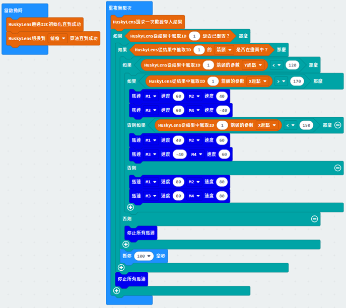

### 練習3

Q. 相比起走直線，車子轉彎時會走的較不順暢，該如何改善這個問題？

A. 由於HuskyLens不像黑白感應器般簡單地區分車子有沒有出界，車子無法適應所有的轉彎角度。在練習2之中，我們把Huskylens的畫面區分向左轉、前進和向右轉三個部分。要令車子根據不同轉彎角度有不同的轉彎速度，我們只需要將Huskylens畫面劃分成更多區域。

以劃分成五個區域爲例：

X起點|車子動作
---|---
150-170|前進
130-150|左小轉
0-130|左大轉
170-190|右小轉
190-320|右大轉

(可根據需要劃分更多區域)

#### 程序

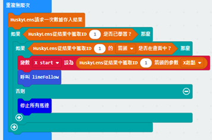
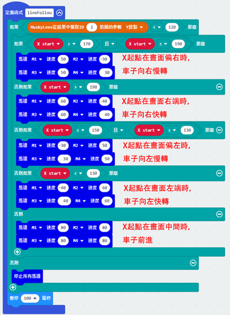

### 練習4

車子巡直線前進的部分除了要加入超聲波大於5的條件外和練習一相似。

建立變數儲存蜂鳴器是否已經在車子遇到障礙或到達終點後播放過一次音樂。

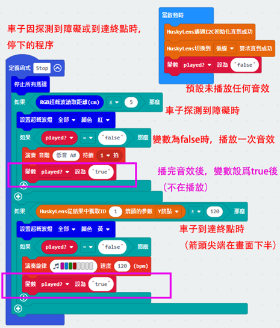
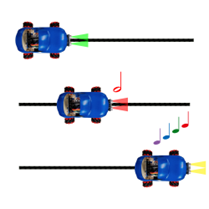
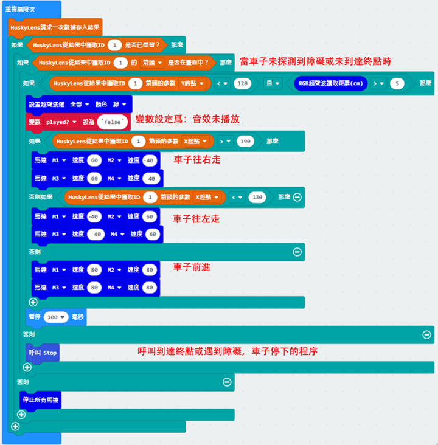
