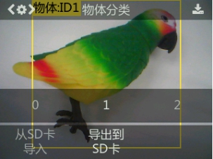
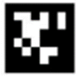
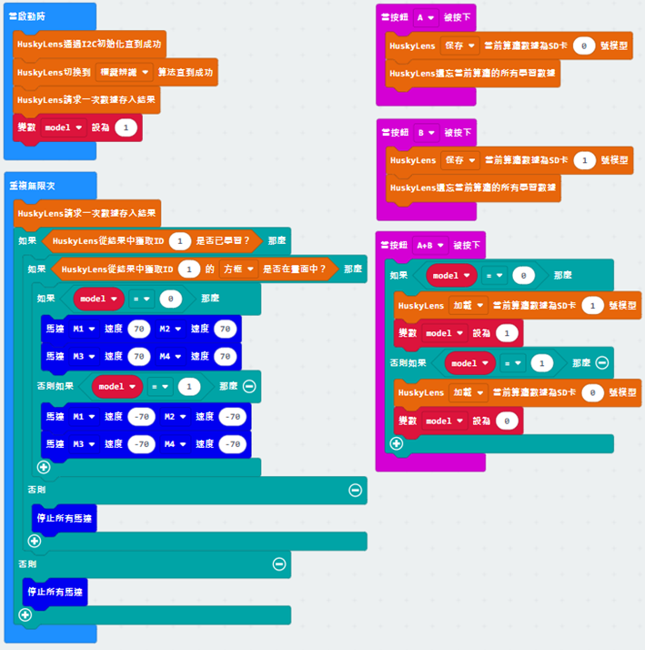

# 第九課

## 簡介

歡迎參加Micro：bit 智能小車課程！在本課程中，我們將探索Micro：bit並學習如何在編程中如何控制Micro：bit智能小車。

## 教學目標

讓學生清楚掌握Micro：bit 智能小車的AI鏡頭原理及其功用，並了解如何透過設計編程令AI鏡頭幫助智能小車實現更多功能。

## Micro:bit AI智能小車
### HuskyLens進階應用

在之前的課程中，同學已經學習了HuskyLens的人臉識別、顏色識別、標籤識別、物件分類、循線以及物件追蹤合共六個功能，並了解到人工智能透過從不同角度、距離對物件進行學習的原理。即使如此，HuskyLens的辨認功能仍然只能在不同模式獨立運作，令多元的功能收到限制。我們需要學習如何扣連並結合不同模式的功能來達成更加複雜且有意義的任務，以進一步實現具有高度AI智能的機械小車。

## 練習1：功能組合：顔色辨認 + 巡線

結合HuskyLens(1)顔色辨認和(2)巡線功能，完成任務。

預先在顔色辨認模式學習以下兩種顔色，並在巡線模式學習下頁的兩種顔色線條。設計程序，按下microbit板上的A按鈕時，找出下圖方塊數量最多的顔色，三秒後自動切換至巡線模式，在下頁找辨認該顔色的線條，走到線條上並進行巡線前進至終點。

提示：

+ 如巡線容易出界可使用暫停積木令車子每次移動後刹停
+ 在按下A按鈕轉換到顔色辨認模式後發送兩次數據存入結果請求
+ 第一次將數據進行初始化，第二次將數據更新化為新的學習結果
+ 建立變數id儲存方塊數量最多的顔色ID
+ 建立變數mode儲存HuskyLens當下的模式

## 練習2：以不同標籤代表不同HuskyLens模式

結合HuskyLens(1)人臉識別、(2)顏色識別、(3)標籤識別、(4)物件分類、(5)循線功能，以為標籤識別爲中心設下不同功能模式的切換條件，並完成任務。

先在標籤識別模式學習以下4個標籤，並在其他四個模式學習相應的物件（見下頁）。當鏡頭中心對準不同標籤並按下A按鈕，HuskyLens切換到對應的功能模式。將不同物件放至車子前，當鏡頭於每個模式辨識到已學習物件時，車子執行不同的車輪動作。按下microbit板B按鈕則返回標籤識別模式，車子停下。

模式|車子動作1
---|---
顏色識別|前進
人臉識別|後退
物件分類|向左水平移動
循線|向右水平移動

顏色

人臉

線條

物件

## SD卡保存/加載模型

隨著學會的功能變多，能夠達成的任務也變得更複雜，HuskyLens或需要儲存較多的學習物件數據。如果每次使用HuskyLens進行新任務時都清除上一次的學習數據並重新學習，只會花費大量時間及人力，有違AI鏡頭促進工作效率的原意。

因此，HuskyLens能夠將同一個模式下學習的多個物體作為一個數據模型，並通過SD卡將其保存。即使刪除了當前模式的所有數據，也可以再從SD卡中重新加載模型，讓HuskyLens學習模型中的數據。

通過保存模型的方法，HuskyLens可以在一個算法中滿足多場景的使用，比如在物體分類算法中，學習包剪揼手勢為1個模型，口罩識別為1個模型。然後通過模型切換，就能快速實現所需功能，避免讓HuskyLens反複學習。

HuskyLens板載一個SD卡插槽，將SD卡插入即可使用。

### 方式一 ：在各算法功能的二級菜單目錄下手動操作

    1.	學習新物體：讓HuskyLens學習幾個新的物體，每個物體有不同的ID號。
    2.	導出模型：長按“功能按鍵”，進入物體分類功能的二級菜單參數設置界面，然後向右撥動“功能按鍵”至選擇“導出到SD卡”（即保存模型到SD卡）。短按“功能按鍵”，左右撥動“功能按鍵”，選擇0~4任意一個即可（相當於選擇保存的位置，方便區分不同的模型，一個模式最多有5個模型），然後短按“功能按鍵”即可保存模型。

    3.	模型導出到SD卡後，用電腦讀取該SD卡，在“HUSKYLENS”文件夾下即可看到後綴為.conf的模型數據文件，不同算法保存的文件名稱不同。如下圖所示：

（根據模型數據文件名可以知道導出的模型數據文件屬於哪個算法功能，而每個模型中學習的圖片無法被查看。）

### 方式二 ：使用積木模塊操作

加載模型時，只支持導入相同算法的模型，不能導入不同算法的模型。

## 拍照、截屏保存到SD卡

配備了鏡頭的HuskyLens可以像一個相機一樣拍照或者截屏攝像頭畫面，並保存到SD卡中。HuskyLens板載一個SD卡插槽，將SD卡插入即可使用。截屏保存的圖片包含屏幕上顯示的文字、方框等內容，而拍照出來的圖片只包含攝像頭畫面，沒有方框及文字信息。

由於拍照/截圖並保存需要一定的時間，因此建議調用該功能的間隔至少0.5秒以上。 

## 練習3

設計程序完成任務。

先學習下面其中一組標簽，使用microbit板A按鈕保存到任一模型，並自動清除學習數據。學習另一組標簽使用B按鈕保存到另一模型，完成後自動清除學習數據。

當按下一次A+B按鈕後，HuskyLens加載第一個標簽，再按下一次則加載第二個標簽，再按下一次則再次加載第一個標簽，如此類推。

當HuskyLens辨識到第一個標簽時，車子前進。

當HuskyLens辨識到第二個標簽時，車子後退。

 
提示：建立變數model儲存當時載入的模型位置

## 練習4：先將物件進行分類，再切換至相應模式 + 截屏

結合HuskyLens(1)標簽識別、(2)物件分類以及截屏保存完成任務。

分別使用物件分類和標簽識別學習以下標簽。

         

在物件分類模式下，當HuskyLens辨識到任何標簽時，切換到標簽識別模式。然後，如車子未能識別到標簽的話，前進靠近，否則車子停下並進行識別。識別到不同標簽時，HuskyLens屏幕顯示不同文字（例如Hello和World），並進行截屏。用電腦讀取SD卡看看截圖的樣子。

***在物件分類模式，要如何令HuskyLens有效率地在認出任何標簽時自動切換至標簽識別？

答：使用一個物件ID一次過識別所有標簽即可

示例：

## 答案
### 練習1

先建立變數id儲存顔色id。

每次按下A按鈕需要發送兩次數據存入結果請求才能儲存最新的學習結果。

當比較得出了哪種顔色方塊數量較多，才執行巡線的程序。

### 練習2

建立變數mode， 將mode 1-4 分別當作顏色識別、人臉識別、標籤識別、物件分類和循線模式。

當按下B按鈕，車子停下並mode設爲0，重新返回標籤識別模式。

車子在不同模式進行不同移動方式的程序：

黃框圈住了HuskyLens在四種功能辨認的物件。

在顔色與人臉辨識，需要辨識ID1物件的方框，而巡線則是箭頭。

在物件分類，只學習ID1的話沒有任何意義，所以要探測ID2物件的方框。

### 練習3

初始化變數model（模型）為-1（未按下任何按鈕）。按下A或B按鈕分保存數據到0和1號模型並清除現有數據。當按下A+B按鈕時，如果model不是0，則載入模型0的數據，並設當時的model為0，否則載入模型1的數據，並設當時的model為0，不斷切換。model是0時，車子前進，否則是1時，車子後退。

### 練習4

啓動時先清除一次屏幕文字，建立變數mode記錄當時運行的HuskyLens模式，設爲object mode(物件分類)。然後建立變數screenshot，設爲true（可以截屏）。

當在物件分類模式，HuskyLens辨識是否有任何標簽（ID2）在畫面内，是則切換到tag mode（標簽辨識）。

當在標簽辨識模式，HuskyLens辨識是否有任何標簽在畫面内，是的話如果screenshot是true，則根據標簽ID顯示文字在屏幕並截屏，截屏後設screenshot為false(停止再截屏)，否則車子繼續前進直到辨識到標簽。

