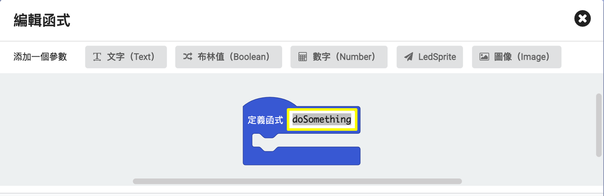

# 第一課

## 簡介

歡迎參加Micro:bit 智能小車課程！在本課程中，我們將探索Micro:bit並學習如何在編程中如何控制Micro:bit智能小車。

## 教學目標

讓學生清楚掌握Micro:bit 智能小車的各種擴展工具及其功用，並了解它們的安裝以及積木編碼操作方式。

 
## 重溫麥克納姆輪車子的結構

+ 4個馬達(M1, M2, M3, M4)
+ 4個麥克納姆輪子
+ Micro bit
+ Micro bit 擴展板

## micro:bit 擴展板

### 傳感器

+ 超聲波傳感器

+ 紅外巡線傳感器

          	 
## 重溫進階積木模塊

進階 >> 函式模塊能夠將複雜的程序整理好並重用。

### 函式
#### 建立函式

#### 在黃框內填入函式名稱 

#### 呼叫函式以運行函式中的程序

  
## 認識機械擴展工具
### 夾子(Beetle)	

### 鏟子(Loader)

### 叉子(Forklift)	

### 推土機配超聲波傳感器

(Bulldozer with ultrasonic) 

### 擴展工具包中所有的零件：

## 認識Micro:bit擴展工具——夾子

Micro:bit機械夾子(gripper/beetle)主要由帶齒輪的上下顎和舵機（伺服馬達）組成，一般安裝在車頭位置。

這次我們主要將舵機的引腳連至S1接口(紅框顯示的pin位)，一般深色線（黑色或啡色）連接到黑色GND接口。

### 機械夾子的原理及功用

在日常生活中，夾子大多用於替代雙手抓握物件，以免弄髒或傷到手，最常見的例子之一有麵包店裏的食物夾和挂衣物用的衣夾。透過兩顎施加壓力，中間的物件受鉗而被固定。

而Micro:bit的機械夾子長的就像鍬形蟲的大顎，外形是一個大鉗而長有鋸齒,因而在英文中有“Beetle”（甲蟲）之稱。

### 安裝夾子：

所需零件：

1）把三顆M3.5*5mm 螺絲，把一隻金屬夾子上臂和驅動前臂安裝在金屬夾爪底板上，完成右臂。

2）用兩顆M3.5*5mm 螺絲，把伺服前臂和舵機連接板裝在一起。

3）用兩顆M3.5*5mm 螺絲，把另一隻夾子上臂安裝到已連接好的伺服前臂上，完成左臂。

4）用兩顆M2.5*5mm 螺絲把舵機裝在金屬夾板上。

（先將右臂放到左臂旁邊，並以舵機模塊0度測試舵機是否能正確合上，才做（5））

5）用一顆M2.5*5mm 螺絲將左臂、舵機連接板及舵機連接起來。

6）用三顆M3*5mm 螺絲將三根M3*18mm 銅柱和金屬夾板連接。

7）用三顆M3*5mm 螺絲將夾爪底板裝到銅柱上。

8）用兩顆螺絲、兩顆螺絲帽將夾子安裝到車子/擴展板上，完成圖見上。

（**不要把螺絲上得太緊，免得擴展板受力彎曲）  

## Stemhub:bit舵機積木模塊

在Stemhub:bit > 舵機(Servo)中有兩個主要的模塊：

選擇接口並把舵機的引腳連接後，便可以調效舵機的轉動角度。

（在MakeCode中的角度數值是0-180，但該數值或不代表實際轉動角度）

## 練習1

設計程式用Micro:bit板的A和B按鈕令夾子打開和關上。

提示：先嘗試舵機模塊的不同角度數值，觀察夾子的動作。

（以防數值過大/小導致夾子嘗試開合至大/小於極限角度導致損壞，建議最小和最大角度數值分別為0及110）

角度數值|夾子動作
--- | ---
增加|
減小|

在成功令夾子打開和關上後，學生可以使用夾子開始進行實驗了！

除了課堂提供的物件之外，你也可以把隨身的小物件放到夾子之間，看看夾住不同形狀和重量的物件會有什麽效果。

## 練習2

下載手制擴展包:

在黃框內輸入連結: <a href="https://github.com/lzty634158/GHBit">https://github.com/lzty634158/GHBit</a> ，將GHBit 加至makecode

設計車子和遙控器的程式，用B1和B2按鈕打開和合上夾子，並以操縱杆控制車子前後移動及向左右轉，遙控器待機時車子停下。

夾子打開和合上時，車子的microbit板分別顯示“打開”和“合上”指示燈：

( 使用micro：bit板指示燈時有些許延遲為正常現象 )

提示：

+ 參考初階第十科，以接收文字作爲行動條件
+ 運用基本 >> 顯示指示燈積木模塊

完成練習2後你可以自由控制車子與夾子遊玩了！ 

## 答案
### 練習1

角度數值|夾子動作|
---|---|
增加|合上|
減小|打開|

### 練習2

遙控器的程式

遙控器控制車子前後移動、轉左轉右、執行按鈕功能和自動停下的程序可參考初階第十科練習二。

車子的程式

車子前後移動、轉左轉右和自動停下的程序可參考初階第十科練習二。

車子收到文字“B1”時，打開夾子並顯示打開“打開”指示燈。

車子收到文字“B2”時，合上夾子並顯示打開“合上”指示燈。

