# 第十課

## 簡介

歡迎參加Micro：bit 智能小車課程！在本課程中，我們將探索Micro：bit並學習如何在編程中如何控制Micro：bit智能小車。

## 教學目標

讓學生清楚掌握Micro:bit 智能小車的各種擴展工具及其功用，並了解它們的安裝以及積木編碼操作方式。

## 雙向可動式叉子

原來的機械叉子只有一個舵機控制升降支架上下移動，而再加上一個舵機後，叉子則能夠同時實現左右和上下移動，在特定場合不需要移動車子也可以把貨物由低處搬去高處以及由左搬去右。

### 安裝步驟

安裝水平移動舵機部分和第七課安裝推土機步驟 2類似，用三顆M2.5*5mm螺絲組裝好舵機，並裝上雲台變焦安裝板。

然後使用兩顆M3.5*5mm螺絲將叉子裝上舵機連接板，在用金屬銅柱把工具裝上車上。

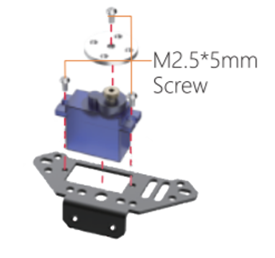
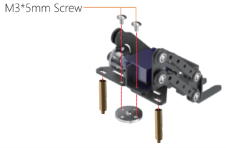

## 練習1

設計程序使用遙控器按鈕操作叉子上升下降和水平移動，以及按下micro:bit板A+B按鈕則令叉子重新面向前面，並完成以下任務。

上升下降部分，叉子只需要兩個不同高度。

而水平移動部分，叉子的角度需要能夠自由調節。

 

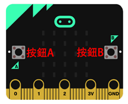
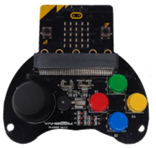

### 任務

控制車子把位於左邊的物件運去中間，再把右邊的物件運去左邊，最後把中間的物件運去右邊。

## 車子接力賽
### 介紹

車子接力賽分爲兩架擴展工具的車子，分別是鏟車和夾子工具。兩架車都是由同一個遙控器控制，並會一同合作完成比賽。如果按鈕A被按下，遙控器就會控制鏟車；如果按鈕B被按下，遙控器就會控制夾子，請設計程式符合比賽條件。

### 游戲規則

①接力賽分為兩個階段， 階段1：AB（任務：將所有三個物體從A點運輸到B點），階段2：BC（任務：將三個物體從B點運輸到C點，並按照1、2、3的順序重叠這些物體） . 完成兩個階段的任務後，只有兩輛小車到達C點（A點為起點，B點為接力點，C點為終點）才算成功。

② 遊戲過程中，玩家不能觸碰車子。

③ 用最短時間完成所有任務者獲勝。

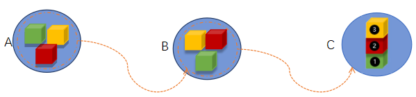
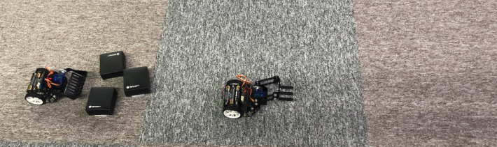

**只有當第一輛車將所有物體運送到指定區域B時，第二輛車才能啟動。**

提示：分別會有三個程式（遙控器、鏟車和夾子） 

## 答案	
### 練習1
#### 車子的程序（叉子水平移動部分）

當angle大於-20°時，angle不停減1令叉子逐漸向左轉。

當angle小於190°時，，angle不停加1令叉子逐漸向右轉。

當按下micro:bit板A+B按鈕，叉子面向正前方（85°）。

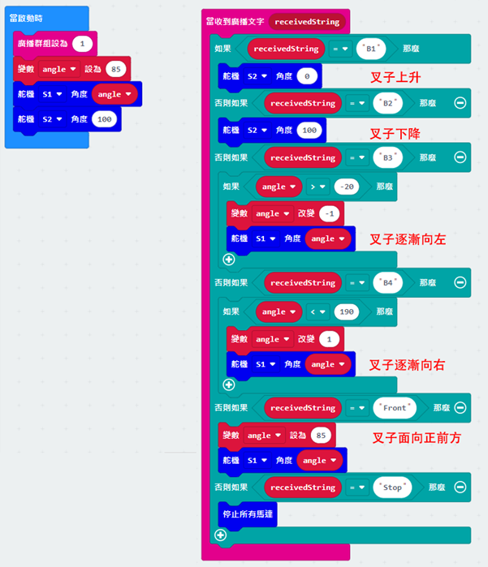

#### 遙控器的程序
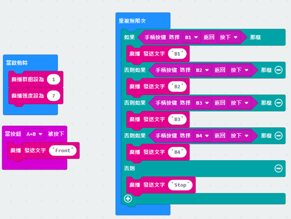

### 車子接力賽
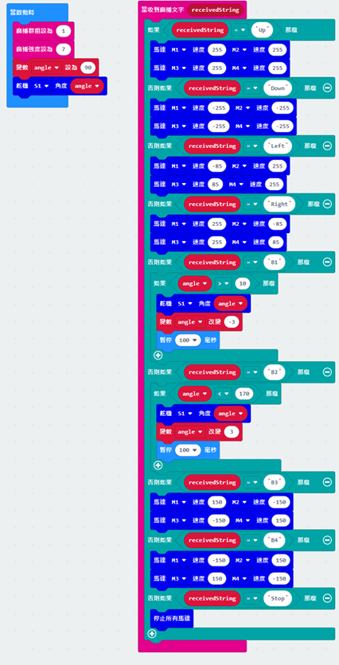

#### 鏟車

廣播群組為1

先調教角度為90 度

然後B1按鈕為調低角度(-3),

B2 按鈕為調高角度(3),

B3向左平移，B4向右平移

#### 叉車
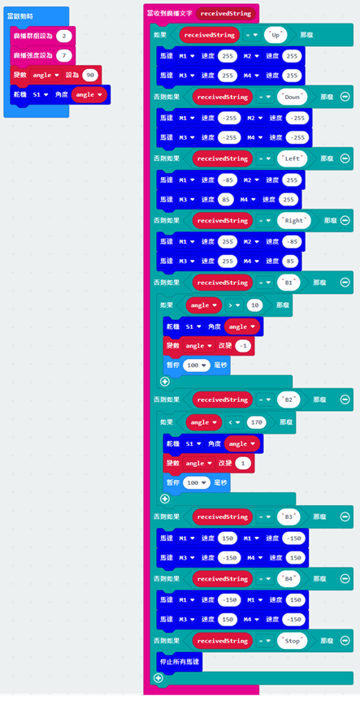

廣播群組為2

先調教角度為90 度

然後B1按鈕為調低角度(-1),

B2 按鈕為調高角度(1),

B3向左平移，B4向右平移

#### 遙控器
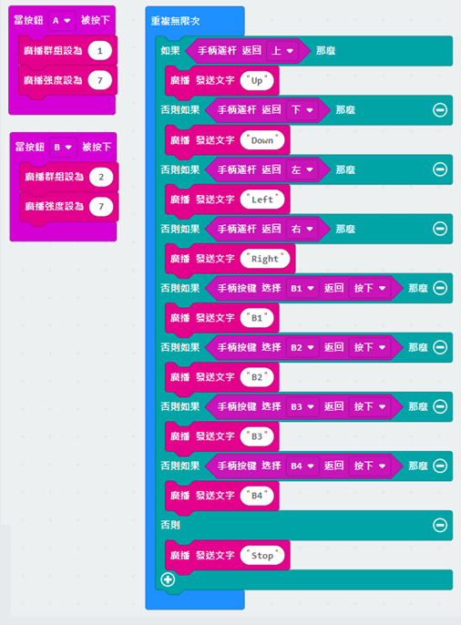

如果按鈕A被按下，遙控器就會控制鏟車

如果按鈕B被按下，遙控器就會控制夾子

