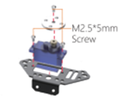
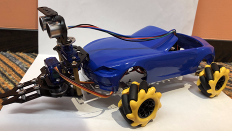
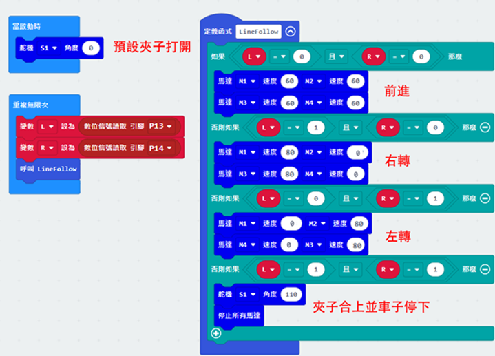

# 第二課

## 簡介 

歡迎參加Micro:bit 智能小車課程！在本課程中，我們將探索Micro:bit並學習如何在編程中如何控制Micro:bit智能小車。

## 教學目標

讓學生清楚掌握Micro:bit 智能小車的各種擴展工具及其功用，並了解它們的安裝以及積木編碼操作方式。

## 練習1

設計車子的程式完成任務。

1）將車子放到黑線開端（起點）

2）車子以夾子打開狀態巡線前進

3）到達終點（黑綫外）後，車子停下，合上夾子並夾住目標物件

提示：需把物件放到正確距離，以及適當調節車子（馬達）的移動速度，合上夾子時才能更易成功夾住物件。

安裝超聲波傳感器：

1）用三顆M2.5*5mm螺絲組裝好另一個舵機，並裝上雲台變焦安裝板(pan-tilt-zoom mount plate)。

2）將超聲波傳感器放入通用擴展安裝板，並用兩顆M3*5mm螺絲將通用擴展安裝板裝上雲台變焦安裝板。**看下圖留意通用擴展安裝板和超聲波傳感器的正確安裝方向

3）用兩顆螺絲、兩顆螺絲帽、兩條銅柱將夾子連同超聲波傳感器安裝到車子上。(**主意雲台變焦安裝板的方向)

完成圖：

## 練習2

自動感測器(超聲波)

運用超聲波偵測車子前方是否有可以搬運的東西，然後用夾子把貨物夾住。

之後車子停下。

(如沒有偵測到，車子會繼續往前走，直至遇到障礙物)。

## 練習3

結合練習1和2，使用超聲波和巡線傳感器完成任務。

1）將車子放在黑線上進行巡線移動

2）當超聲波第一次探測到障礙，小車180度調頭

3）巡線回到起點

4）走出黑線時，小車停下並夾住物件

（預設車子只會在回到起點時完全走出黑線）

提示

+ 建立變數“goal”記錄目的地，並用於條件積木（以文字“start”和“end”分別代表起點和終點）
+ 留意超聲波、巡線及“goal”的條件檢查次序

## 答案
### 練習1

巡線前進部分可參考初階第七、八課。

### 練習2

當超聲波讀取距離大於4，打開夾子並車子前進。

當超聲波讀取距離少於或等於4，合上夾子並車子停下。

### 練習3

預設目的地為終點（黑線末）

1）當目的地為終點而超聲波沒有反應，夾子打開並巡線移動

2）當探測到障礙，小車調頭，設目的地為起點（黑線開端）並繼續巡線移動

3）當目的地爲起點並走出了黑線，小車停下，夾住起點的物件

