# 第四課

## 簡介

歡迎參加Micro:bit 智能小車課程！在本課程中，我們將探索Micro:bit並學習如何在編程中如何控制Micro:bit智能小車。

## 教學目標:

讓學生清楚掌握Micro:bit 智能小車的各種擴展工具及其功用，並了解它們的安裝以及積木編碼操作方式。

在第三課成功令鏟子鏟起和放下後，你可以使用鏟子開始進行實驗了！

你可以把鏟子放到不同形狀、大小和重量的物件前嘗試能不能夠鏟起。

你也可以看看舵機角度數值太大或太小會得出什麽問題，並思考一下有沒有辦法解決。

物件|效果
---|---
<t>       <t> | 
<t>       <t> | 
<t>       <t> | 

舵機角度數值|問題
---|---
太大|
太小|

## 練習一

設計車子的程式完成任務。

1）將車子放到黑線開端（起點）

2）車子以放下鏟子狀態巡線前進

3）到達終點（黑線外）後，車子停下，鏟起目標物件

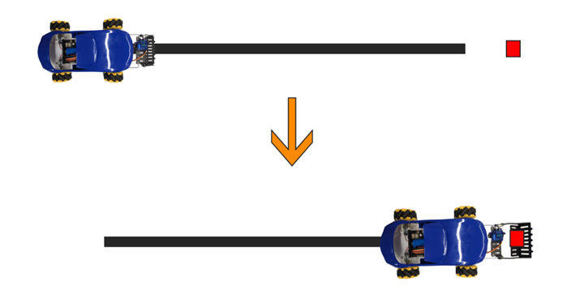

提示：需把物件放到正確距離，以及適當調節車子（馬達）的移動速度，合上夾子時才能更易成功夾住物件。 

## 安裝超聲波傳感器：
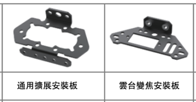

1）用三顆M2.5*5mm螺絲組裝好另一個舵機，並裝上雲台變焦安裝板(pan-tilt-zoom mount plate)。

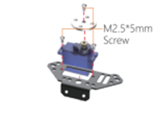

2）將超聲波傳感器放入通用擴展安裝板，並用兩顆M3*5mm螺絲將通用擴展安裝板裝上雲台變焦安裝板。

3）用兩顆螺絲、兩顆螺絲帽、兩條銅柱將鏟子連同超聲波傳感器安裝到車子/擴展板上。(注意雲台變焦安裝板的方向)

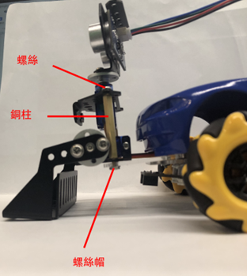

完成圖：

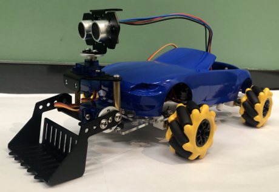

## 練習二

自動感測器(超聲波)

運用超聲波偵測車子前方是否有可以搬運的東西，然後用鏟子把貨物鏟起。

鏟起後車子停下。

(如沒有偵測到，車子會繼續往前走，直至遇到障礙物)。

提示: 鏟子要成功拿起物件所需的超聲波或比機械夾子更短

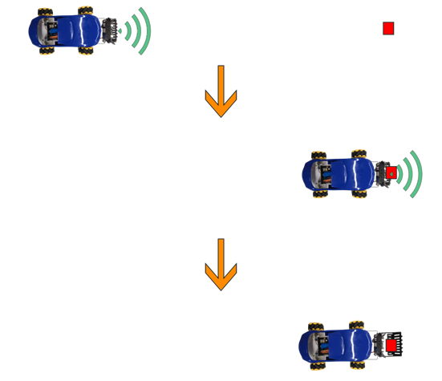

## 練習三

結合超聲波和巡線傳感器以及遙控器，設計程序透過遙控器即時改變車子的行動模式，一次過實現避障與控制鏟子兩個超聲波探測功能，並完成任務：

1）車子在黑線上進行巡線移動，當超聲波探測到障礙，小車避開 （水平移動即可）

2）以遙控器(B1)按鈕改變車子行動模式（超聲波避障功能改變為控制鏟子動作）

3）當超聲波探測到物件，車子停下並鏟起物件

提示：

變數“mode”記錄車子行動模式（文字積木“avoid”和“load”代表避障和鏟運模式）

車子行動模式不同，超聲波探測到物件的反應不同。

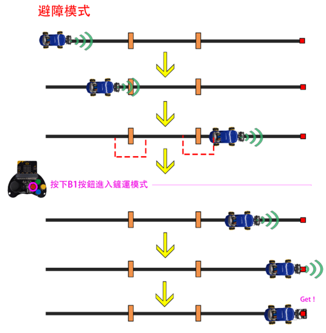

## 答案
### 練習一

巡線前進部分可參考第二課。

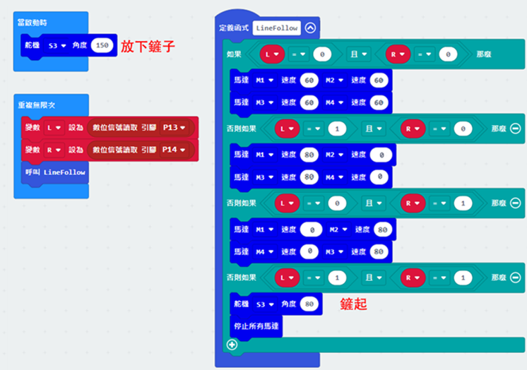

### 練習二

當超聲波讀取距離大於4，放下鏟子並車子前進。

當超聲波讀取距離少於或等於4，鏟起並車子停下。

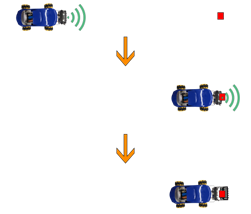
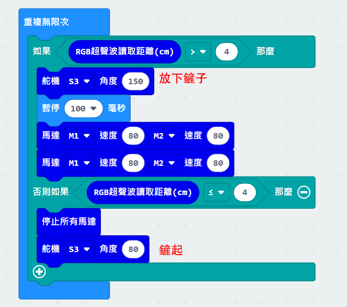

### 練習三

遙控器只需要發送”B1”文字。

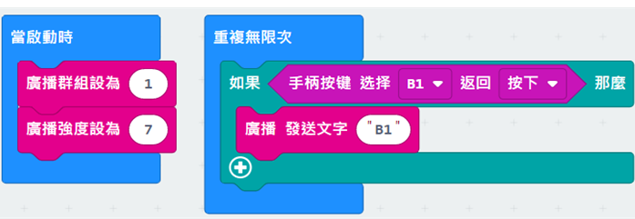
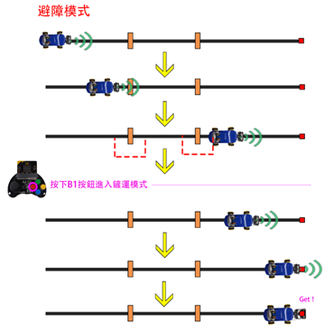

車子的程序：

預設車子變數mode為“avoid”，當收到文字”B1“則mode設爲“load”。

當超聲波探測不到物件車子進行巡線前進，出界則向右轉返回線上。

當超聲波探測到物件而mode是“avoid”，車子水平移動避障。

（向左移動時間比向右久，避免車子未回到線上便右轉，導致方向顛倒）

否則超聲波探測到物件而mode是“load”，車子停下並鏟起物件。

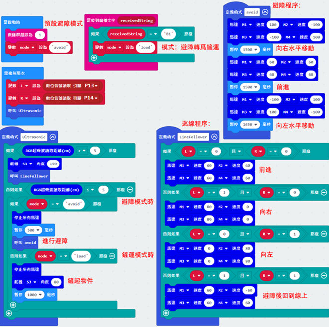
