# 第五課

## 簡介

歡迎參加Micro:bit 智能小車課程！在本課程中，我們將探索Micro:bit並學習如何在編程中如何控制Micro:bit智能小車。

## 教學目標

讓學生清楚掌握Micro:bit 智能小車的各種擴展工具及其功用，並了解它們的安裝以及積木編碼操作方式。

 
## 認識Micro:bit擴展工具——叉子

Micro:bit 機械叉子(forklift) 主要由三隻叉齒、升降支架和一個舵機（伺服馬達）而組成，一般安裝在車頭位置。 

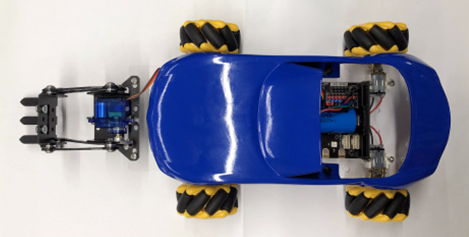

這次我們主要將舵機的引腳連至S2接口(紅框顯示的pin位)。

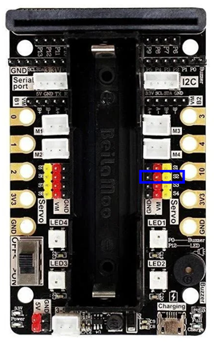

### 機械叉子的原理及功用

叉車主要用於倉庫內貨物的裝卸搬運，能夠減輕裝卸工人繁重的體力勞動，提高效率。它的原理很簡單，先把鐵枝(紅圈)伸進貨架(紅框)裡，再利用機械的力量抬起貨物。要留意的是，物品要墊高一點，叉車才能搬運，就像在貨架上。

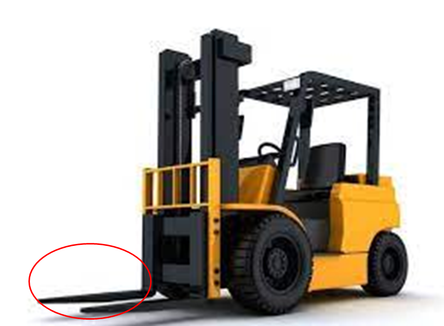

### 安裝叉車

零件：

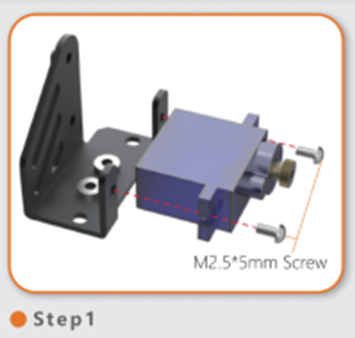

首先，利用兩顆M2.5*5mm 螺絲，把合金齒輪舵機安裝在舵機底座上。

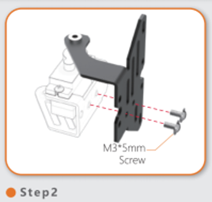

然後，把舵機打側，用M3*5mm 螺絲，把底板安裝在底座之下。

（底板比較長的一方面向後）

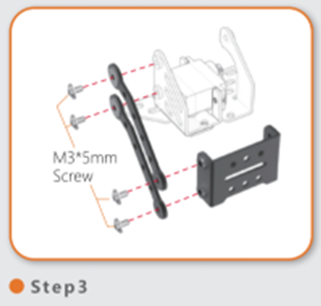

之後，用4顆M3*5mm 螺絲安裝連桿在舵機右面，臂板在舵機前方。

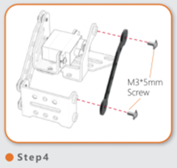

然後，用兩顆M3*5mm 螺絲把連桿安裝在舵機的左面。

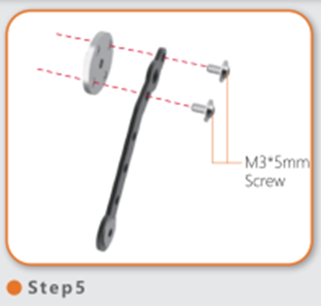

接著，連接安裝板、舵機臂連桿和兩顆M3*5mm螺絲。

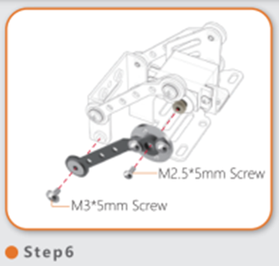

然後，把組裝好的連桿連接舵機和臂板的左方(舵機旁使用M2.5*5mm螺絲，臂板使用M3*5mm螺絲)

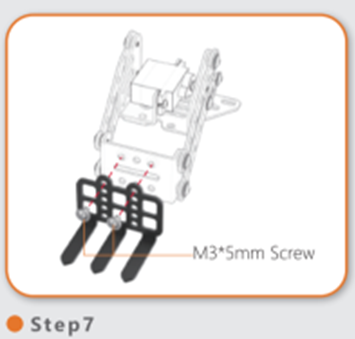

之後，用M3*5mm把叉車板安裝在臂板上。

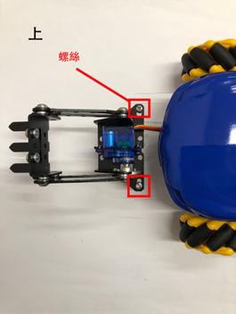
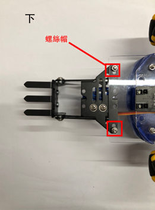

最後，用兩顆螺絲及兩顆螺絲帽將夾子安裝到車上。

 
## 練習一

設計程式用Micro:bit板的A和B按鈕令叉車零件向上或下移動。

提示：數值0～100

角度數值|叉車動作
---|---
增加|
減小|

## 練習二

尋找適合叉車搬運的物件及計算其角度

(**叉車舉得最高的高度是6cm，留意選擇物件的大小**)

  
物件|角度
---|---
<T><T>|
<T><T>|
<T><T>|

總結：每輛車子搬運物件的角度未必相同。 

## 練習三

遙控小車及擴展工具

下載手制擴展包:

在黃框內輸入連結: <a href="https://github.com/lzty634158/GHBit">https://github.com/lzty634158/GHBit</a> ，將GHBit 加至makecode

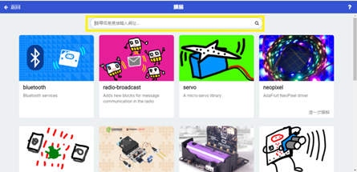
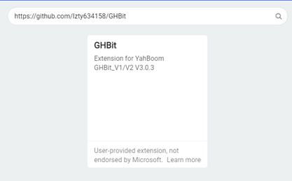

還記得我們在初階課程裡學的遙控汽車嗎？

這次遙控器除了要控制車子，還要控制叉車升降的動作。

(提示：用兩個按鈕控制升降)

## 答案
### 練習一

舵機角度減小，叉子會上升。角度增加，叉子則下降。

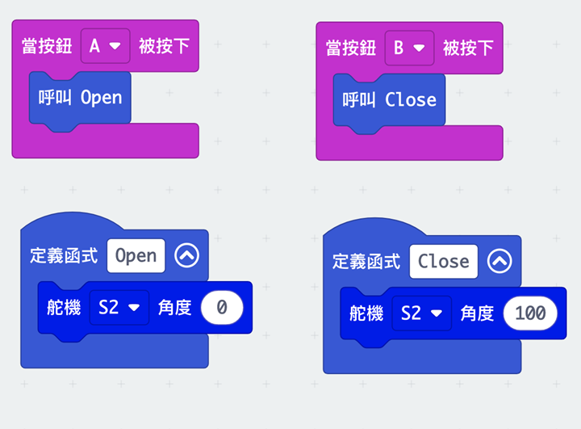

### 練習三

車子的程式

紅框內的程式就是控制叉車的升降，其他的按鈕請參考初階第十課

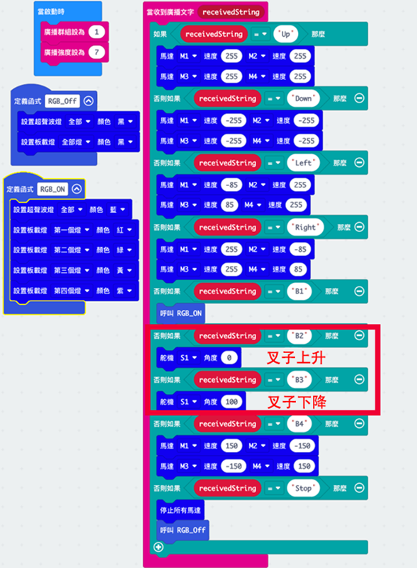

控制器的程式

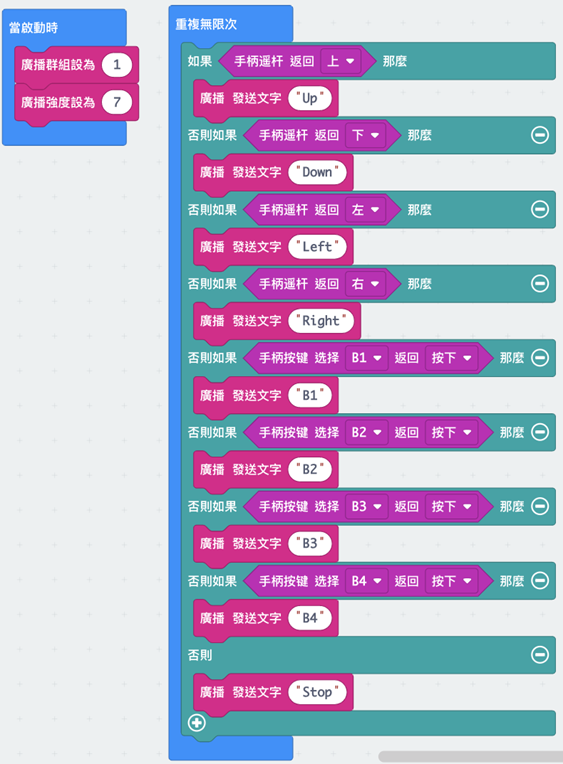
