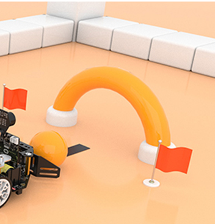
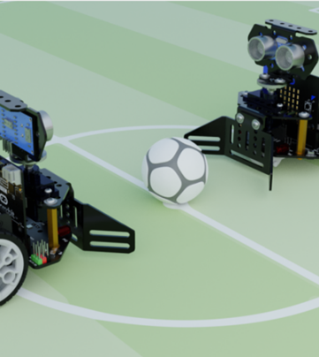
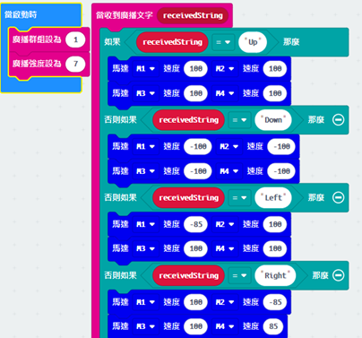
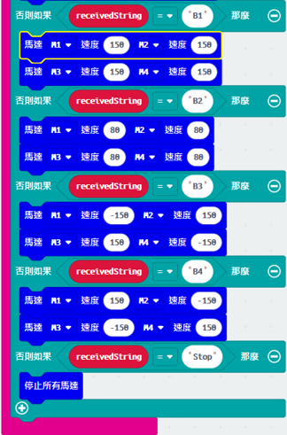
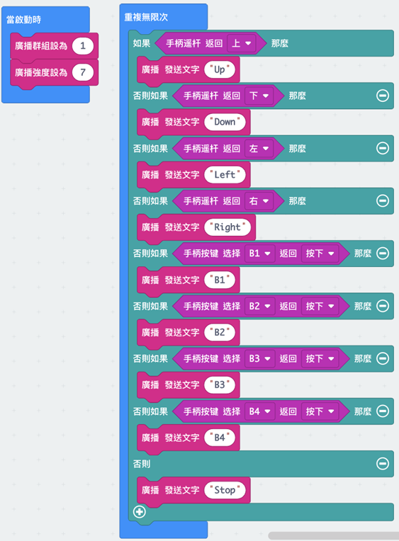
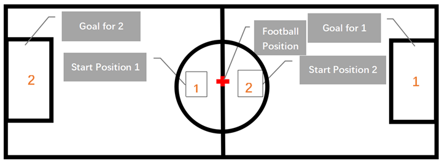

# 第八課

## 簡介

歡迎參加Micro：bit 智能小車課程！在本課程中，我們將探索Micro：bit並學習如何在編程中如何控制Micro：bit智能小車。

## 教學目標

讓學生清楚掌握Micro:bit 智能小車的各種擴展工具及其功用，並了解它們的安裝以及積木編碼操作方式。

## 推土機工具的運用

經過上一課認識了推土機的組裝及原理後，我們現在運用在各種練習以及比賽上。

### 練習一
#### 射龍門

為遙控器和小車編寫程式，控制小車把球送到龍門内。

提示：利用廣播模組，令遙控器能控制車子

**按鈕自定功能**（例如：加減速、左右移動、播放音樂、斜移、刹車...)

#### 足球比賽

剛才同學們在上一個練習中練習了如何透過遙控器控制小車入球，現在進行足球比賽！

規則：

    1.	車子或擴展工具不可超過龍門前的綫
    2.	速度不可超過150
    3.	比賽途中不可以觸碰車子

## 答案
### 車子程式

### 遙控器程式

### 附錄:足球場地

