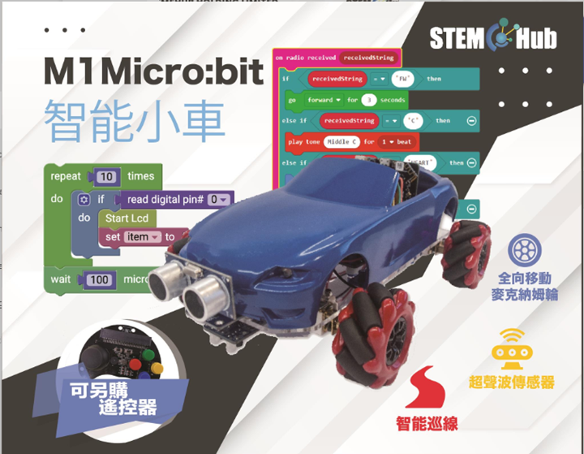
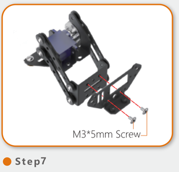
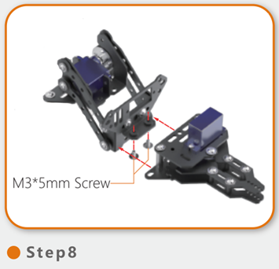
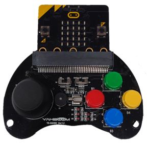
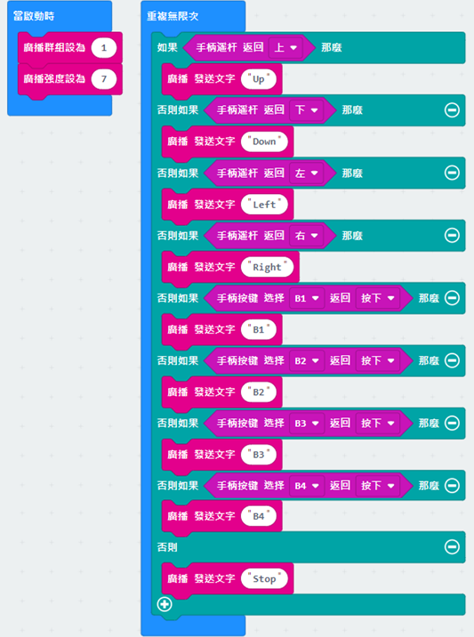
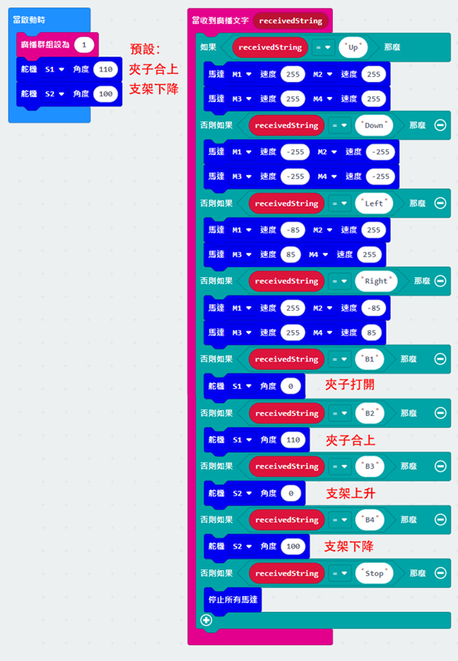
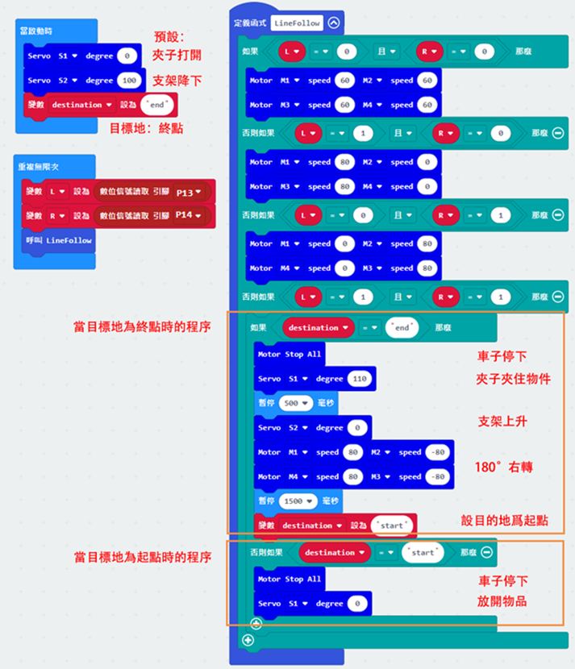
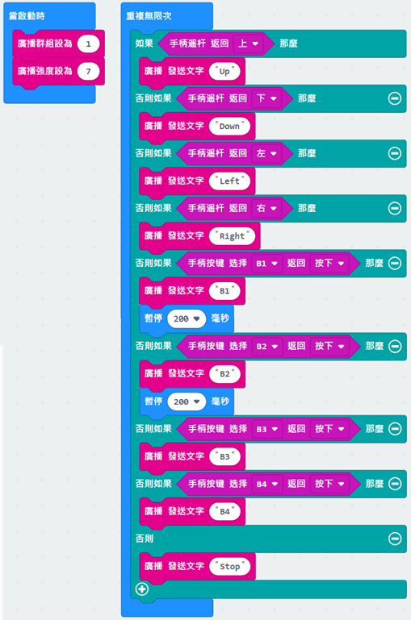
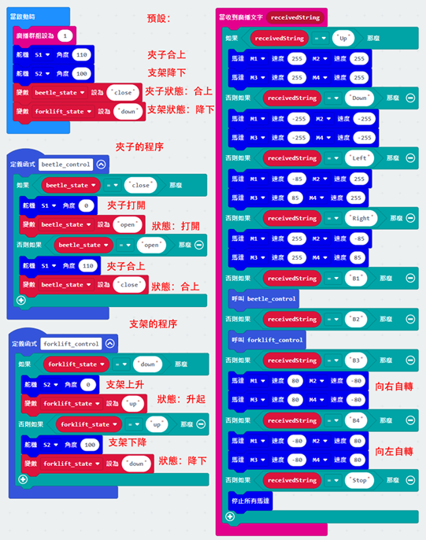

# 第九課

## 簡介

歡迎參加Micro：bit 智能小車課程！在本課程中，我們將探索Micro：bit並學習如何在編程中如何控制Micro：bit智能小車。

## 教學目標

讓學生清楚掌握Micro:bit 智能小車的各種擴展工具及其功用，並了解它們的安裝以及積木編碼操作方式。

## 可升降夾子

就像在科幻片和工廠裏的機械臂一樣，配搭上升降支架的夾子可以實現上下升降功能，進行不同高度的搬運工作。

### 安裝升降支架：

可參照第一課安裝機械叉子步驟 1 - 6

連接夾子到升降支架：

## 練習1

設計程序使用遙控器的四個按鈕分別控制夾子開合與支架升降，並操作車子把物件從較低的起點夾到較高的終點。

 
## 練習2

設計程序令車子巡黑線前進到終點，夾住物件後轉身180度巡線回到起點，將物件放下在較高的平台上。

提示：

+ 夾子加上支架長度增加，佈置場地時預留足夠距離。
+ 操作每一個工具時留意是否需要暫停。
+ 建立變數“destination”記錄目的地，以目的地確定車子出界時的動作 

## 多功能工程車（夾子和叉子）

micro:bit小車雖有多種擴展工具，但它們的用途和使用的前提各有不同，因此我們能夠同時把兩種工具放到車上，一次過完成多個任務。

## 練習3

我們現在把夾子和叉子組裝在同一架車，然後用遙控器的四個按鈕分別控制工具開合、升降，以及原地向左和向右自轉。

(安裝兩件工具令車子體積增加，原地自轉使車子在狹窄處移動更方便)

任務：首先把貨物夾到貨架上，然後利用叉車把貨物送到終點。

提示：

+ 叉車在車子前面，夾子在車子後面
+ 直接改良練習1程序
+ 建立變數記錄兩種工具使用狀態，以此狀態決定工具的下個動作

## 答案
### 練習1
#### 遙控器的程序

#### 車子的程序

### 練習2

### 練習3

遙控器的程序基本上和練習1一樣，除了發送B1和B2文字後需暫停以避免發送過多信號。

#### 車子的程序

B1按鈕：如果beetle_state(夾子狀態)是close，夾子打開並將beetle_state設為close。如果beetle_state當時是open，夾子合上並將beetle_state設為(close)。

B2按鈕：如果forklift_state(支架狀態)是down，支架升起並將forklift_state設為up。如果forklift_state當時是up，支架下降並將forkliftlift_state設為down。

