# Lesson 01: Automated Smart Street Lamp
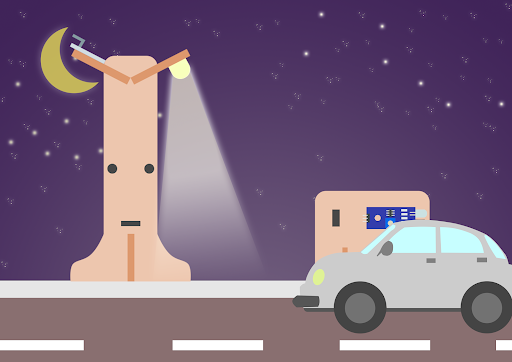
 
## 1.1 Goal

Make a smart street lamp which can automatically turn on when it is getting dark or senses a car coming from afar.

## 1.2 Background

### What is a smart street lamp?

Smart street lamp is a lamp which can open automatically when it senses a car coming from afar. Installing an auto-light can help the earth save electricity. When no car passes by, the light will automatically turn off.

### Smart street lamp operation

Light sensors should be able to detect the environmental brightness and obstacle Infrared avoidance sensor should be able to detect if there is a car coming. If it is getting dark and there is a car coming from afar, the LED light should turn on, vice versa.

 
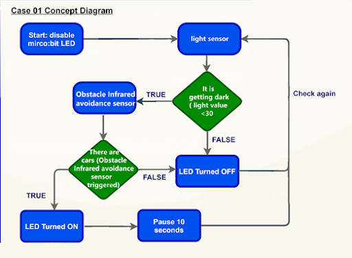

## 1.3 Part List

Micro:bit（1） 
Extension board（1） 
Obstacle Infrared avoidance sensor（1） 
Light sensor（1） 
White LED Light（1） 
3-pin module wire（1） 
Female To Female Dupont Cable Jumper Wire Dupont Line （6） 
M3*8mm screw  （4） 
M3 nut （4） 
Screwdriver（1） 
module A（1） 
module B（1） 

## 1.4 Assembly step
### Step 1 

Attach light sensor and white LED to A2 model with M3 * 8mm screws and nuts. 

 
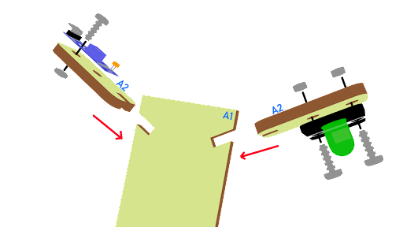

### Step 2 

Put the A2 model onto the A1 model, and put the A1 model onto the A3 model

 
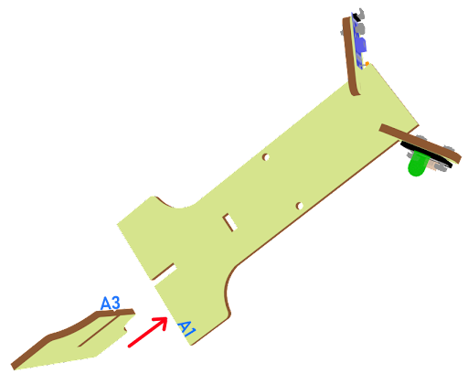

### Step 3 

Assembly completed! 

 
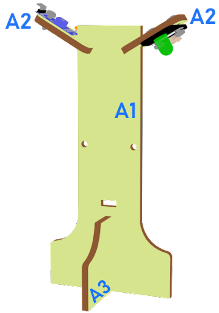

### Step 4

Attach obstacle Infrared avoidance sensor to B1 model with M3 * 8mm screws and nuts. 

 
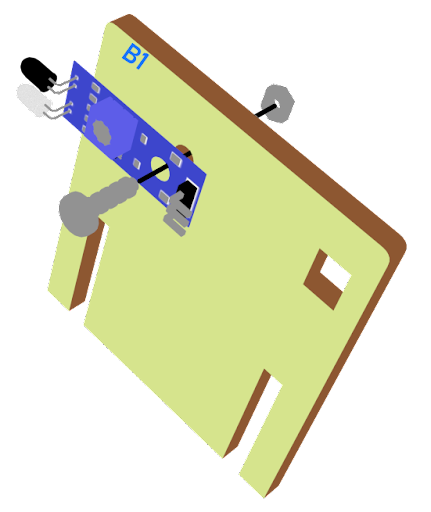

### Step 5 

Put the B1 model onto the B2 model.

 
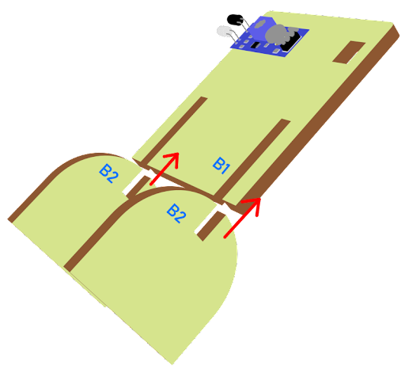
 
### Step 6 

Assembly completed! 

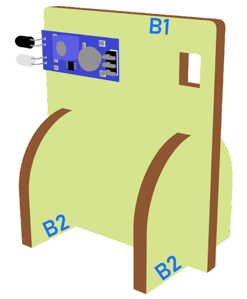

## 1.5. Hardware connect 

Connect obstacle Infrared avoidance sensor to P0 port 
Connect light sensor to P1 port 
Connect LED light to P2 port  

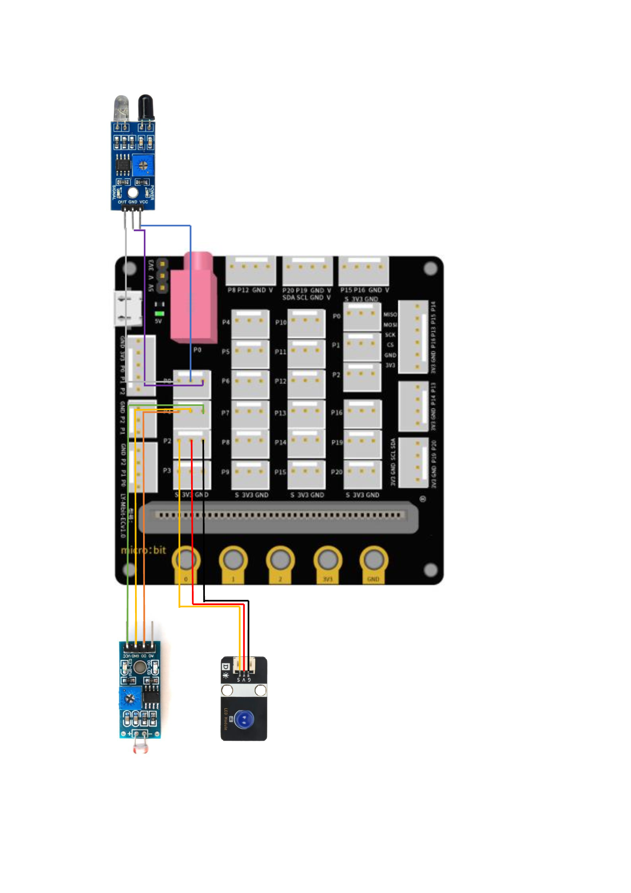
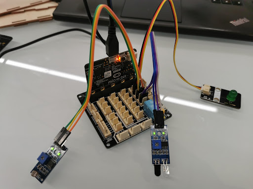

## 1.6. Programming (MakeCode) 

### Step 1. Disable micro:bit LED. 
 
+ Snap led enable false to on start  
+ Note that P3 is used as LED in default setting, LED need to be disable
 
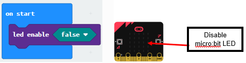

### Step 2. Turn on LED by light sensor and obstacle Infrared avoidance sensor
+ Drag forever from Basic
+ Snap if statement into forever
+ Set get light value (percentage) at P1 <40  and get motion (triggered or not) at P0 = true, into if statement that says motion is triggered, someone passes by.
+ Then, turn white LED to 1023 at P2 as turning on white LED and pause 10 seconds. 
+ Else, turn white LED at P2 to 0 as turning off. 

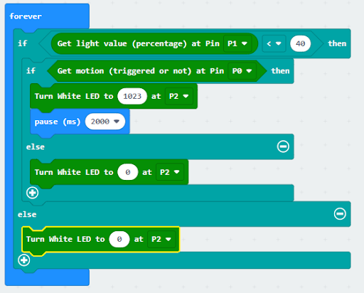

Full Solution  
MakeCode:https://makecode.microbit.org/_Mpriarcg0fJv

 

## 1.7 Result

An obstacle Infrared avoidance sensor is used to detect the motion of a car. If there is, the LED light will be turned on; otherwise, it will be turned off.

## 1.8 Think 

Q1. How can you use the obstacle Infrared avoidance sensor, other than turning on the light automatically?

