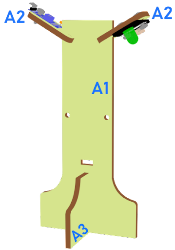
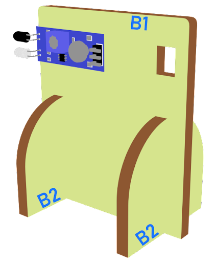
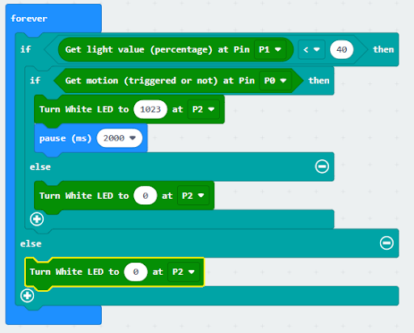

# Lesson 01: Automated Smart Street Lamp 自動智能街燈

 
## Goal 目標

Make a smart street lamp which can automatically turn on when it is getting dark or senses a car coming from afar.

製作一個智能街燈。當天黑或感應到遠處有車輛駛來，自動開啓路燈。

## Background 背景

### What is a smart street lamp? 什麽是智能街燈

Smart street lamp is a lamp which can open automatically when it senses a car coming from afar. Installing an auto-light can help the earth save electricity. When no car passes by, the light will automatically turn off.

智能街燈是指當感應到天黑或遠處有汽車駛來時可以自動打開的燈。安裝自動燈可以幫助地球節省電力。若天够光及當沒有車經過時，燈會自動關閉。

### Smart street lamp operation 智能街燈的運作

Light sensors should be able to detect the environmental brightness and obstacle Infrared avoidance sensor should be able to detect if there is a car coming. If it is getting dark and there is a car coming from afar, the LED light should turn on, vice versa.

光敏傳感器能檢測環境光度，紅外路障傳感器能檢測是否有汽車駛來。如果天黑了且感應到有汽車從遠處駛來，LED燈應該打開，反之亦然。

 

## Part List 材料準備

Micro:bit （1） 
Extension board 擴展板 （1） 
Obstacle Infrared avoidance sensor 紅外路障傳感器 （1） 
Light sensor 光敏傳感器 （1） 
White LED Light 白色LED燈 （1） 
3-pin module wire  PH2.0轉杜邦綫3P（1） 
母對母杜邦綫 Female To Female Dupont Cable Jumper Wire Dupont Line （6） 
M3*8mm screw  （4） 
M3 nut （4） 
Screwdriver 螺絲批（1） 
module A（1） 
module B（1） 

## Assembly step 組裝步驟
### Step 1 第一步

Attach light sensor and white LED to A2 model with M3 * 8mm screws and nuts. 

將光敏傳感器及白色LED燈安裝在模板A2上，並用M3*8mm螺絲及螺母固定。

 

### Step 2 第二步

Put the A2 model onto the A1 model, and put the A1 model onto the A3 model

把A2 模型放到A1模型上，再把A1放在A3上。

 

### Step 3 第三步

Assembly completed! 組裝完成!

 

### Step 4 第四步

Attach obstacle Infrared avoidance sensor to B1 model with M3 * 8mm screws and nuts. 

將紅外路障傳感器安裝在模板B1上，並用M3*8mm螺絲及螺母固定。 

 

### Step 5 第五步

Put the B1 model onto the B2 model. 把B1模型放到B2模型上。

 

 
### Step 6 第六步

Assembly completed! 組裝完成!

## Hardware connect 硬件連接

Connect obstacle Infrared avoidance sensor to P0 port 
Connect light sensor to P1 port 
Connect LED light to P2 port  

將紅外路障傳感器連接到P0端口。 
將光敏傳感器連接到P1端口。 
將白色LED燈連接到P2端口。 

## Programming (MakeCode) 編程

### Step 1. Disable micro:bit LED. 第一步 停用 micro:bit LED。
 
+ Snap led enable false to on start  將積木啓用設爲false拖放到當啓動時
+ Note that P3 is used as LED in default setting, LED need to be disable 注意，P3在默认设置中被用作LED，因此LED需要被禁用。
 
 

### Step 2. Turn on LED by light sensor and obstacle Infrared avoidance sensor 第二步 使用光敏傳感器和紅外路障傳感器打開 LED
+ Drag forever from Basic 從基本中拖出重複無數次 
+ Snap if statement into forever 將如果語句放入重複無數次中
+ Set get light value (percentage) at P1 <40  and get motion (triggered or not) at P0 = true, into if statement that says motion is triggered, someone passes by. 在如果語句中設定 get light value (percentage) at P1 <40 和 get motion (triggered or not) at P0 = true。
+ Then, turn white LED to 1023 at P2 as turning on white LED and pause 10 seconds. 然后，turn white LED to 1023 at P2，打開白色LED並暫停10秒。
+ Else, turn white LED at P2 to 0 as turning off. 否则，turn white LED at P2 to 0，關閉白色LED。

 

Full Solution  
MakeCode:https://makecode.microbit.org/_Mpriarcg0fJv

 

## Result 總結

An obstacle Infrared avoidance sensor is used to detect the motion of a car. If there is, the LED light will be turned on; otherwise, it will be turned off.

光敏傳感器用戶感應環境光度，紅外路障傳感器用於檢測車輛的運動。如果天黑了而有車輛經過，LED燈將會打開；否則，它將會關閉。

## Think 思考

Q1. How can you use the obstacle Infrared avoidance sensor, other than turning on the light automatically?

Q1. 除了自動開燈以外，紅外路障傳感器還能怎麽用？

