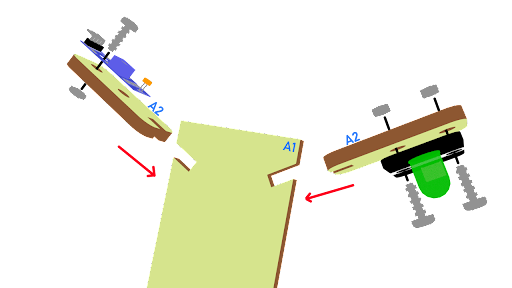

# 自動智能街燈

 
## 目標

製作一個智能街燈。當天黑或感應到遠處有車輛駛來，自動開啓路燈。

## 背景

### 什麽是智能街燈

智能街燈是指當感應到天黑或遠處有汽車駛來時可以自動打開的燈。安裝自動燈可以幫助地球節省電力。若天够光及當沒有車經過時，燈會自動關閉。

### 智能街燈的運作

光敏傳感器能檢測環境光度，紅外路障傳感器能檢測是否有汽車駛來。如果天黑了且感應到有汽車從遠處駛來，LED燈應該打開，反之亦然。

 

## 材料準備

Micro:bit （1） 
Extension board 擴展板 （1） 
Obstacle Infrared avoidance sensor 紅外路障傳感器 （1） 
Light sensor 光敏傳感器 （1） 
White LED Light 白色LED燈 （1） 
3-pin module wire  PH2.0轉杜邦綫3P（1） 
母對母杜邦綫 Female To Female Dupont Cable Jumper Wire Dupont Line （6） 
M3*8mm screw  （4） 
M3 nut （4） 
Screwdriver 螺絲批（1） 
module A（1） 
module B（1） 

## 組裝步驟
### 第一步

將光敏傳感器及白色LED燈安裝在模板A2上，並用M3*8mm螺絲及螺母固定。

 

### 第二步

把A2 模型放到A1模型上，再把A1放在A3上。

 

### 第三步

組裝完成!

 

### 第四步

將紅外路障傳感器安裝在模板B1上，並用M3*8mm螺絲及螺母固定。 

 

### 第五步

把B1模型放到B2模型上。

 

 
### 第六步

組裝完成!

## 硬件連接

將紅外路障傳感器連接到P0端口。 
將光敏傳感器連接到P1端口。 
將白色LED燈連接到P2端口。 

## 編程

### 第一步 停用 micro:bit LED。
 
+ 將積木啓用設爲false拖放到當啓動時
+ 注意，P3在默认设置中被用作LED，因此LED需要被禁用。
 

### 第二步 使用光敏傳感器和紅外路障傳感器打開 LED
+ 從基本中拖出重複無數次 
+ 將如果語句放入重複無數次中
+ 在如果語句中設定 get light value (percentage) at P1 <40 和 get motion (triggered or not) at P0 = true。
+ 然后，turn white LED to 1023 at P2，打開白色LED並暫停10秒。
+ 否则，turn white LED at P2 to 0，關閉白色LED。

Full Solution  
MakeCode:https://makecode.microbit.org/_Mpriarcg0fJv

 

## 總結

光敏傳感器用戶感應環境光度，紅外路障傳感器用於檢測車輛的運動。如果天黑了而有車輛經過，LED燈將會打開；否則，它將會關閉。

## 思考

Q1. 除了自動開燈以外，紅外路障傳感器還能怎麽用？

