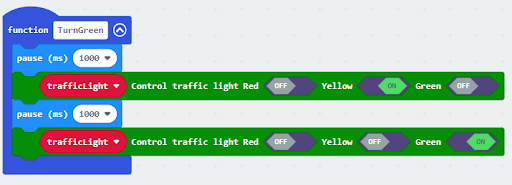

# Lesson 10: Intersection

## 10.1 Goal 

Make a smart traffic light system which automatically switches between red and green lights among different intersection traffic lights according to the road traffic situation. 

## 10.2 Background
### What is a smart traffic light? 

Smart traffic light systems are designed to maintain normal operation of the intersection. They automatically switch between red and green lights among different intersection traffic lights according to the road traffic situation.   

### Smart traffic light operation 
  

## 10.3 Part List 

Microbit （1） 
Expansion board （1） 
Distance sensor (2) 
Traffic light （2） 
4-pin module wire （2） 
Female To Female Dupont Cable Jumper Wire Dupont Line  （8） 
M2*8mm screw (8) 
M3*8mm screw (4) 
M2 nut （8） 
M3 nut （4） 
Screwdriver 
Module E (2) 
Module I（2） 

## 10.4 Assembly step 
### Step 1 

Attach the Traffic light Module to I1 model using M3*8 screw and nut. 

  

### Step 2 

Put the I1 model onto the I2 model. 

  
### Step 3 

Assembly completed! 

  

### Step 4 

Attach the distance sensor to E1 model using M4*8mm screw. 

  

### Step 5 

Put the E2 model on the E1 model. 

  

### Step 6

Assembly completed! 

  

## 10.5 Hardware connect 

Microbit 1：

Connect the Traffic light LED Module to P0 P1 P2 port 
Connect the Distance Sensor to P15 (trig)/ P16 (echo) port 

 

Microbit2:

Connect the Traffic light LED Module to P0 P1 P2 port 
Connect the Distance Sensor to P15 (trig)/ P16 (echo) port 

 

Microbit 3:

Car

 

Microbit4：

Car

## 10.6 Programming (MakeCode) 
### Traffic light 1：
### Step 1. Set up a new function (TurnRed) 
+ Snap pause to wait 1 second 
+ Control traffic light yellow on 
+ Snap pause to wait 1 second 
+ Control traffic light red on 
  

### Step 2. Set up a new function (TurnGreen) 
+ Snap pause to wait 1 second 
+ Control traffic light yellow on 
+ Snap pause to wait 1 second 
+ Control traffic light green on 
  

### Step 3. Initialize the program 
+ Drag set variable trafficLight to Traffic light pin setting Red P0 Yellow P1 Green P2 to on start 
+ Drag radio set group 10 to on start   
+ Control traffic light red on 
+ Pause for 5s 
  

### Step 4. Keep the green light status for 5 second 
+ Call function TurnGreen 
+ Pause 1.5s before TurnGreen 
+ Pause 3.5s after TurnGreen 
  

### Step 5. Keep the red light status for 5 second 
+ Call function TurnRed
+ set variable second to 50 
+ While second > 0, snap pause to 0.1 second and change second by -1.
  

### Step 6. Get distance value
+ Snap if statement into while loop, set get distance unit cm trig P15 echo P16 < 20

  

### Step 7. Control traffic light 2 and car by sending radio number
+ Drag radio send number 1 into if 
+ Drag radio send number 0 after TurnGreen 
+ Drag radio send string “R”  before TurnGreen 
+ Drag radio send string “G” before TurnRed 
  

Full solution: 
https://makecode.microbit.org/_Pm2eWtRwERU8

### Traffic light 2：
### Step 1. Set up new functions 
  

### Step 2. Initialize the program
+ Drag set variable trafficLight to Traffic light pin setting Red P0 Yellow P1 Green P2 to on start 
+ Drag radio set group 10 to on start   
+ Control traffic light green on 
+ Pause for 5s 
  

### Step 3. Control traffic light and car by receiving different number 
+ Snap if statement into on radio received receivedString 
+ Set receivedString =“R” and call TurnRed 
+ Set receivedString =“G” and call TurnGreen 
  

### Step 4. Keep the red light status for 5 second 
+ After TurnRed, set variable second to 50 
+ While second > 0, snap pause to 0.1 second and change second by -1.
+ Before TurnGreen, pause 1.5s 
+ After TurnGreen, pause 3.5s 
  

### Step 5. Get distance value and control the car
+ Snap if statement into while loop, set get distance unit cm trig P15 echo P16 < 20
+ Drag radio send number 3 into if 將廣播發送數字1拖入 if 句式
  

Full solution: 
https://makecode.microbit.org/_fudKTM57XTKA

### Car 1:
### Step 1. Set radio set group at start position 
+ Drag radio set group 10 to on start  
  

### Step 2. Control car by receiving different number 
+ Snap if statement into on radio received receivedNumber 
+ Set receivedNumber =1 and make the car stop 
+ Set receivedNumber=0 and make the car move forward 設
  

Full solution： 
https://makecode.microbit.org/_1o1iRhg3qfRF

### Car 2:
### Step 1. Set radio set group at start position 
+ Drag radio set group 10 to on start 
  

### Step 2. Control car by receiving different number 
+ Snap if statement into on radio received receivedNumber 
+ Set receivedNumber =3 and make the car stop 
+ Set receivedNumber=2 and make the car move forward 
  

Full solution： 
https://makecode.microbit.org/_YmH3PrRA14pC

## 10.7 Result 

Distance sensor is used to detect whether there are cars passing by. If it is yes (i.e., there are cars passing by in the intersection), it sends a signal to the cars in the corresponding direction and alerts them to stop, in order to maintain a normal traffic flow of the intersection. 

## 10.8 Think 

Challenge question: 

In case that it is a intersecion, there should be four traffic lights for four different directions. Can you write a program in that case?

