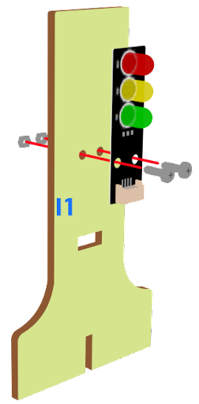

# 十字路口

## 目標

打造智能紅綠燈系統，根據道路交通情況，在不同路口紅綠燈之間自動切換紅綠燈。

## 背景
### 什麽是智能交通燈？

智能交通信號燈系統旨在維持十字路口的正常運行。 它們根據道路交通情況在不同的路口紅綠燈之間自動切換紅綠燈。

### 智能交通燈運作
  

## 材料準備

Microbit （1） 
Expansion board 擴展板 （1） 
Distance sensor 距離傳感器(2) 
Traffic light 交通燈 （2） 
4-pin module wire PH2.0轉杜邦綫4P（2） 
母對母杜邦綫 Female To Female Dupont Cable Jumper Wire Dupont Line  （8） 
M2*8mm screw (8) 
M3*8mm screw (4) 
M2 nut （8） 
M3 nut （4） 
螺絲批 
Module E (2) 
Module I（2） 

## 組裝步驟
### 第一步

用M3*8螺絲和螺母將交通燈模塊安裝到I1模型上。

  

### 第二步

把I1模型放到I2模型上。

  
### 第三步

組裝完成

  

### 第四步

使用M4螺釘將距離傳感器安裝到E1模型上。

  

### 第五步

把E2模型放在E1模型上。

  

### 第六步

組裝完成!

  

## 硬件連接

Microbit 1：

將交通LED模塊連接到P0 P1 P2埠。 
將距離傳感器連接到P14（Trig）/P15（echo）端口。 

 

Microbit2:

將交通LED模塊連接到P0 P1 P2埠。 
將距離傳感器連接到P14（Trig）/P15（echo）端口。 

 

Microbit 3:

Car

 

Microbit4：

Car

## 編程
### Traffic light 1：
### 設置一個新的功能（TurnRed）。
+ 暫停一秒
+ n 控制交通燈亮黃燈
+ 暫停一秒
+ 控制交通燈亮紅燈
  

### 設置一个新的功能（TurnGreen）。
+ 暫停一秒
+ 控制交通燈亮黃燈
+ 暫停一秒
+ 控制交通燈亮綠燈
  

### 初始化程式
+ 將 trafficLight to Traffic light pin setting Red P0 Yellow P1 Green P2 拖入 當啓動時
+ 將廣播群組設爲10拖入當啓動時
+ 控制交通燈亮紅燈
+ 暫停5秒
  

### 保留綠燈狀態五秒
+ 呼叫函數 TurnGreen
+ 在此前暫停1.5s
+ 在此後暫停3.5s
  

### 保留紅燈狀態五秒
+ 呼叫函數 TurnRed
+ 設定變數second為50
+ 當second大於0，停止0.1秒，並改變second減少1
  

### 獲得距離數值
+ 將get distance unit cm trig P15 echo P16 < 20的如果句式拖入循環中
  

### 發送廣播數字以控制交通燈及車輛
+ 將廣播發送數字1拖入 if 句式
+ 將廣播發送數字0拖到TurnGreen後
+ 將廣播發送字串“R”拖到TurnGreen前
+ 將廣播發送字串“G”拖到TurnRed前
  

Full solution: 
<a href="https://makecode.microbit.org/_Pm2eWtRwERU8">https://makecode.microbit.org/_Pm2eWtRwERU8</a>

### Traffic light 2：
### 設置新的功能。
  

### 初始化程序
+ 將 trafficLight to Traffic light pin setting Red P0 Yellow P1 Green P2 拖入當啓動時
+  將廣播群組設爲10拖入當啓動時
+ 控制交通燈亮綠燈
+ 暫停5秒
  

### 通過接收不同數字來控制交通燈及車輛
+ 將如果語句放入當收到廣播數字 receivedString 
+ 設receivedString=”R”，並呼叫TurnRed
+ S設receivedString=”G”，並呼叫TurnGreen
  

### 保留紅燈狀態五秒
+ 設定變數second為50
+ 當second大於0，停止0.1秒，並改變second減少1
+ 在此前暫停1.5s
+ 在此後暫停3.5s
  

### 獲得距離數值並控制車輛
+ 將get distance unit cm trig P15 echo P16 < 20的如果句式拖入循環中
+ 將廣播發送數字1拖入 if 句式
+ 將廣播發送數字0拖到TurnGreen後
  

Full solution: 
<a href="https://makecode.microbit.org/_fudKTM57XTKA">https://makecode.microbit.org/_fudKTM57XTKA</a>

### Car 1:
### 在起始位置設置廣播群組
+ 將廣播群組設爲10拖入當啓動時
  

### 通過接收不同數字來控制車輛
+ 將如果語句放入當收到廣播數字 receivedNumber 
+ 設receivedNumber =1，並控制刹車。
+ 設receivedNumber=0，並讓車向前移動。
  

Full solution： 
<a href="https://makecode.microbit.org/_1o1iRhg3qfRF">https://makecode.microbit.org/_1o1iRhg3qfRF</a>

### Car 2:
### 在起始位置設置廣播群組
+ 將廣播群組設爲10拖入當啓動時
  

### 通過接收不同數字來控制車輛
+ 將如果語句放入當收到廣播數字 receivedNumber 
+ 設receivedNumber =3，並控制刹車。
+ 設receivedNumber=2，並讓車向前移動。
  

Full solution： 
<a href="https://makecode.microbit.org/_YmH3PrRA14pC">https://makecode.microbit.org/_YmH3PrRA14pC</a>

## 總結

距離傳感器可用作感應是否有車輛經過。如果有，它會向有關方向的車輛發送信息，要求他們刹車。

## 思考

挑戰問題：

一般十字路口會有四個方向的紅綠燈和車流。你可以根據這種情況改寫程式嗎？

