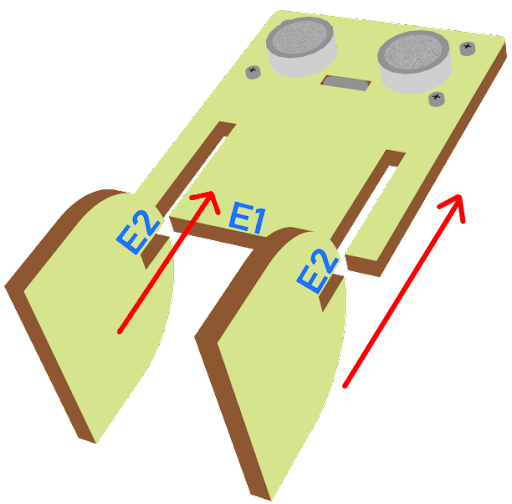
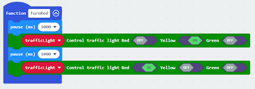
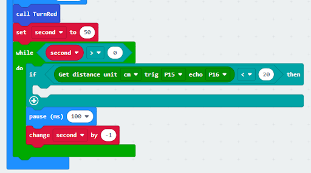
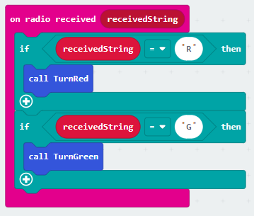
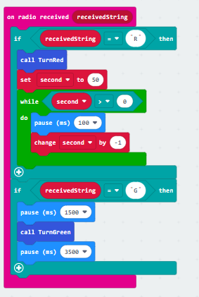

# Lesson 10: Intersection 十字路口

## Goal 目標

Make a smart traffic light system which automatically switches between red and green lights among different intersection traffic lights according to the road traffic situation. 

## Background 背景
### What is a smart traffic light? 什麽是智能交通燈？

Smart traffic light systems are designed to maintain normal operation of the intersection. They automatically switch between red and green lights among different intersection traffic lights according to the road traffic situation.   

### Smart traffic light operation 智能交通燈運作
  

## Part List 材料準備

Microbit （1） 
Expansion board 擴展板 （1） 
Distance sensor 距離傳感器(2) 
Traffic light 交通燈 （2） 
4-pin module wire PH2.0轉杜邦綫4P（2） 
母對母杜邦綫 Female To Female Dupont Cable Jumper Wire Dupont Line  （8） 
M2*8mm screw (8) 
M3*8mm screw (4) 
M2 nut （8） 
M3 nut （4） 
螺絲批 
Module E (2) 
Module I（2） 

## Assembly step 組裝步驟
### Step 1 第一步

Attach the Traffic light Module to I1 model using M3*8 screw and nut. 

用M3*8螺絲和螺母將交通燈模塊安裝到I1模型上。

  

### Step 2 第二步

Put the I1 model onto the I2 model. 把I1模型放到I2模型上。

  
### Step 3 第三步

Assembly completed! 組裝完成

  

### Step 4 第四步

Attach the distance sensor to E1 model using M4*8mm screw. 使用M4螺釘將距離傳感器安裝到E1模型上。

  

### Step 5 第五步

Put the E2 model on the E1 model. 把E2模型放在E1模型上。

  

### Step 6 第六步

Assembly completed! 組裝完成!

  

## Hardware connect 硬件連接

Microbit 1：

Connect the Traffic light LED Module to P0 P1 P2 port 
Connect the Distance Sensor to P15 (trig)/ P16 (echo) port 

將交通LED模塊連接到P0 P1 P2埠。 
將距離傳感器連接到P14（Trig）/P15（echo）端口。 

 

Microbit2:

Connect the Traffic light LED Module to P0 P1 P2 port 
Connect the Distance Sensor to P15 (trig)/ P16 (echo) port 

將交通LED模塊連接到P0 P1 P2埠。 
將距離傳感器連接到P14（Trig）/P15（echo）端口。 

 

Microbit 3:

Car

 

Microbit4：

Car

## Programming (MakeCode) 編程
### Traffic light 1：
### Step 1. Set up a new function (TurnRed) 設置一個新的功能（TurnRed）。
+ Snap pause to wait 1 second 暫停一秒
+ Control traffic light yellow on 控制交通燈亮黃燈
+ Snap pause to wait 1 second 暫停一秒
+ Control traffic light red on 控制交通燈亮紅燈
  

### Step 2. Set up a new function (TurnGreen) 設置一个新的功能（TurnGreen）。
+ Snap pause to wait 1 second 暫停一秒
+ Control traffic light yellow on 控制交通燈亮黃燈
+ Snap pause to wait 1 second 暫停一秒
+ Control traffic light green on 控制交通燈亮綠燈
  

### Step 3. Initialize the program 初始化程式
+ Drag set variable trafficLight to Traffic light pin setting Red P0 Yellow P1 Green P2 to on start 將 trafficLight to Traffic light pin setting Red P0 Yellow P1 Green P2 拖入 當啓動時
+ Drag radio set group 10 to on start   將廣播群組設爲10拖入當啓動時
+ Control traffic light red on 控制交通燈亮紅燈
+ Pause for 5s 暫停5秒
  

### Step 4. Keep the green light status for 5 second 保留綠燈狀態五秒
+ Call function TurnGreen 呼叫函數 TurnFreen
+ Pause 1.5s before TurnGreen 在此前暫停1.5s
+ Pause 3.5s after TurnGreen 在此後暫停3.5s
  

### Step 5. Keep the red light status for 5 second 保留紅燈狀態五秒
+ Call function TurnRed
+ set variable second to 50 設定變數second為50
+ While second > 0, snap pause to 0.1 second and change second by -1.當second大於0，停止0.1秒，並改變second減少1
  

### Step 6. Get distance value獲得距離數值
+ Snap if statement into while loop, set get distance unit cm trig P15 echo P16 < 20
+ 將get distance unit cm trig P15 echo P16 < 20的如果句式拖入循環中
  

### Step 7. Control traffic light 2 and car by sending radio number發送廣播數字以控制交通燈及車輛
+ Drag radio send number 1 into if 將廣播發送數字1拖入 if 句式
+ Drag radio send number 0 after TurnGreen 將廣播發送數字0拖到TurnGreen後
+ Drag radio send string “R”  before TurnGreen 將廣播發送字串“R”拖到TurnGreen前
+ Drag radio send string “G” before TurnRed 將廣播發送字串“G”拖到TurnRed前
  

Full solution: 
https://makecode.microbit.org/_Pm2eWtRwERU8

### Traffic light 2：
### Step 1. Set up new functions  設置新的功能。
  

### Step 2. Initialize the program
+ Drag set variable trafficLight to Traffic light pin setting Red P0 Yellow P1 Green P2 to on start 將 trafficLight to Traffic light pin setting Red P0 Yellow P1 Green P2 拖入當啓動時
+ Drag radio set group 10 to on start   將廣播群組設爲10拖入當啓動時
+ Control traffic light green on 控制交通燈亮綠燈
+ Pause for 5s 暫停5秒
  

### Step 3. Control traffic light and car by receiving different number 通過接收不同數字來控制交通燈及車輛
+ Snap if statement into on radio received receivedString 將如果語句放入當收到廣播數字 receivedString 
+ Set receivedString =“R” and call TurnRed 設receivedString=”R”，並呼叫TurnRed
+ Set receivedString =“G” and call TurnGreen 設receivedString=”G”，並呼叫TurnGreen
  

### Step 4. Keep the red light status for 5 second 保留紅燈狀態五秒
+ After TurnRed, set variable second to 50 設定變數second為50
+ While second > 0, snap pause to 0.1 second and change second by -1.當second大於0，停止0.1秒，並改變second減少1
+ Before TurnGreen, pause 1.5s 
+ After TurnGreen, pause 3.5s 
  

### Step 5. Get distance value and control the car獲得距離數值並控制車輛
+ Snap if statement into while loop, set get distance unit cm trig P15 echo P16 < 20
+ 將get distance unit cm trig P15 echo P16 < 20的如果句式拖入循環中
+ Drag radio send number 3 into if 將廣播發送數字1拖入 if 句式
+ Drag radio send number 2 after TurnGreen 將廣播發送數字0拖到TurnGreen後
  

Full solution: 
https://makecode.microbit.org/_fudKTM57XTKA

### Car 1:
### Step 1. Set radio set group at start position 在起始位置設置廣播群組
+ Drag radio set group 10 to on start  將廣播群組設爲10拖入當啓動時
  

### Step 2. Control car by receiving different number 通過接收不同數字來控制車輛
+ Snap if statement into on radio received receivedNumber 將如果語句放入當收到廣播數字 receivedNumber 
+ Set receivedNumber =1 and make the car stop 設receivedNumber =1，並控制刹車。
+ Set receivedNumber=0 and make the car move forward 設receivedNumber=0，並讓車向前移動。
  

Full solution： 
https://makecode.microbit.org/_1o1iRhg3qfRF

### Car 2:
### Step 1. Set radio set group at start position 在起始位置設置廣播群組
+ Drag radio set group 10 to on start  將廣播群組設爲10拖入當啓動時
  

### Step 2. Control car by receiving different number 通過接收不同數字來控制車輛
+ Snap if statement into on radio received receivedNumber 將如果語句放入當收到廣播數字 receivedNumber 
+ Set receivedNumber =3 and make the car stop 設receivedNumber =3，並控制刹車。
+ Set receivedNumber=2 and make the car move forward 設receivedNumber=2，並讓車向前移動。
  

Full solution： 
https://makecode.microbit.org/_YmH3PrRA14pC

## Result 總結

Distance sensor is used to detect whether there are cars passing by. If it is yes (i.e., there are cars passing by in the intersection), it sends a signal to the cars in the corresponding direction and alerts them to stop, in order to maintain a normal traffic flow of the intersection. 

距離傳感器可用作感應是否有車輛經過。如果有，它會向有關方向的車輛發送信息，要求他們刹車。

## Think 思考

Challenge question: 

In case that it is a intersecion, there should be four traffic lights for four different directions. Can you write a program in that case?

挑戰問題：

一般十字路口會有四個方向的紅綠燈和車流。你可以根據這種情況改寫程式嗎？

