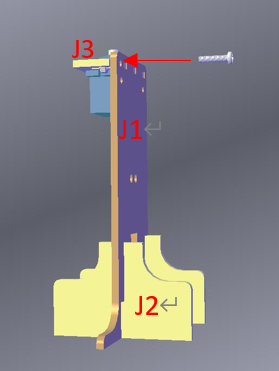

# 智能路牌

## 目標

製作一個智能路牌，在不同的時段展示適當的交通標誌。

## 背景
### 什麼是智能路牌?

智能電子指路牌，是機械工程和互聯網結合的革命性產品，智能電子指路牌將導航、大數據採集、分析多種現代信息功能集於一身。以智能導視為基礎，成為現代公共空間信息服務的一站式解決方案！車輛實現自動轉向，提高了車輛的機動性、城市效率和生產力，將乘客盡快送到目的地。

### 智能路牌運作

 
## 材料準備

MicroBit (1) 
Expansion board (1) 
SG90 Servo (1) 
M2*8 screw (2)  
M2*8 nut (2) 
M3*12 screw (2)  
M3*12 nut (2)  
螺絲批  
Module J (5) 

## 組裝步驟
### 第一步

把J1模型放到J2模型上。

 

### 第二步

把J3模型放到J1模型上。

 

### 第三步

使用M2*8mm螺絲及M2螺絲帽將SG90 Servo安裝在J3模型上，然後把M3螺絲帽放在J3模型右方的空隙中。

 

### 第四步

使用M3*8mm螺絲以連接J1模型及J3模型。

 

### 第五步

使用SG90 Servo提供的螺絲釘連接J4模型及SG90 Servo。

 

### 第六步

把M3螺絲帽放在J5模型的空隙中。

 

### 第七步

把J5模型放在J4模型上。

 

### 第八步

使用M3*8mm螺絲以連接J4模型及J5模型，然後把印有停止的紙張貼在J5模型上。

 

### 第九步

組裝完成!

 

## Hardware connect 硬件連接

將舵機連接到P3端口

## 編程
### 新增函數庫

+ 點擊擴展
+ 輸入StemhubCity後點擊函數庫

### 更新時間。

+ 暫停1秒
+ 然後將time增加1
+ 如果time等於25則將time設為0

### 初始化時間

+ 將time設為0

### 檢查時間及更改路牌

+ 呼叫函數TimeChange 以改變時間
+ 在stemhubcity函庫拖出兩個turn servo to 0 degree at P0
+ 分別把turn servo to 0 degree at P0放在如果time <= 12 中及否則中
+ 然後按下圖分別把turn servo to 0 degree at P0改為turn servo to 0 degree at P3及turn servo to 180 degree at P3

## 總結

交通標誌的轉換是由舵機控制的。每十二秒的間隔，交通標誌會轉換一次。

## 思考

挑戰問題:

你能為十字路口設計路牌嗎?

