# Lesson 02: Car Speed Monitoring
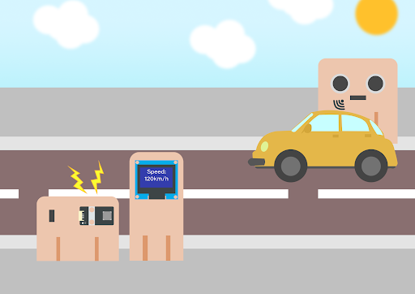

## 2.1 Goal

Make a car speed monitor to detect car speed on the road. If it exceeds the speed limit, the buzzer will alert.

  
## 2.2 background 

### What is car speed monitoring? 

It is an automatic system to check car speed on the road at a certain time interval. There are cars often over-speed causing traffic accidents, therefore installing a car speed monitoring is a must to minimize the chances of traffic accidents.

### Car speed monitor operation 

The distance sensor measures two different distances at a certain time interval, and therefore car speed can be calculated and be shown on the OLED.

Every 500ms (0.5 second), the distance sensor will keep updating the distance between the sensor and the car.

  
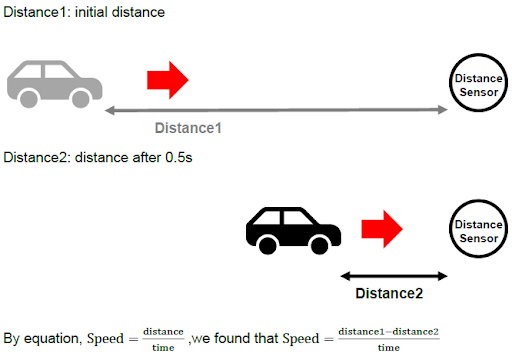

If distance 1 ≥ distance 2, that’s say the car is moving towards. The moving distance is distance1 -distance2. The speed is (distance1-distance2)/0.5 (unit: cm/s)

If distance 1 = distance 2, that’s say the car has stopped moving or there are no cars. The moving distance and speed are 0

For car speed < 0, it is the exceptional case (the car turns left/right and leaves the road) and the speed will not be shown.

  
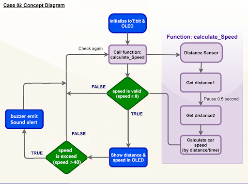

## 2.3 Part List 

Microbit （1） 
Extension board （1） 
Distance sensor  （1） 
Buzzer  （1） 
OLED （1） 
3-pin module wire （1） 
Female To Female Dupont Cable Jumper Wire Dupont Line （8） 
M3*8mm screw（2） 
M2*8mm screw（8） 
M3 nut （2） 
M2 nut （8） 
Screwdriver （1） 
Module C （1） 
Module D（1） 
Module E （1） 

## 2.4 Assembly step 
### Step 1 

Attach the buzzer to C1 model using M3 * 8mm screw and nut.

  
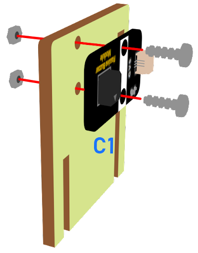

### Step 2

Put the C1 model onto the C2 model. 

  
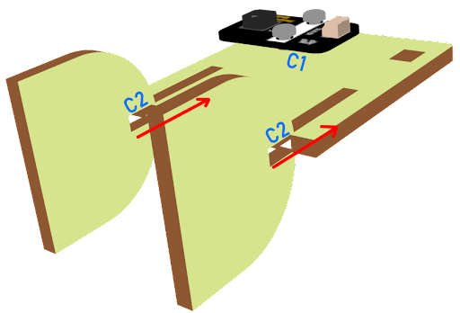

### Step 3 

Assembly completed! 

  
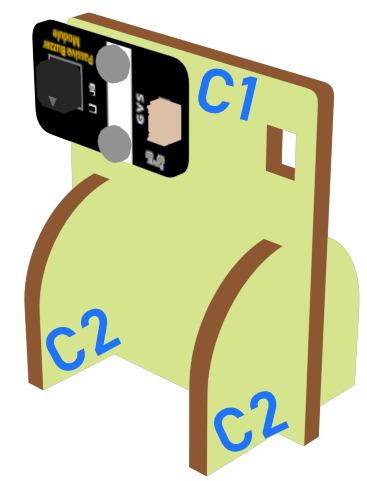

### Step 4 

Attach the OLED to D1 model using M2 * 8mm screw and nut. 

  
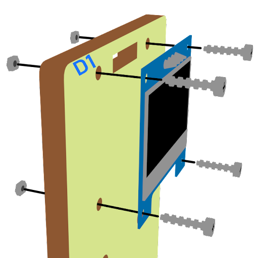

### Step 5 

Put the D1 model onto the D2 model. 

  
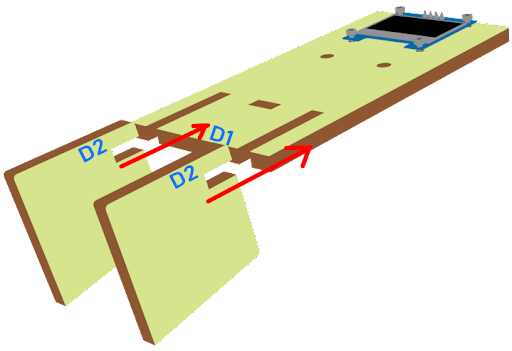

### Step 6 

Assembly completed! 

  
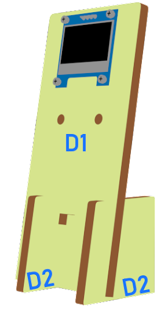

### Step 7 

Attach the distance sensor to E1 model using M2*8mm screw. 

  

### Step 8 

Put the E1 model on the E2 model. 

  

### Step 9 

Assembly completed!

  

## 2.5 Hardware connect 

Connect the Distance Sensor to P14 (trig)/ P15 (echo) port  
Extend the connection of OLED to the I2C connection port  
Connect buzzer to P0 port  

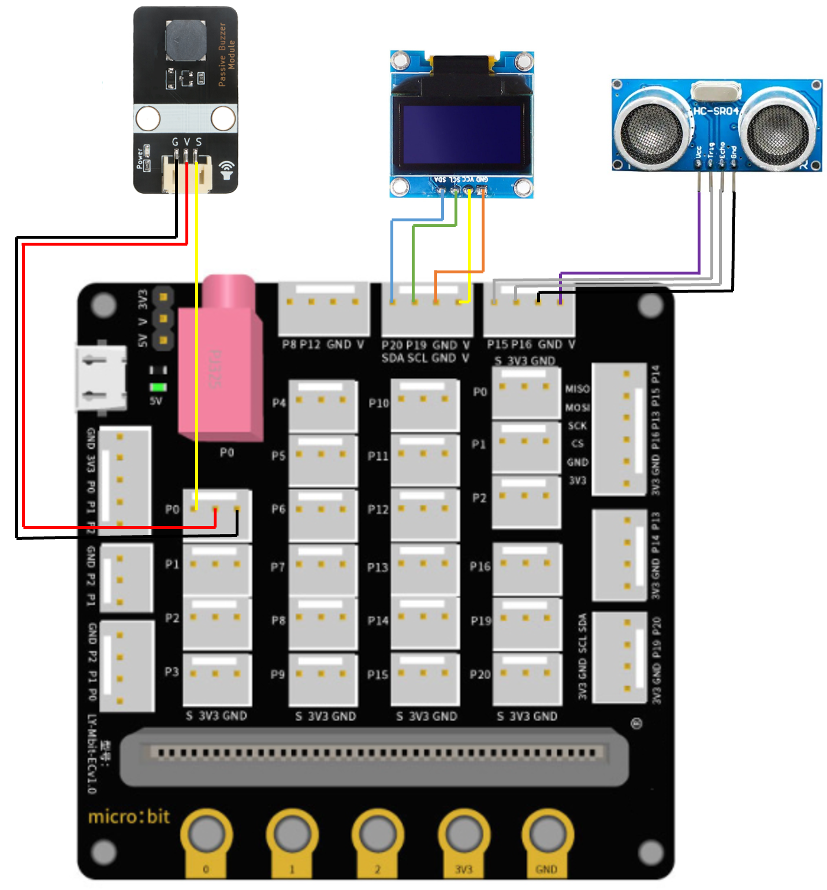
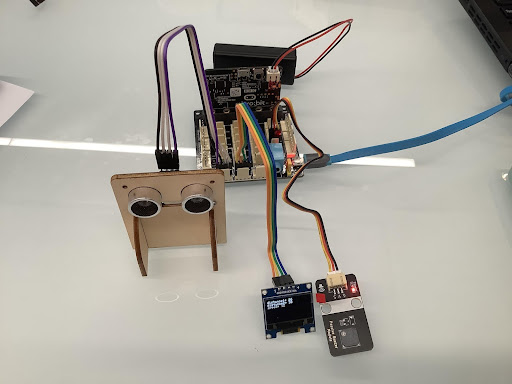

## 2.6 Programming (MakeCode) 
### Step 1. Initialize OLED screen 

+ Drag Initialize OLED with width:128, height: 64 to on start  
+ Set distance1, distance2 and speed to 0 from variables 
  
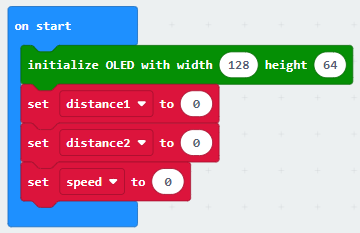

### Step 2. Set up function (calculate_Speed) 
+ Set up a new function calculate_Speed from Advanced > Functions.  
+ Set distance1 to get distance unit cm trig P14 echo P15 (distance from the car to the distance sensor before 0.5 second) Drag Pause to wait 500ms and set distance2 to get distance unit cm trig P14 echo P15 (distance from the car to the distance sensor after 0.5 second) 
+ By the equation of speed = distance / time. We get the speed of the moving car to (distance1-distance2)/0.5 (unit: cm/s) 
  
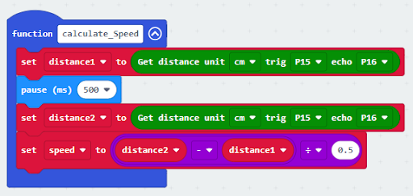

### Step 3. Calculate car speed 
+ In block forever, call function calculate_Speed from Advanced > Functions to get the speed of the moving car 
+ Snap If statement into the loop 
+ Snap clear OLED display from OLED to avoid overlap 
+ Snap show string and show value of variables distance1, distance2 and speed 
  
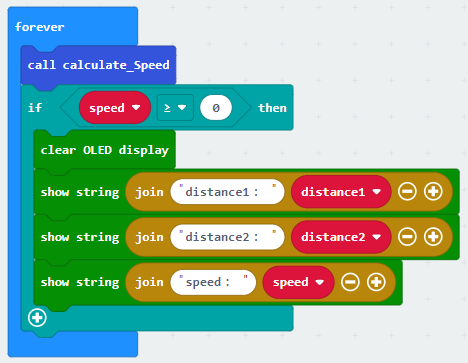

### Step 4. buzzer 
+ Snap If statement into the loop 
+ If speed ≥40, then snap play tone Middle C for 1 beat from music 
  
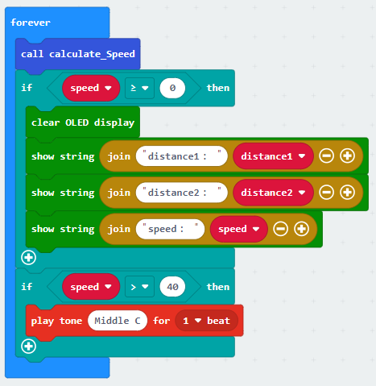

Full Solution 
MakeCode: https://makecode.microbit.org/_ehC0Pwc6078v

## 2.7 Result 總結

It will keep checking the distance of cars from distance sensor by distance sensor every 500ms. The speed of the cars will be shown on OLED. If it exceeds the speed limit, the buzzer will alert.

## 2.8 Think 思考

How can we set another alert to notify that there is car over-speeding?

