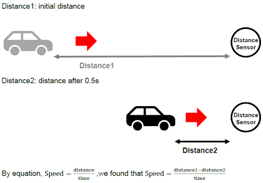
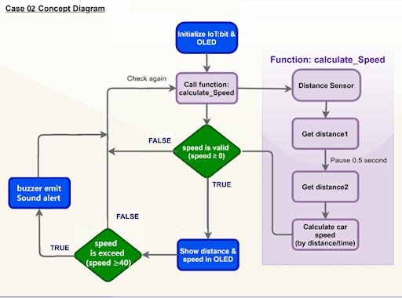
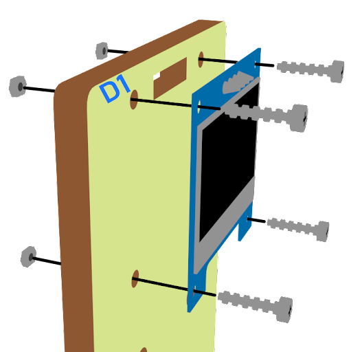
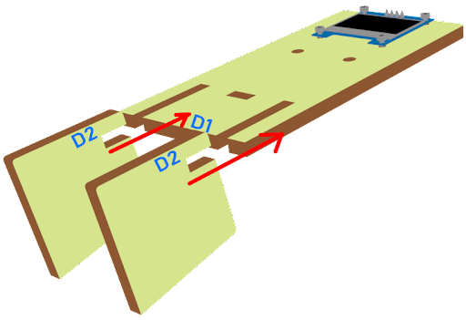
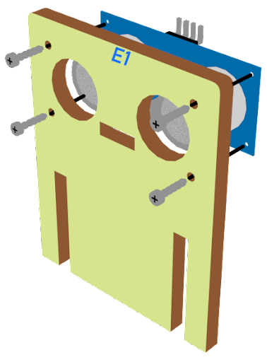
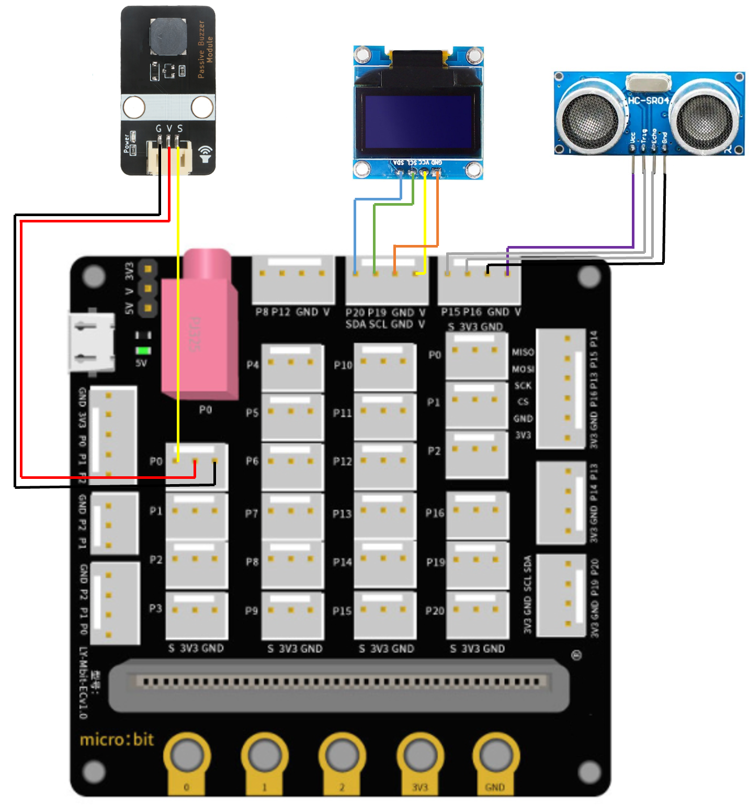
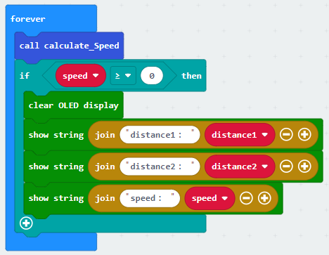

# Lesson 02: Car Speed Monitoring 車速監測

## 2.1 Goal 目標

Make a car speed monitor to detect car speed on the road. If it exceeds the speed limit, the buzzer will alert.

製作車速檢測器，實時顯示在OLED上。如果超速，蜂鳴器將會響起以示警告。

## 2.2 background 背景

### What is car speed monitoring? 什麽是車速檢測

It is an automatic system to check car speed on the road at a certain time interval. There are cars often over-speed causing traffic accidents, therefore installing a car speed monitoring is a must to minimize the chances of traffic accidents.

它是一個自動系統，在一定時間間隔內檢查道路上的汽車速度。有的汽車經常超速造成交通事故，因此安裝汽車速度監測是必須的，以減少交通事故的發生。

### Car speed monitor operation 車速檢測運作

The distance sensor measures two different distances at a certain time interval, and therefore car speed can be calculated and be shown on the OLED.

距
傳感器在一定的時間間隔內測量兩個不同的距離，因此可以計算出汽車的速度並顯示在OLED上。

 

Every 500ms (0.5 second), the distance sensor will keep updating the distance between the sensor and the car.

每隔500毫秒（0.5秒），距離傳感器就會持續更新傳感器和汽車之間的距離。

  

If distance 1 ≥ distance 2, that’s say the car is moving towards. The moving distance is distance1 -distance2. The speed is (distance1-distance2)/0.5 (unit: cm/s)

如果距離1≥距離2，那就說明汽車正向這邊駛來。移動的距離是距離1-距離2。速度是（距離1-距離2）/0.5（單位：厘米/秒）。

If distance 1 = distance 2, that’s say the car has stopped moving or there are no cars. The moving distance and speed are 0

如果距離1=距離2，就表示汽車已經停止移動或者沒有汽車。移動距離和速度為0。

For car speed < 0, it is the exceptional case (the car turns left/right and leaves the road) and the speed will not be shown.

對於汽車速度<0，是特殊情況（汽車左轉/右轉，離開道路），速度不會顯示。

  

## 2.3 Part List 材料準備

Microbit （1） 
Extension board 擴展板（1） 
Distance sensor 距離傳感器 （1） 
Buzzer 蜂鳴器 （1） 
OLED （1） 
3-pin module wire （1） 
母對母杜邦綫 Female To Female Dupont Cable Jumper Wire Dupont Line （8） 
M3*8mm screw（2） 
M2*8mm screw（8） 
M3 nut （2） 
M2 nut （8） 
Screwdriver （1） 
Module C （1） 
Module D（1） 
Module E （1） 

## 2.4 Assembly step 組裝步驟
### Step 1 第一步

Attach the buzzer to C1 model using M3 * 8mm screw and nut. 用M3*8毫米的螺釘和螺母將蜂鳴器安裝到C1模型上。

  

### Step 2 第二步

Put the C1 model onto the C2 model. 把C1模型放到C2模型上。

  

### Step 3 第三步

Assembly completed! 組裝完成!

  

### Step 4 第四步

Attach the OLED to D1 model using M2 * 8mm screw and nut. 用M2*8毫米的螺釘和螺母將OLED安裝到D1模型上。

  

### Step 5 第五步

Put the D1 model onto the D2 model. 把D1模型放到D2模型上。

  

### Step 6 第六步

Assembly completed! 組裝完成!

  

### Step 7 第七步

Attach the distance sensor to E1 model using M2*8mm screw. 使用M2*8mm螺絲將距離傳感器安裝到E1模型上。

  

### Step 8 第八步

Put the E1 model on the E2 model. 把E1模型放在E2模型上。

  

### Step 9 第九步

Assembly completed! 組裝完成!

  

## 2.5 Hardware connect 硬件連接

Connect the Distance Sensor to P14 (trig)/ P15 (echo) port  
Extend the connection of OLED to the I2C connection port  
Connect buzzer to P0 port  

將距離傳感器連接到P14（Trig）/P15（echo）埠上。 
將OLED的連接延伸到I2C連接埠 
將蜂鳴器連接到P0端口 

## 2.6 Programming (MakeCode) 編程
### Step 1. Initialize OLED screen 初始化OLED屏幕

+ Drag Initialize OLED with width:128, height: 64 to on start  拖動OLED初始化寬：128高:64，至當啟動時。
+ Set distance1, distance2 and speed to 0 from variables 從變數中將distance1、distance2和speed設為0。
  

### Step 2. Set up function (calculate_Speed) 設定函數（計算速度）
+ Set up a new function calculate_Speed from Advanced > Functions.  從高級>功能中定義函式calculate_Speed。
+ Set distance1 to get distance unit cm trig P14 echo P15 (distance from the car to the distance sensor before 0.5 second) Drag Pause to wait 500ms and set distance2 to get distance unit cm trig P14 echo P15 (distance from the car to the distance sensor after 0.5 second) 將distance1設爲get distance unit cm trig P14 echo P15（0.5秒前從汽車到距離傳感器的距離） 拖動Pause等待500ms，將distance2設爲get distance unit cm trig P14 echo P15 （0.5秒後從汽車到距離傳感器的距離）。
+ By the equation of speed = distance / time. We get the speed of the moving car to (distance1-distance2)/0.5 (unit: cm/s) 根據速度=距離/時間的方程式，我們得到移動的汽車的速度為（distance1-distance2）/0.5（單位：cm/s）。
  

### Step 3. Calculate car speed 計算車速
+ In block forever, call function calculate_Speed from Advanced > Functions to get the speed of the moving car 在重複無限次塊中，從高級>函數中呼叫函式calculate_Speed，以獲得移動的汽車的速度。
+ Snap If statement into the loop 將如果語句放入循環中
+ Snap clear OLED display from OLED to avoid overlap 從OLED中拖出清除OLED顯示，以避免重疊。
+ Snap show string and show value of variables distance1, distance2 and speed 拖出新行顯示字符串並顯示變數distance1、distance2和speed的值。

### Step 4. buzzer 
+ Snap If statement into the loop 將如果語句放入循環中
+ If speed ≥40, then snap play tone Middle C for 1 beat from music 如果speed≥40，那麼演奏音階中音C持續一拍
  

Full Solution 
MakeCode: https://makecode.microbit.org/_ehC0Pwc6078v

## 2.7 Result 總結

It will keep checking the distance of cars from distance sensor by distance sensor every 500ms. The speed of the cars will be shown on OLED. If it exceeds the speed limit, the buzzer will alert.

每隔500ms，它會通過距離傳感器不斷檢查汽車與距離傳感器之間的距離。汽車的速度將顯示在OLED上。如果超速，蜂鳴器將會響起以示警告。

## 2.8 Think 思考

How can we set another alert to notify that there is car over-speeding?

我們如何設置另一個警報來通知有車超速？

