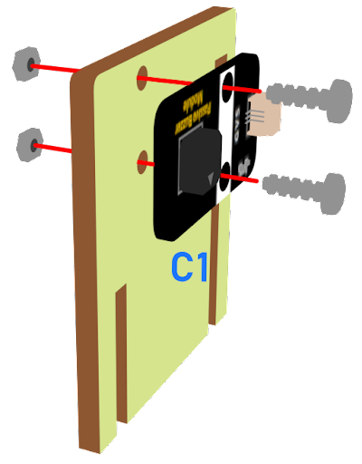
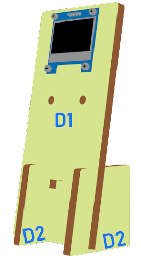

# 車速監測

## 目標

製作車速檢測器，實時顯示在OLED上。如果超速，蜂鳴器將會響起以示警告。

## 背景

### 什麽是車速檢測

它是一個自動系統，在一定時間間隔內檢查道路上的汽車速度。有的汽車經常超速造成交通事故，因此安裝汽車速度監測是必須的，以減少交通事故的發生。

### 車速檢測運作

距
傳感器在一定的時間間隔內測量兩個不同的距離，因此可以計算出汽車的速度並顯示在OLED上。

每隔500毫秒（0.5秒），距離傳感器就會持續更新傳感器和汽車之間的距離。

  

如果距離1≥距離2，那就說明汽車正向這邊駛來。移動的距離是距離1-距離2。速度是（距離1-距離2）/0.5（單位：厘米/秒）。

如果距離1=距離2，就表示汽車已經停止移動或者沒有汽車。移動距離和速度為0。

對於汽車速度<0，是特殊情況（汽車左轉/右轉，離開道路），速度不會顯示。

  

## 材料準備

Microbit （1） 
Extension board 擴展板（1） 
Distance sensor 距離傳感器 （1） 
Buzzer 蜂鳴器 （1） 
OLED （1） 
3-pin module wire （1） 
母對母杜邦綫 Female To Female Dupont Cable Jumper Wire Dupont Line （8） 
M3*8mm screw（2） 
M2*8mm screw（8） 
M3 nut （2） 
M2 nut （8） 
Screwdriver （1） 
Module C （1） 
Module D（1） 
Module E （1） 

## 組裝步驟
### 第一步

用M3*8毫米的螺釘和螺母將蜂鳴器安裝到C1模型上。

  

### 第二步

把C1模型放到C2模型上。

  

### 第三步

組裝完成!

  

### 第四步

用M2*8毫米的螺釘和螺母將OLED安裝到D1模型上。

  

### 第五步

把D1模型放到D2模型上。

  

### 第六步

組裝完成!

  

### 第七步

使用M2*8mm螺絲將距離傳感器安裝到E1模型上。

  

### 第八步

把E1模型放在E2模型上。

  

### 第九步

組裝完成!

  

## 硬件連接

將距離傳感器連接到P14（Trig）/P15（echo）埠上。 
將OLED的連接延伸到I2C連接埠 
將蜂鳴器連接到P0端口 

## 編程
### 初始化OLED屏幕

+ 拖動OLED初始化寬：128高:64，至當啟動時。
+ 從變數中將distance1、distance2和speed設為0。
  

### 設定函數（計算速度）
+ 從高級>功能中定義函式calculate_Speed。
+ 將distance1設爲get distance unit cm trig P14 echo P15（0.5秒前從汽車到距離傳感器的距離） 拖動Pause等待500ms，將distance2設爲get distance unit cm trig P14 echo P15 （0.5秒後從汽車到距離傳感器的距離）。
+ 根據速度=距離/時間的方程式，我們得到移動的汽車的速度為（distance1-distance2）/0.5（單位：cm/s）。
  

### 計算車速
+ 在重複無限次塊中，從高級>函數中呼叫函式calculate_Speed，以獲得移動的汽車的速度。
+ 將如果語句放入循環中
+ 從OLED中拖出清除OLED顯示，以避免重疊。
+ 拖出新行顯示字符串並顯示變數distance1、distance2和speed的值。

###  蜂鳴器
+ 將如果語句放入循環中
+ 如果speed≥40，那麼演奏音階中音C持續一拍
  

Full Solution 
MakeCode: <a href="https://makecode.microbit.org/_ehC0Pwc6078v">https://makecode.microbit.org/_ehC0Pwc6078v</a>

## 總結

每隔500ms，它會通過距離傳感器不斷檢查汽車與距離傳感器之間的距離。汽車的速度將顯示在OLED上。如果超速，蜂鳴器將會響起以示警告。

## Think 思考

How can we set another alert to notify that there is car over-speeding?

我們如何設置另一個警報來通知有車超速？

