# Lesson 03: Unloading Alert System
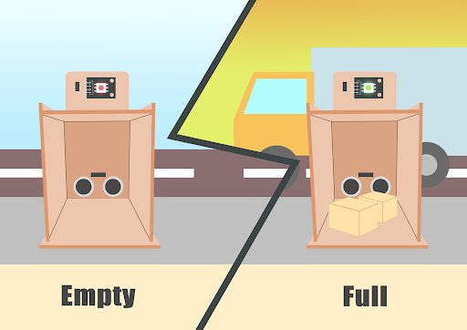

## 3.1 Goal

There are sensors in the unloading area. If the unloading area senses that an object has been placed in the unloading area, LED will be turned on to report the situation.

## 3.2 Background 
### What is an Unloading alert system? 

The LED lights in the unloading area can distinguish whether the goods are received or not. When the goods are delivered and placed in the unloading area, the LED light will turn green and the person in charge will be notified immediately to confirm the receipt.

### Unloading alert system operation 

The distance sensor should be able to sense the position of goods placed on the unloading area. A LED can be used to emit different colors of light (green and red light), which represent if the goods arrive.

  
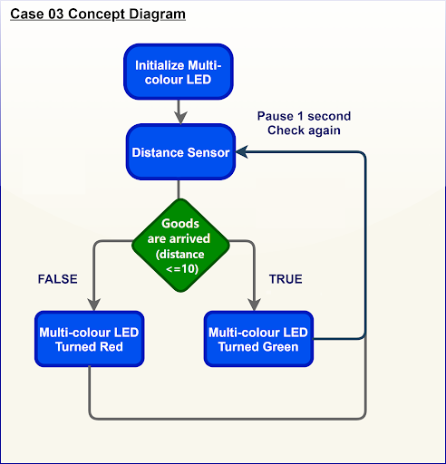

## 3.3 Part List 

Microbit （1） 
Extension board （1） 
Multi-color LED （1） 
Distance sensor  （1） 
 Female To Female Dupont Cable Jumper Wire Dupont Line （8） 
M2*8mm screw （6） 
M2 nut （6） 
Screwdriver（1） 
Model F （1） 

## 3.4 Assembly step 
### Step 1 第一步

Attach the distance sensor to F1 model with M2 * 8mm screw.

  
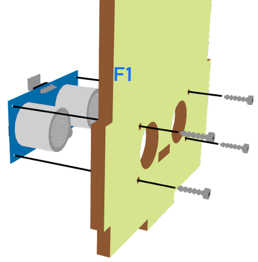

### Step 2 

Put together all the boards (F1-F4).

  

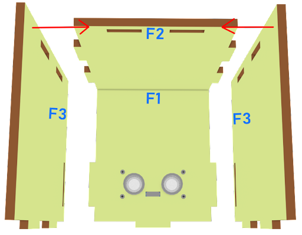
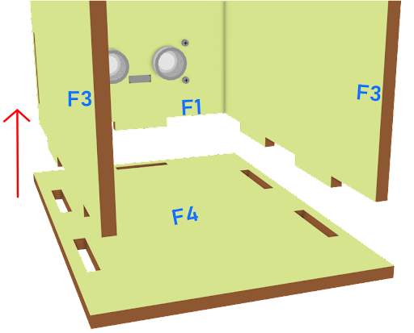

### Step3 

Attach the Multi-colour LED to F5 model with M2 * 8mm screws and nuts, and put it on F2.

  
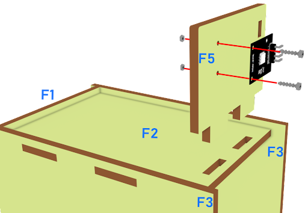

### Step 4 

Assembly completed! 

  
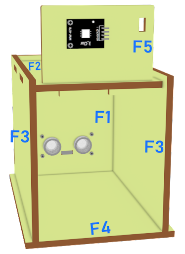

## 3.5 Hardware connect 

Connect the Distance Sensor to P15 (trig)/ P16 (echo) port  
Connect Multi-color LED to P0 P1 P2 port  

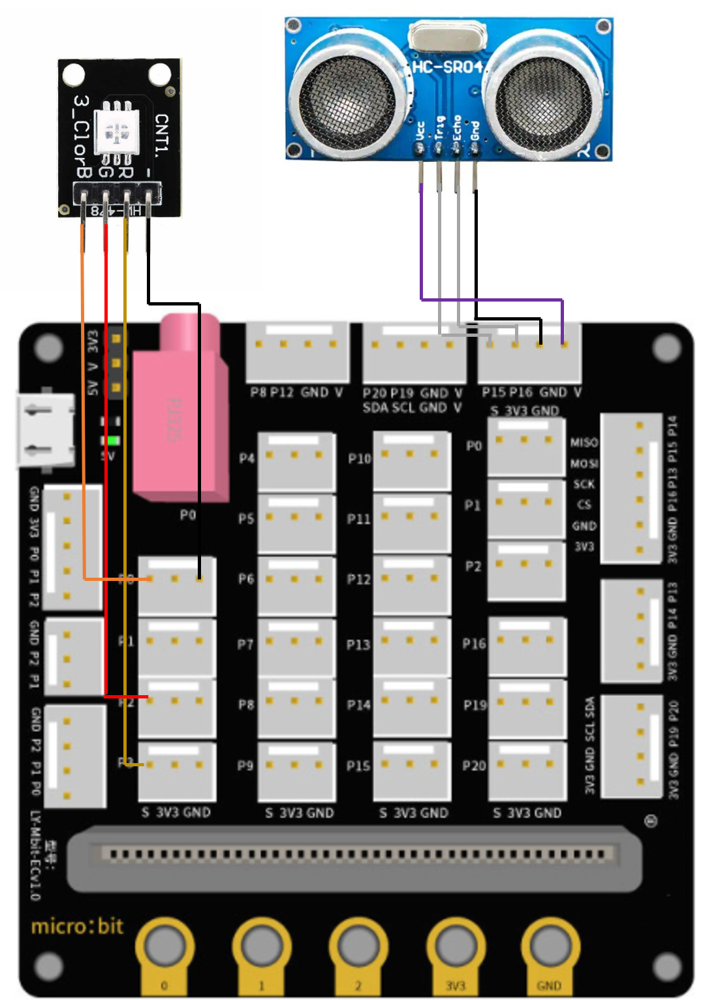  
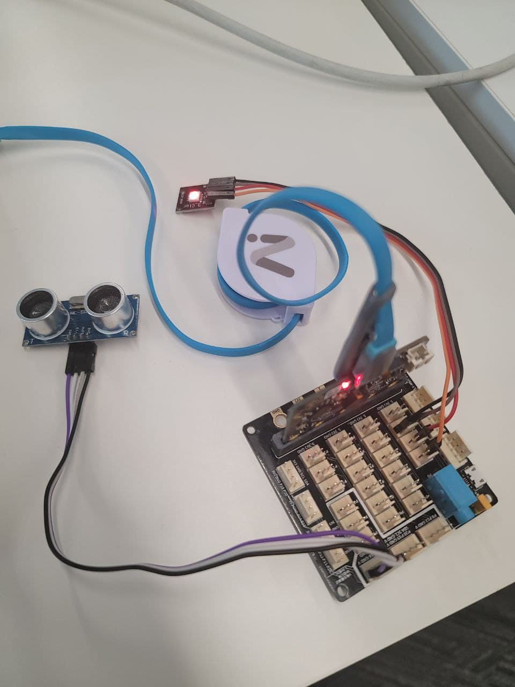

## 3.6 Programming (MakeCode) 
### Step 1. Set variable and initialize multi-colour LED 
+ Inside on start, snap set variable distance to 0 from variables 
+ Snap set colorLED to color pin setting....  
+ Snap pause to wait 5 seconds 
  
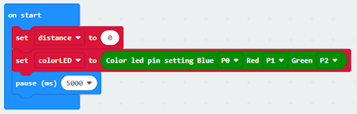

### Step 2. Get distance value 
+ Inside block forever. Set distance to get distance unit cm trig P15 echo P16, that’s say get the distance value by connecting the distance sensor to P15 and P16 
+ Snap if statement into forever, set distance ≤ 10 into if statement 
+ Snap Pause to the loop to wait 1 second for next checking 
  
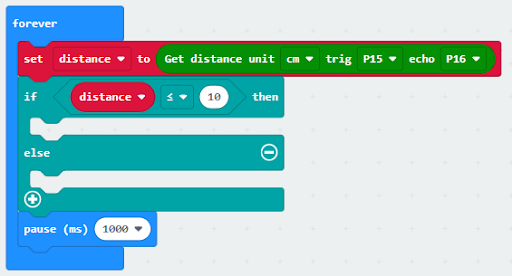

### Step 3. Show indicating colours with distance value
+ If distance ≤ 10, then strip show color green, else strip show color red 
  
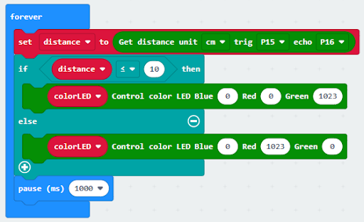

Full Solution 
MakeCode: https://makecode.microbit.org/_crvP36Fh0KUh

## 3.7 Result 

The distance sensor can return the distance value between the sensor and the position of goods. The LED light is used to indicate if there are goods placed at the unloading area. If there is, the LED turns green, else, the LED turns red.

## 3.8. Think 

Q1. How to make a sound notification if there is goods unloading (i.e. using buzzer)?

