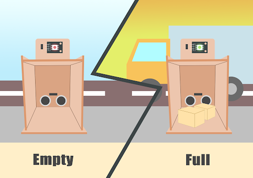
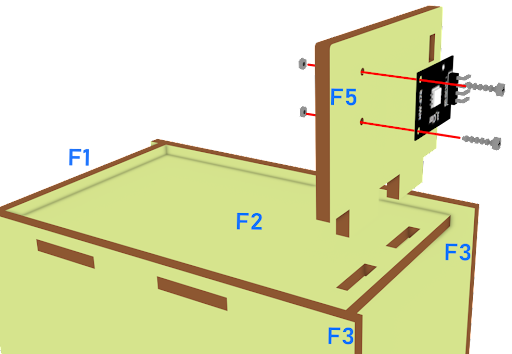
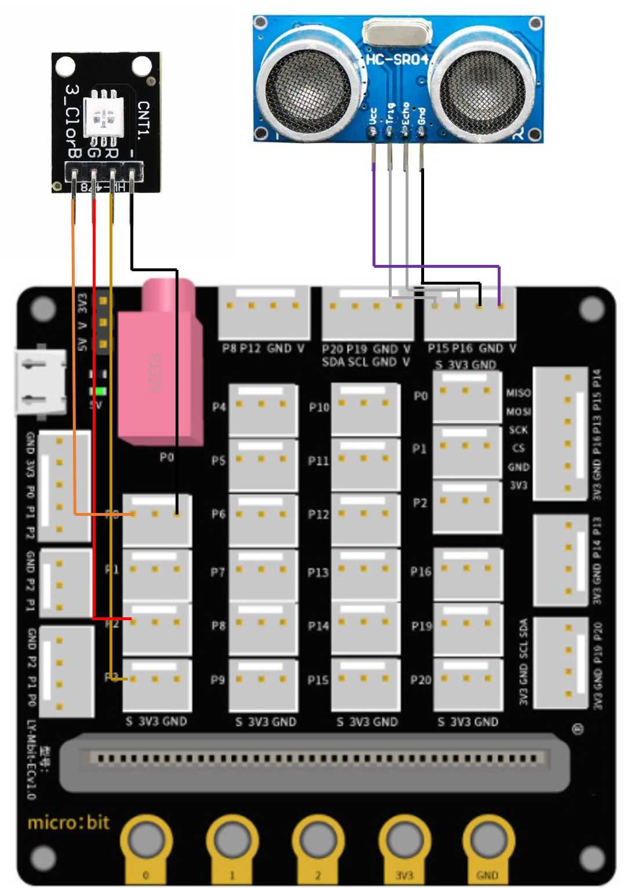

# 卸貨提醒系統

## 目標

卸貨區内設有傳感器，若卸貨區感應到有物件被放置在此，將會亮燈提醒。

## 背景
### 什麽是卸貨提醒系統？

卸貨區的LED燈可以辨別貨物是否收到。當貨物完成交付並放置在卸貨區時，LED燈將會轉成綠色，即時通知負責人來確認收貨。

### 卸貨提醒系統運作

距離傳感器應能感知放置在卸貨區的貨物的位置。可以用一個LED來發出不同顏色的光（綠光和紅光），分辨貨物是否到達。

  

## 材料準備

Microbit （1） 
Extension board 擴展板（1） 
Multi-color LED 多彩LED（1） 
Distance sensor 距離傳感器 （1） 
母對母杜邦綫 Female To Female Dupont Cable Jumper Wire Dupont Line （8） 
M2*8mm screw （6） 
M2 nut （6） 
螺絲批（1） 
Model F （1） 

## 組裝步驟
### 第一步

用M2*8mm的螺絲將距離傳感器安裝到F1模型上。

  

### 第二步

將所有部件（F1-F4）放在一起。

  

### 第三步

用M2*8mm的螺絲和螺母將多色LED安裝到F5模型上。，並放在F2上

  

### 第四步

組裝完成!

  

## 硬件連接

將距離傳感器連接到P15（Trig）/P16（echo）端口。 
將多色LED連接到P0 P1 P2端口 

  
  

## 編程
### 設置變量並初始化多色LED
+ 在但啓動時裏，從變數拖入變數distance設為0
+ 拖入變數colorLED設為 color pin設定...。
+ 拖出暫停5秒
  

### 獲取距離值
+ 在重複無限次的版塊裏。將變數distance設為get distance unit cm trig P15 echo P16，也就是說通過連接距離傳感器到P15和P16獲得distance值。
+ 將如果語句插入重複無限次中，將如果語句設為distance≤10。
+ 把暫停拖入循環，為下一次檢查等待1秒。
  

### 以距離值顯示指示色
+ 如果distance≤10，則顯示綠色，否則顯示紅色。
  

Full Solution 
MakeCode: https://makecode.microbit.org/_crvP36Fh0KUh

## 總結

距離傳感器可以獲得傳感器和貨物位置之間的距離值。LED燈用於指示在卸貨區是否有貨物放置。如果有，LED燈變成綠色，否則，LED燈變成紅色。

## 思考

如果有貨物卸下，想發出聲音通知（即使用蜂鳴器），應該怎麼做？

