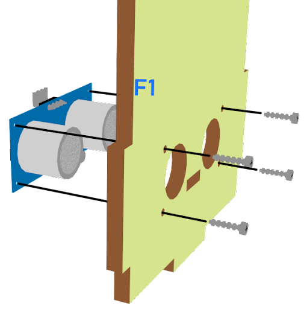
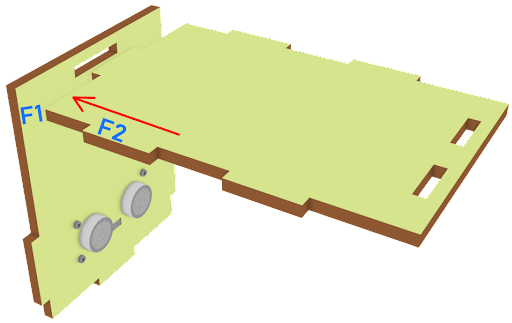
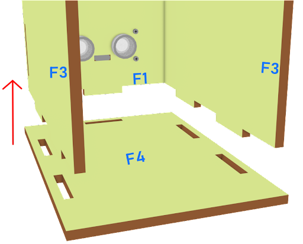
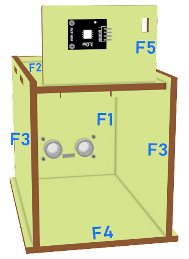
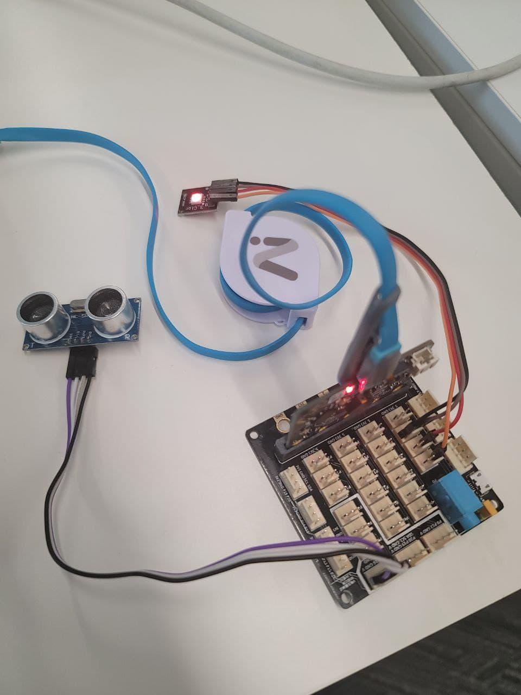
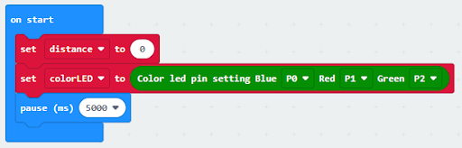

# Lesson 03: Unloading Alert System 卸貨提醒系統

## 3.1 Goal 目標

There are sensors in the unloading area. If the unloading area senses that an object has been placed in the unloading area, LED will be turned on to report the situation.

卸貨區内設有傳感器，若卸貨區感應到有物件被放置在此，將會亮燈提醒。

## 3.2 Background 背景
### What is an Unloading alert system? 什麽是卸貨提醒系統？

The LED lights in the unloading area can distinguish whether the goods are received or not. When the goods are delivered and placed in the unloading area, the LED light will turn green and the person in charge will be notified immediately to confirm the receipt.

卸貨區的LED燈可以辨別貨物是否收到。當貨物完成交付並放置在卸貨區時，LED燈將會轉成綠色，即時通知負責人來確認收貨。

### Unloading alert system operation 卸貨提醒系統運作

The distance sensor should be able to sense the position of goods placed on the unloading area. A LED can be used to emit different colors of light (green and red light), which represent if the goods arrive.

距離傳感器應能感知放置在卸貨區的貨物的位置。可以用一個LED來發出不同顏色的光（綠光和紅光），分辨貨物是否到達。

  

## 3.3 Part List 材料準備

Microbit （1） 
Extension board 擴展板（1） 
Multi-color LED 多彩LED（1） 
Distance sensor 距離傳感器 （1） 
母對母杜邦綫 Female To Female Dupont Cable Jumper Wire Dupont Line （8） 
M2*8mm screw （6） 
M2 nut （6） 
螺絲批（1） 
Model F （1） 

## 3.4 Assembly step 組裝步驟
### Step 1 第一步

Attach the distance sensor to F1 model with M2 * 8mm screw.

用M2*8mm的螺絲將距離傳感器安裝到F1模型上。

  

### Step 2 第二步

Put together all the boards (F1-F4).

將所有部件（F1-F4）放在一起。

  

### Step3 第三步

Attach the Multi-colour LED to F5 model with M2 * 8mm screws and nuts, and put it on F2.

用M2*8mm的螺絲和螺母將多色LED安裝到F5模型上。，並放在F2上

  

### Step 4 第四步

Assembly completed! 組裝完成!

  

## 3.5 Hardware connect 硬件連接

Connect the Distance Sensor to P14 (trig)/ P15 (echo) port  
Connect Multi-color LED to P0 P1 P2 port  

將距離傳感器連接到P14（Trig）/P15（echo）端口。 
將多色LED連接到P0 P1 P2端口 

  

## 3.6 Programming (MakeCode) 編程
### Step 1. Set variable and initialize multi-colour LED 設置變量並初始化多色LED
+ Inside on start, snap set variable distance to 0 from variables 在但啓動時裏，從變數拖入變數distance設為0
+ Snap set colorLED to color pin setting....  拖入變數colorLED設為 color pin設定...。
+ Snap pause to wait 5 seconds 拖出暫停5秒
  

### Step 2. Get distance value 獲取距離值
+ Inside block forever. Set distance to get distance unit cm trig P15 echo P16, that’s say get the distance value by connecting the distance sensor to P15 and P16 在重複無限次的版塊裏。將變數distance設為get distance unit cm trig P15 echo P16，也就是說通過連接距離傳感器到P15和P16獲得distance值。
+ Snap if statement into forever, set distance ≤ 10 into if statement 將如果語句插入重複無限次中，將如果語句設為distance≤10。
+ Snap Pause to the loop to wait 1 second for next checking 把暫停拖入循環，為下一次檢查等待1秒。
  

### Step 3. Show indicating colours with distance value 以距離值顯示指示色
+ If distance ≤ 10, then strip show color green, else strip show color red 如果distance≤10，則顯示綠色，否則顯示紅色。
  

Full Solution 
MakeCode: https://makecode.microbit.org/_crvP36Fh0KUh

## 3.7 Result 總結

The distance sensor can return the distance value between the sensor and the position of goods. The LED light is used to indicate if there are goods placed at the unloading area. If there is, the LED turns green, else, the LED turns red.

距離傳感器可以獲得傳感器和貨物位置之間的距離值。LED燈用於指示在卸貨區是否有貨物放置。如果有，LED燈變成綠色，否則，LED燈變成紅色。

## 3.8. Think 思考

Q1. How to make a sound notification if there is goods unloading (i.e. using buzzer)?

如果有貨物卸下，想發出聲音通知（即使用蜂鳴器），應該怎麼做？

