# Lesson 04: Smart Car Park Access Barrier 1: Car Park Monitoring System 
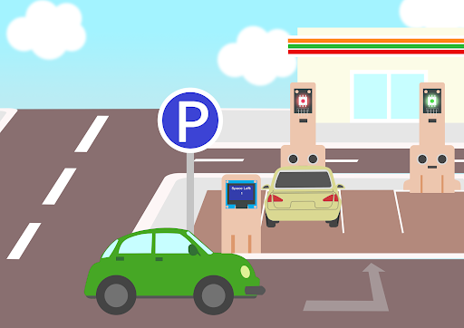

## 4.1 Goal 

Make a smart car park monitoring system which senses if there are vacancies in the car park and displays the related information using multi-color LED and OLED sensors. 

## 4.2 Background 
### What is an Smart car park monitoring systems? 

Smart car park monitoring systems are used to allow people to live conveniently. It can reduce manpower and time in managing car vacancy information. An OLED display is used to remind drivers about the parking vacancy information.

### Smart car park monitoring systems operation 
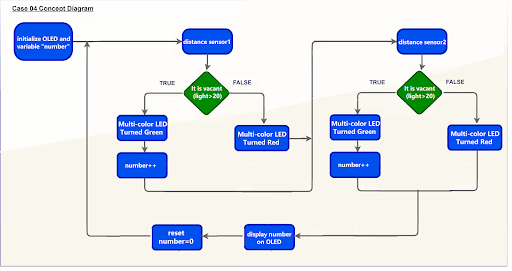

## 4.3 Part List 

Microbit （1） 
Expansion board （1） 
Distance sensor  （1） 
multi-color LED  （1） 
OLED （1） 
Female To Female Dupont Cable Jumper Wire Dupont Line （12）  
M2*8mm screw (10) 
M2 nut （10） 
Screwdriver（1） 
Module D (1） 
Module E (1)  
Module G （1） 

## 4.4 Assembly step
### Step 1

Attach the OLED to D1 model using M2 * 8mm screw and nut.

  
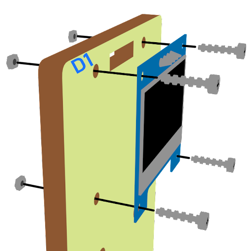

### Step 2 

Put the D1 model onto the D2 model. 

  
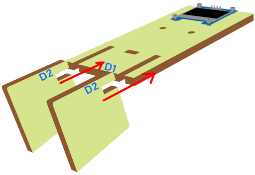

### Step 3

Assembly completed! 

  
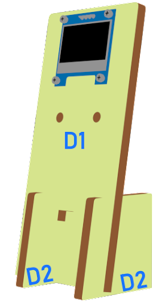

### Step 4

Attach the distance sensor to E1 model using M2 screw. 

  
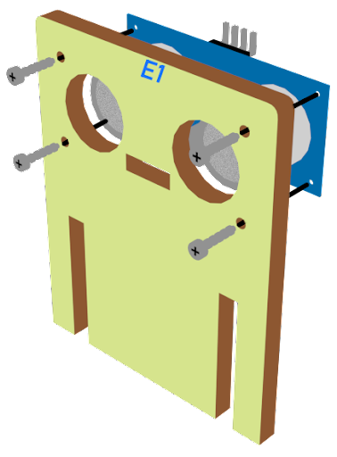

### Step 5 

Put the E1 model on the E2 model. 

  

### Step 6 

Assembly completed! 

  

### Step 7 

Attach the multi color LED to G1 model using M2 * 8mm screw and nut.

  
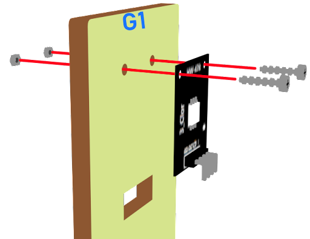

### Step 8 

Put the G1 model on the G2 model. 

  
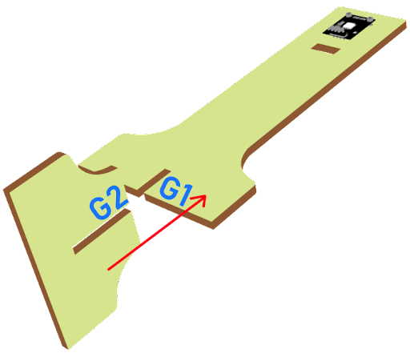

### Step 9 

Assembly completed! 

  
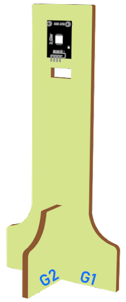

## 4.5 Hardware connect 

Connect the Distance Sensor to P15 (trig)/ P16 (echo) port of IoT:bit 
Connect multi color LED to P0  P1 and P2 port of IoT:bit 
Extend the connection of OLED to the I2C connection port 

## 4.6 Programming (MakeCode) 

### Step 1. Set variables and  initialize multi-colour LED and OLED screen 
+ Drag Initialize OLED with width:128, height: 64 to on start  
+ Inside on start, snap set variable distance to 0 and set number to 0 from variables. 
+ Snap set colorLED to color led pin setting  …  拖入set colorLED to color led pin setting ...。
  
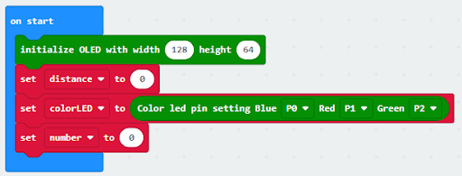

### Step 2. Get distance
+ Drag get distance to distance unit cm trig P15 echo P16, store the value to variable distance. 
  
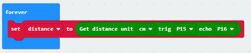

### Step 3.  Show indicating colours and count the number of vacancies 
+ Snap if statement into forever, set variable distance > 10 
+ If distance >10, then colorLED shows color green, else colorLED shows color red 
+ Snap change number by 1 if distance>10
  
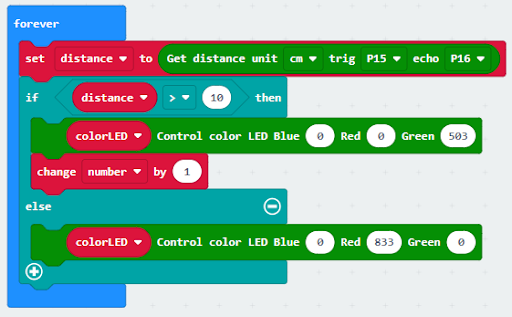

### Step 4 display on OLED  
+ Snap clear OLED display from OLED to avoid overlap 
+ Snap show number and show value of variables number 
+ Snap Pause to the loop to wait 1 second for next checking 
+ Reset number to 0 before next checking 
  
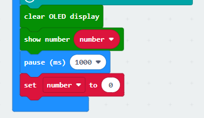

Full Solution 
MakeCode: https://makecode.microbit.org/_e7bDyaMcDCsJ

## 4.7 Result 

The distance sensor is used to check the vacancies in the car park. When there are vacancies in the car park, the multi-color LED will turn green showing the car park is available. Otherwise, it will turn red. The number of vacancies will be counted and displayed on an OLED screen.

## 4.8 Think 

Q1. How to change the program if there are more than one parking spaces?

https://makecode.microbit.org/_ipxDmdhiCbYA

