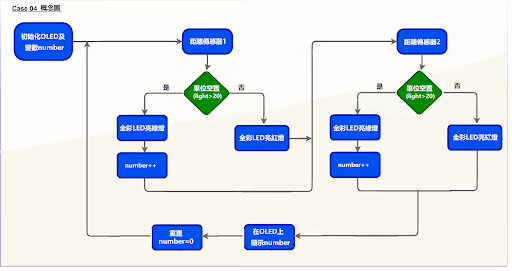
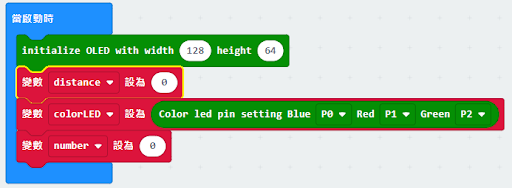
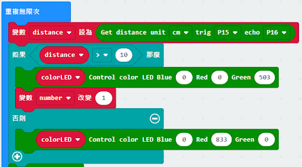
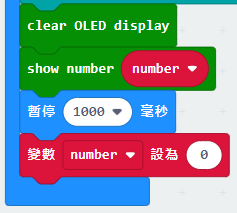

# 智能停車場障礙一：車位監測

## 目標

製作一個停車場監控系統以檢測停車場是否有空置車位，並用多彩LED及OLED顯示空置情況及空置車位數量。

## 背景
### 什麽是智能停車場監控系統？

智能停車場監控系統可以使人們生活得更方便。它減少了停車場管理方面的人力。人們可以直接通過OLED了解車位的空置情況。

### 智能停車場監控系統運作

## 材料準備

Microbit （1） 
Expansion board 擴展板（1） 
Distance sensor 距離傳感器 （1） 
multi-color LED  全彩LED （1） 
OLED （1） 
母對母杜邦綫 Female To Female Dupont Cable Jumper Wire Dupont Line （12）  
M2*8mm screw (10) 
M2 nut （10） 
螺絲批（1） 
Module D (1） 
Module E (1)  
Module G （1） 

## 組裝步驟
### 第一步

用M2*8毫米的螺釘和螺母將OLED安裝到D1模型上。

  

### 第二步

把D1模型放到D2模型上。

  

### 第三步

組裝完成!

  

### 第四步

使用M2螺釘將距離傳感器安裝到E1模型上。

  

### 第五步

把E1模型放在E2模型上。

  

### 第六步

組裝完成!

  

### 第七步

用M2*8毫米的螺釘和螺母將全彩 LED安裝到G1模型上。

  

### 第八步

把G1模型放在G2模型上。

  

### 第九步

組裝完成!

  

## 硬件連接

將距離傳感器連接到P14（Trig）/P15（echo）端口。 
將全彩LED連接到P0 P1 P2端口 
將OLED的連接延伸到I2C連接埠 

## 編程

### 在起始位置設置變量並初始化多色LED及OLED屏幕
+ 拖動OLED初始化寬：128高:64，至當啟動時。
+ 在當啟動時中，從變數中拖入變數distance設為0，變數number設為0。
+ 拖入set colorLED to color led pin setting ...。
  

### 獲得距離的數值
+ 拖動變數distance設為get distance unit cm trig P15 echo P16，將該值存儲到變量distance。
  

### 顯示指示色及計算空置車位數量
+ 將如果語句放入重複無數次 ，設變數distance>10
+ 如果distance>10，則顯示綠色，否則顯示紅色。
+ 如果distance>10，變數number設為1
  

### 在OLED上顯示空置車位數量
+ 從OLED中拖出清除OLED顯示，以避免重疊。
+ 拖出新行數字並顯示變數number的值。
+ 把暫停拖入循環，為下一次檢查等待1秒。
+  重置number至0以開始新的檢查。
  

Full Solution 
MakeCode: <a href="https://makecode.microbit.org/_e7bDyaMcDCsJ">https://makecode.microbit.org/_e7bDyaMcDCsJ</a>

## 總結

距離傳感器是用來檢查停車場的空位。當有空置車位時，全彩LED會顯示綠色。否則，它會顯示紅色。空置車位的數量將會顯示在OLED上。

## 思考

如果有多過一個停車位，應該怎麽改變程式呢

<a href="https://makecode.microbit.org/_ipxDmdhiCbYA">https://makecode.microbit.org/_ipxDmdhiCbYA</a>

