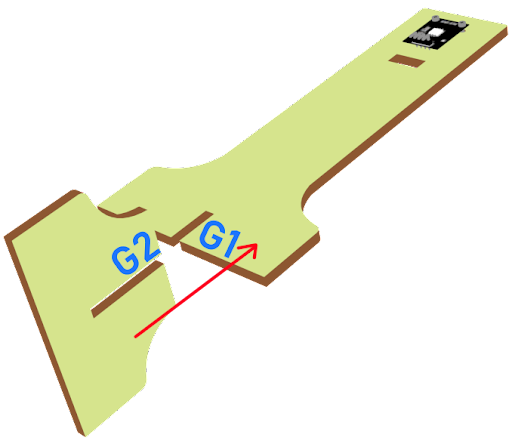
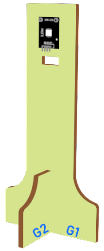
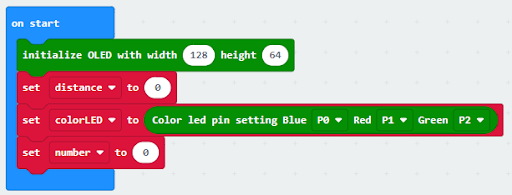
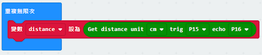
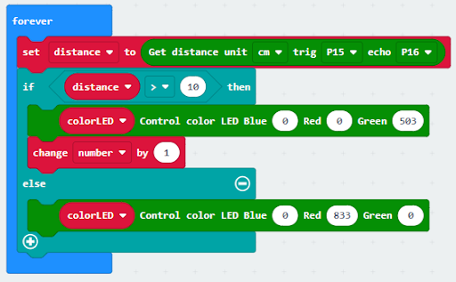

# Lesson 04: Smart Car Park Access Barrier 1: Car Park Monitoring System 智能停車場障礙一：車位監測

## Goal 目標

Make a smart car park monitoring system which senses if there are vacancies in the car park and displays the related information using multi-color LED and OLED sensors. 

製作一個停車場監控系統以檢測停車場是否有空置車位，並用多彩LED及OLED顯示空置情況及空置車位數量。

## Background 背景
### What is an Smart car park monitoring systems? 什麽是智能停車場監控系統？

Smart car park monitoring systems are used to allow people to live conveniently. It can reduce manpower and time in managing car vacancy information. An OLED display is used to remind drivers about the parking vacancy information.

智能停車場監控系統可以使人們生活得更方便。它減少了停車場管理方面的人力。人們可以直接通過OLED了解車位的空置情況。

### Smart car park monitoring systems operation 智能停車場監控系統運作

## Part List 材料準備

Microbit （1） 
Expansion board 擴展板（1） 
Distance sensor 距離傳感器 （1） 
multi-color LED  全彩LED （1） 
OLED （1） 
母對母杜邦綫 Female To Female Dupont Cable Jumper Wire Dupont Line （12）  
M2*8mm screw (10) 
M2 nut （10） 
螺絲批（1） 
Module D (1） 
Module E (1)  
Module G （1） 

## Assembly step 組裝步驟
### Step 1 第一步

Attach the OLED to D1 model using M2 * 8mm screw and nut. 用M2*8毫米的螺釘和螺母將OLED安裝到D1模型上。

  

### Step 2 第二步

Put the D1 model onto the D2 model. 把D1模型放到D2模型上。

  

### Step 3 第三步

Assembly completed! 組裝完成!

  

### Step 4 第四步

Attach the distance sensor to E1 model using M2 screw. 使用M2螺釘將距離傳感器安裝到E1模型上。

  

### Step 5 第五步

Put the E1 model on the E2 model. 把E1模型放在E2模型上。

  

### Step 6 第六步

Assembly completed! 組裝完成!

  

### Step 7 第七步

Attach the multi color LED to G1 model using M2 * 8mm screw and nut. 用M2*8毫米的螺釘和螺母將全彩 LED安裝到G1模型上。

  

### Step 8 第八步

Put the G1 model on the G2 model. 把G1模型放在G2模型上。

  

### Step 9 第九步

Assembly completed! 組裝完成!

  

## Hardware connect 硬件連接

Connect the Distance Sensor to P15 (trig)/ P16 (echo) port of IoT:bit 
Connect multi color LED to P0  P1 and P2 port of IoT:bit 
Extend the connection of OLED to the I2C connection port 

將距離傳感器連接到P14（Trig）/P15（echo）端口。 
將全彩LED連接到P0 P1 P2端口 
將OLED的連接延伸到I2C連接埠 

## Programming (MakeCode) 編程

### Step 1. Set variables and  initialize multi-colour LED and OLED screen 在起始位置設置變量並初始化多色LED及OLED屏幕
+ Drag Initialize OLED with width:128, height: 64 to on start  拖動OLED初始化寬：128高:64，至當啟動時。
+ Inside on start, snap set variable distance to 0 and set number to 0 from variables. 在當啟動時中，從變數中拖入變數distance設為0，變數number設為0。
+ Snap set colorLED to color led pin setting  …  拖入set colorLED to color led pin setting ...。
  

### Step 2. Get distance 獲得距離的數值
+ Drag get distance to distance unit cm trig P15 echo P16, store the value to variable distance. 拖動變數distance設為get distance unit cm trig P15 echo P16，將該值存儲到變量distance。
  

### Step 3.  Show indicating colours and count the number of vacancies 顯示指示色及計算空置車位數量
+ Snap if statement into forever, set variable distance > 10 將如果語句放入重複無數次 ，設變數distance>10
+ If distance >10, then colorLED shows color green, else colorLED shows color red 如果distance>10，則顯示綠色，否則顯示紅色。
+ Snap change number by 1 if distance>10
  

### Step 4 display on OLED  在OLED上顯示空置車位數量
+ Snap clear OLED display from OLED to avoid overlap 從OLED中拖出清除OLED顯示，以避免重疊。
+ Snap show number and show value of variables number 拖出新行數字並顯示變數number的值。
+ Snap Pause to the loop to wait 1 second for next checking 把暫停拖入循環，為下一次檢查等待1秒。
+ Reset number to 0 before next checking 重置number至0以開始新的檢查。
  

Full Solution 
MakeCode: https://makecode.microbit.org/_e7bDyaMcDCsJ

## Result 總結

The distance sensor is used to check the vacancies in the car park. When there are vacancies in the car park, the multi-color LED will turn green showing the car park is available. Otherwise, it will turn red. The number of vacancies will be counted and displayed on an OLED screen.

距離傳感器是用來檢查停車場的空位。當有空置車位時，全彩LED會顯示綠色。否則，它會顯示紅色。空置車位的數量將會顯示在OLED上。

## Think 思考

Q1. How to change the program if there are more than one parking spaces?

如果有多過一個停車位，應該怎麽改變程式呢

https://makecode.microbit.org/_ipxDmdhiCbYA

