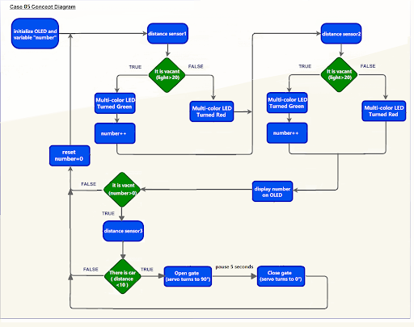

# Lesson 05: Smart Car Park Access Barrier 2: Car Park Access Barrier

## 5.1 Goal 

On the basis of lesson 4, make a smart car park access barrier which opens automatically if there are vacancies in the car park and there are cars coming in. 

## 5.2 Background 

### What is a smart car park access barrier? 

Smart Car park Access Barrier is used to allow people to live conveniently. It can reduce manpower and time in controlling the gate and manage information (e.g. car park vacancies). It will be opened automatically if there are vacancies in the car park and there are cars coming in. 

### Car park access barrier operation 

The car park access barrier open and close operation is controlled by 180ᵒ servo. If there are vacancies in the car park (i.e. detected by light sensor), the LED will turn green. When cars near the car park gate (i.e. detected by distance sensor), the barrier will open automatically. When there are no vacancies (detected by light sensor), then the gate will keep closed and the LED will turn red.

  

## 5.3 Part List 

Microbit （1） 
Expansion board （1） 
Distance sensor （2） 
Multi-color LED（1）  
OLED （1） 
SG90 servo （1） 
Female To Female Dupont Cable Jumper Wire Dupont Line （16）  
M2*8mm (16) 
M2 nut （16） 
Screwdriver（1） 
Module D (1） 
Module E (1)  
Module G （1） 
Module H（1） 

## 5.4 Assembly step 

### Step 1 

Attach the distance sensor to H1 model with M2 * 8mm screws 

 

### Step 2 

Attach the OLED to H1 model with M2 * 8mm screws and nuts.

  

### Step 3

Attach the servo to H1 model with M2 * 8mm screws and nuts

  

### Step 4 

Attach the H2 model to the servo with M2 * 8mm sharp screw. Put the H1 model onto the H3 model.

  

### Step 5 

Assembly completed! 

  

## 5.5 Hardware connect 

Connect the Distance Sensor to P15 (trig)/ P16 (echo) port 
Connect the Distance Sensor to P8 (trig)/ P12 (echo) port 
Extend the connection of OLED to the I2C connection port 
Connect multi color LED to P0, P1和P2 port  
Connect 180° Servo to P3 port  

## 5.6 Programming (MakeCode) 

### Step 1. Set variables, initialize OLED screen and servo at start position 
+ Drag Initialize OLED with width:128, height: 64 to on start  
+ Inside on start, snap set variable distance1 to 0, set variable distance2 to 0 and set number to 0 from variables. 
+ Snap set colorLED to color led pin setting  
+ Snap Turn Servo to 0 degree at P0.  
+ Snap pause to wait 5 seconds 
  

### Step 2. Get distance 
+ Drag set distance1 to distance unit cm trig P15 echo P16, store the value to variable distance1. 

  
### Step 3.  Show indicating colours and count the number of vacancies 
+ Snap if statement into forever, set  variable distance1 > 10 
+ If distance1 >10, then colorLED shows color green, else colorLED shows color red 
+ Snap change number by 1 if distance1>10
  

### Step 4 display on OLED  
+ Snap clear OLED display from OLED to avoid overlap 
+ Snap show number and show value of variables number 
  

### Step 5. Open/close gate with distance value 
+ Snap if statement into forever, set variable number>0 
+ Drag get distance2 to distance unit cm trig P8 echo P12, store the value to variable distance2. 
+ Snap if statement into forever, set variable distance2 < 10 
+ Snap Pause to the loop to wait 1 second for next checking 
+ Reset number to 0 before next checking 
  

### Step 6. Set servo position 
+ Snap Turn Servo to 90 degree at P3 as the gate is opened. 
+ Snap pause to the loop to wait 5 seconds 
+ Snap Turn Servo to 0 degree at P3 as the gate is closed. 
  

Full Solution 
MakeCode: https://makecode.microbit.org/_Cxu5Xs51oh2x

## 5.7 Result 

The distance sensor is used to check the vacancies in the car park and detect if there are any cars coming near the car park gate. The car park gate is controlled by 180ᵒ servo. When there are vacancies in the car park, the multi-color LED will turn green showing the car park is available. When there are cars near the car park gate. The gate will be opened for 5 seconds and then closed to let the car enter the car park.

## 5.8 Think 

Q1. Other than OLED, can you suggest some other methods that show signals to let drivers know there are vacancies in the car park?

