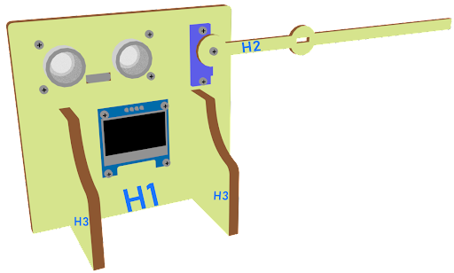

# 智能停車場障礙二：車閘

## 目標

在上一課的基礎下，製作一個智能停車場入口欄杆,會在停車場尚有空位，並在感應到有新車輛駛入停車場入口時，自動打開讓車輛進入。

## 背景

### 什麽是智能停車場入口欄杆？

智能停車場入口欄杆是用來方便人們方便地生活的。它可以減少控制大門的人力和時間，並管理信息（如停車場的空缺）。如果停車場有空缺，并且有汽車進入，他就會自動打開。

### 停車場欄杆運作

停車場入口的開關是由180度的舵機控制的。如果停車場有空位（例如由距離傳感器檢測到），會在有汽車進入時自動打開。否則，欄杆保持關閉。

  

## 材料準備

Microbit （1） 
Expansion board 擴展板（1） 
Distance sensor 距離傳感器（2） 
Multi-color LED 全彩LED（1）  
OLED （1） 
SG90 servo （1） 
母對母杜邦綫 Female To Female Dupont Cable Jumper Wire Dupont Line （16）  
M2*8mm (16) 
M2 nut （16） 
螺絲批 （1） 
Module D (1） 
Module E (1)  
Module G （1） 
Module H（1） 

## 組裝步驟

### 第一步

用M2*8mm的螺絲將距離傳感器安裝到H1模型上。

  

### 第二步

用M2*8mm的螺絲和螺母將距離傳感器安裝到H1模型上。

  

### 第三步

用M2 * 8mm的螺絲和螺母將舵機安裝在H1模型上。

  

### 第四步

用M2 * 8mm的尖頭螺絲將B2模型固定在舵機上。將H1模型放到H3模型上。

  

### 第五步

組裝完成!

  

##  硬件連接

將距離傳感器連接到P14（Trig）/P15（echo）端口。 
將距離傳感器連接到P8（Trig）/P12（echo）端口。 
將OLED的連接延伸到I2C連接埠 
將全彩LED連接到P0 P1 P2端口 
將180°舵機連接到P3端口 

## 編程

### 在起始位置設置變量，初始化OLED屏幕及舵機裝置
+ 拖動OLED初始化寬：128高:64，至當啟動時。
+ 在當啟動時中，從變數中拖入變數distance1設為0，變數distance2設為0及變數number設為0。
+ 拖入set colorLED to color led pin setting ...。
+ 拖入Turn Servo to 0 degree at P0。
+ 拖出暫停5秒
  

### 獲得距離的數值
+ 拖動變數distance1設為get distance unit cm trig P15 echo P16，將該值存儲到變量distance1。

  
### 顯示指示色及計算空置車位數量
+ 將如果語句放入重複無數次 ，設變數distance1>10
+ 如果distance1>10，則顯示綠色，否則顯示紅色。
+ 如果distance>10，變數number設為1
  

### 在OLED上顯示空置車位數量
+ 從OLED中拖出清除OLED顯示，以避免重疊。
+ 拖出新行數字並顯示變數number的值。
  

### 打開及放下欄杆
+ 將如果語句放入重複無數次 ，設變數number>0
+ 拖動變數distance2設為get distance unit cm trig P8 echo P12，將該值存儲到變量distance2。
+ 將如果語句放入重複無數次 ，設變數distance2<10
+ 把暫停拖入循環，為下一次檢查等待1秒。
+ 重置number至0以開始新的檢查。
  

### 設置舵機位置
+ 在P3處將舵機轉到90度即打開欄杆
+ 暫停循環，等待5秒。
+ S在P3處將舵機轉到0度即放下欄杆。
  

Full Solution 
MakeCode: <a href="https://makecode.microbit.org/_Cxu5Xs51oh2x">https://makecode.microbit.org/_Cxu5Xs51oh2x</a>

## 總結

距離傳感器是用來檢查停車場的空位及檢查是否有任何車輛接近停車場的門。停車場欄杆是由180°舵機控制的。當停車場有空位和有車輛靠近停車場大門時，閘門將會被打開五秒，然後關門，讓汽車進入停車場。

## 思考

Q1. 除了OLED以外，你還能説出什麽顯示信號讓司機知道停車場有空位嗎？

