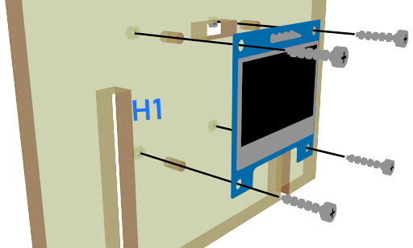
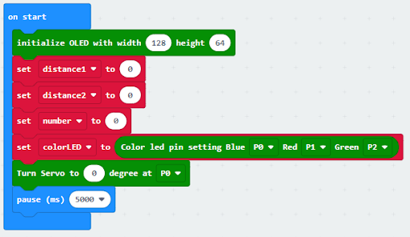
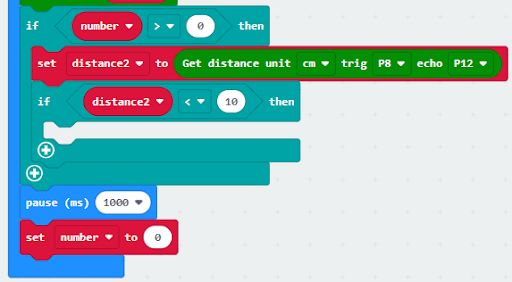

# Lesson 05: Smart Car Park Access Barrier 2: Car Park Access Barrier 智能停車場障礙二：車閘

## 5.1 Goal 目標

On the basis of lesson 4, make a smart car park access barrier which opens automatically if there are vacancies in the car park and there are cars coming in. 

在上一課的基礎下，製作一個智能停車場入口欄杆,會在停車場尚有空位，並在感應到有新車輛駛入停車場入口時，自動打開讓車輛進入。

## 5.2 Background 背景

### What is a smart car park access barrier? 什麽是智能停車場入口欄杆？

Smart Car park Access Barrier is used to allow people to live conveniently. It can reduce manpower and time in controlling the gate and manage information (e.g. car park vacancies). It will be opened automatically if there are vacancies in the car park and there are cars coming in. 

智能停車場入口欄杆是用來方便人們方便地生活的。它可以減少控制大門的人力和時間，並管理信息（如停車場的空缺）。如果停車場有空缺，并且有汽車進入，他就會自動打開。

### Car park access barrier operation 停車場欄杆運作

The car park access barrier open and close operation is controlled by 180ᵒ servo. If there are vacancies in the car park (i.e. detected by light sensor), the LED will turn green. When cars near the car park gate (i.e. detected by distance sensor), the barrier will open automatically. When there are no vacancies (detected by light sensor), then the gate will keep closed and the LED will turn red.

停車場入口的開關是由180度的舵機控制的。如果停車場有空位（例如由距離傳感器檢測到），會在有汽車進入時自動打開。否則，欄杆保持關閉。

  

## 5.3 Part List 材料準備

Microbit （1） 
Expansion board 擴展板（1） 
Distance sensor 距離傳感器（2） 
Multi-color LED 全彩LED（1）  
OLED （1） 
SG90 servo （1） 
母對母杜邦綫 Female To Female Dupont Cable Jumper Wire Dupont Line （16）  
M2*8mm (16) 
M2 nut （16） 
螺絲批 （1） 
Module D (1） 
Module E (1)  
Module G （1） 
Module H（1） 

## 5.4 Assembly step 組裝步驟

### Step 1 第一步

Attach the distance sensor to H1 model with M2 * 8mm screws 

用M2*8mm的螺絲將距離傳感器安裝到H1模型上。

  

### Step 2 第二步

Attach the OLED to H1 model with M2 * 8mm screws and nuts.

用M2*8mm的螺絲和螺母將距離傳感器安裝到H1模型上。

  

### Step 3 第三步

Attach the servo to H1 model with M2 * 8mm screws and nuts

用M2 * 8mm的螺絲和螺母將舵機安裝在H1模型上。

  

### Step 4 第四步

Attach the H2 model to the servo with M2 * 8mm sharp screw. Put the H1 model onto the H3 model.

用M2 * 8mm的尖頭螺絲將B2模型固定在舵機上。將H1模型放到H3模型上。

  

### Step 5 第五步

Assembly completed! 組裝完成!

  

## 5.5 Hardware connect 硬件連接

Connect the Distance Sensor to P15 (trig)/ P16 (echo) port 
Connect the Distance Sensor to P8 (trig)/ P12 (echo) port 
Extend the connection of OLED to the I2C connection port 
Connect multi color LED to P0, P1和P2 port  
Connect 180° Servo to P3 port  

將距離傳感器連接到P14（Trig）/P15（echo）端口。 
將距離傳感器連接到P8（Trig）/P12（echo）端口。 
將OLED的連接延伸到I2C連接埠 
將全彩LED連接到P0 P1 P2端口 
將180°舵機連接到P3端口 

## 5.6 Programming (MakeCode) 編程

### Step 1. Set variables, initialize OLED screen and servo at start position 在起始位置設置變量，初始化OLED屏幕及舵機裝置
+ Drag Initialize OLED with width:128, height: 64 to on start  拖動OLED初始化寬：128高:64，至當啟動時。
+ Inside on start, snap set variable distance1 to 0, set variable distance2 to 0 and set number to 0 from variables. 在當啟動時中，從變數中拖入變數distance1設為0，變數distance2設為0及變數number設為0。
+ Snap set colorLED to color led pin setting  …  拖入set colorLED to color led pin setting ...。
+ Snap Turn Servo to 0 degree at P0.  拖入Turn Servo to 0 degree at P0。
+ Snap pause to wait 5 seconds 拖出暫停5秒
  

### Step 2. Get distance 獲得距離的數值
+ Drag set distance1 to distance unit cm trig P15 echo P16, store the value to variable distance1. 拖動變數distance1設為get distance unit cm trig P15 echo P16，將該值存儲到變量distance1。

  
### Step 3.  Show indicating colours and count the number of vacancies 顯示指示色及計算空置車位數量
+ Snap if statement into forever, set  variable distance1 > 10 將如果語句放入重複無數次 ，設變數distance1>10
+ If distance1 >10, then colorLED shows color green, else colorLED shows color red 如果distance1>10，則顯示綠色，否則顯示紅色。
+ Snap change number by 1 if distance1>10
  

### Step 4 display on OLED  在OLED上顯示空置車位數量
+ Snap clear OLED display from OLED to avoid overlap 從OLED中拖出清除OLED顯示，以避免重疊。
+ Snap show number and show value of variables number 拖出新行數字並顯示變數number的值。
  

### Step 5. Open/close gate with distance value 打開及放下欄杆
+ Snap if statement into forever, set variable number>0 將如果語句放入重複無數次 ，設變數number>0
+ Drag get distance2 to distance unit cm trig P8 echo P12, store the value to variable distance2. 拖動變數distance2設為get distance unit cm trig P8 echo P12，將該值存儲到變量distance2。
+ Snap if statement into forever, set variable distance2 < 10 將如果語句放入重複無數次 ，設變數distance2<10
+ Snap Pause to the loop to wait 1 second for next checking 把暫停拖入循環，為下一次檢查等待1秒。
+ Reset number to 0 before next checking 重置number至0以開始新的檢查。
  

### Step 6. Set servo position 設置舵機位置
+ Snap Turn Servo to 90 degree at P3 as the gate is opened. 在P3處將舵機轉到90度即打開欄杆
+ Snap pause to the loop to wait 5 seconds 暫停循環，等待5秒。
+ Snap Turn Servo to 0 degree at P3 as the gate is closed. 在P3處將舵機轉到0度即放下欄杆。
  

Full Solution 
MakeCode: https://makecode.microbit.org/_Cxu5Xs51oh2x

## 5.7 Result 總結

The distance sensor is used to check the vacancies in the car park and detect if there are any cars coming near the car park gate. The car park gate is controlled by 180ᵒ servo. When there are vacancies in the car park, the multi-color LED will turn green showing the car park is available. When there are cars near the car park gate. The gate will be opened for 5 seconds and then closed to let the car enter the car park.

距離傳感器是用來檢查停車場的空位及檢查是否有任何車輛接近停車場的門。停車場欄杆是由180°舵機控制的。當停車場有空位和有車輛靠近停車場大門時，閘門將會被打開五秒，然後關門，讓汽車進入停車場。

## 5.8 Think 思考

Q1. Other than OLED, can you suggest some other methods that show signals to let drivers know there are vacancies in the car park?

Q1. 除了OLED以外，你還能説出什麽顯示信號讓司機知道停車場有空位嗎？

