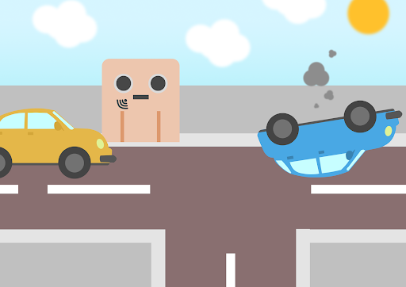
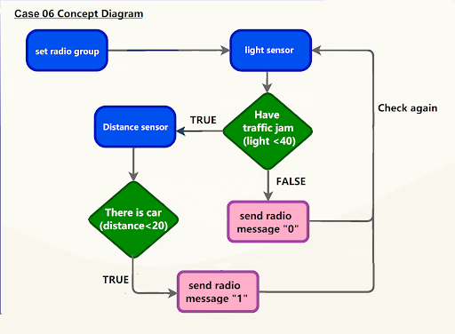
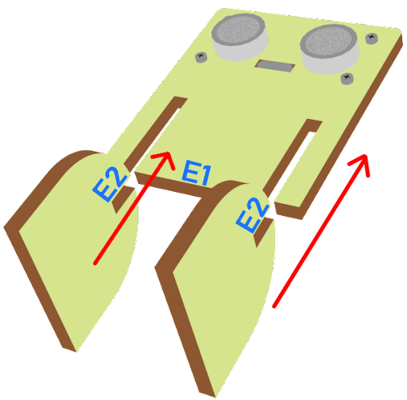
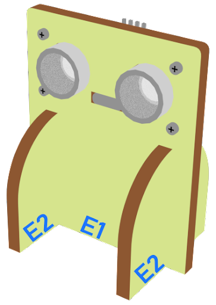
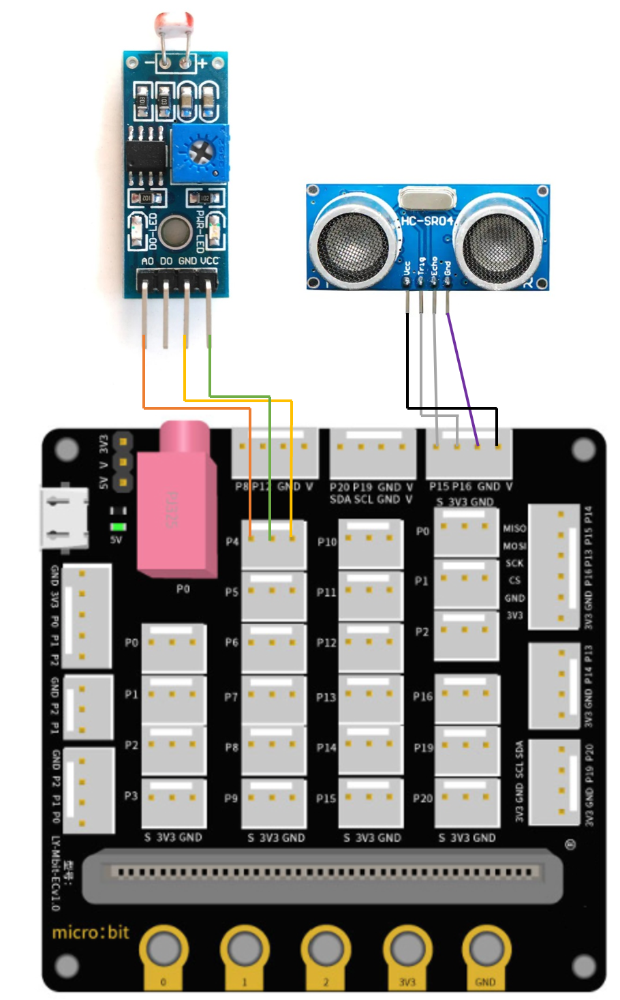
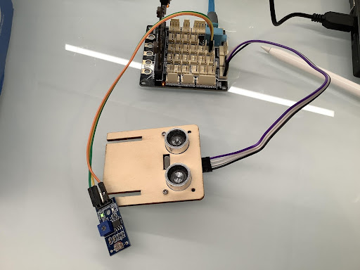
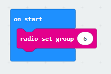
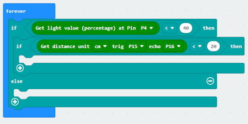
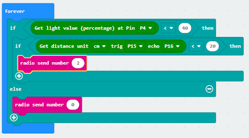
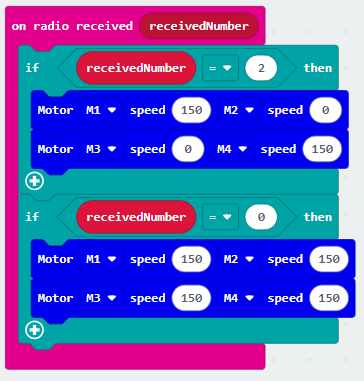

# Lesson 06: Broken Car

## 6.1 Goal

Make a smart traffic system which forces the car to go in another direction when there is a traffic jam in one of the roads.  

## 6.2 Background
### What is a smart traffic system ? 

Smart traffic systems are used to prevent traffic jams. When a traffic jam occurs, the other cars are forced to go in another direction such that the normal traffic flow can be maintained. 

### Smart traffic system Operation 

## 6.3 Part List 

Microbit （1） 
Expansion board （1） 
Light sensor （1） 
Distance sensor （1） 
Female To Female Dupont Cable Jumper Wire Dupont Line （7） 
M3*8mm screw (1) 
M2*8mm screw(4) 
M3 nut （1） 
M2 nut（4） 
Screwdriver （1） 
Module E (1)  

## 6.4 Assembly step 
### Step 1 

Attach the distance sensor to E1 model using M2*8mm screw. 

 

### Step 2 

Put the E1 model on the E2 model. 

 

### Step 3 

Assembly completed! 

 

## 6.5 Hardware connect 

Micorbit 1：

Connect light sensor to P4 port
Connect the Distance Sensor to P15 (trig)/ P16 (echo) port

 

Microbit 2：

Car

## 6.6 Programming (MakeCode) 

### Sender：

### Step 1. Set radio set group at start position 
+ Drag radio set group 6 to on start  
 

### Step 2. Get light and distance value 
+ Snap if statement into forever, set get light value (percentage) at pin P4 < 40
+ If get light value (percentage) at pin P4 < 40, and else if get distance unit cm trig P15 echo 16 < 20

### Step 3. Control the car by sending radio number
+ Drag radio send number to 2 into if 
+ Drag radio send number to 0 into else 
 

Full solution： 
https://makecode.microbit.org/_PcaMb88sqMuF

### Receiver：
### Step 1. Set radio set group at start position 
+ Drag radio set group 6 to on start  
+ Initially, the car  moves forward by default
 

 

### Step 2. Control car by receiving different number 
+ Snap if statement into on radio received receivedNumber  
+ Set receivedNumber =2 and make the car turn left 
+ Set receivedNumber=0 and make the car move forward 
 

Full solution： 
https://makecode.microbit.org/_4hW5yAXg8f5T 
https://makecode.microbit.org/_1o1iRhg3qfRF

## 6.7 Result 

Distance sensor is used to sense if there are cars passing by. Light sensor is used to detect the broken car. When the light sensor is covered (i.e., when an accident happens), it sends a signal to the passing cars to alert them to change direction so as to maintain normal traffic flow. 

## 6.8 Think 

Other than turning, how can we control the passing cars to change direction so as to maintain normal traffic flow? 

