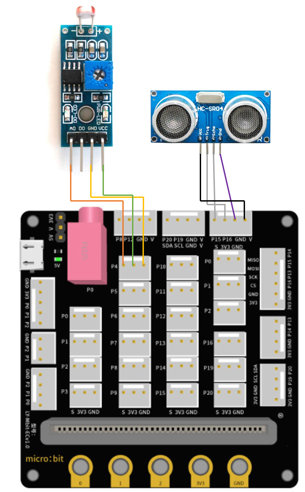
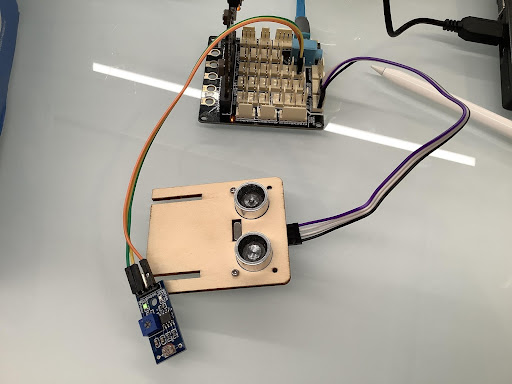

# 壞車

## 目標

製作智能交通系統。當遇到交通事故時，車輛會向另一方向行駛以避開事故車輛。

## 背景
### 什麽是智能交通系統？

智能交通系統可以幫助避開交通事故。當遇上交通意外時，它會提醒後方車輛駛向另一方向，幫助避免交通擁塞。

### 智能交通系統運作

## 材料準備

Microbit （1） 
Expansion board 擴展板 （1） 
Light sensor 光敏傳感器 （1） 
Distance sensor 距離傳感器 （1） 
母對母杜邦綫 Female To Female Dupont Cable Jumper Wire Dupont Line （7） 
M3*8mm screw (1) 
M2*8mm screw(4) 
M3 nut （1） 
M2 nut（4） 
螺絲批 （1） 
Module E (1)  

## 組裝步驟
### 第一步

使用M2 *8mm螺釘將距離傳感器安裝到E1模型上。

 

### 第二步

把E1模型放在E2模型上。

 

### 第三步

組裝完成!

 

## 硬件連接

Micorbit 1：

將光敏傳感器連接到P4端口。
將距離傳感器連接到P14（Trig）/P15（echo）端口。

 

 

Microbit 2：

Car

## 編程

### Sender：

### 在起始位置設置廣播群組
+ 將廣播群組設爲6拖入當啓動時
 

### 獲得光及距離的數值
+ 將如果語句放入重複無數次 ，設get light value (percentage) at pin P4 <40
+ 如果get light value (percentage) at pin P4 < 40，再拖入 如果get distance unit cm trig P15 echo 16 < 20
 

### 發送廣播數字以控制車輛
+ 將廣播發送數字2拖入 if 句式 
+ 將廣播發送數字0拖入 else 句式 
 

Full solution： 
<a href="https://makecode.microbit.org/_PcaMb88sqMuF">https://makecode.microbit.org/_PcaMb88sqMuF</a>

### Receiver：
### 在起始位置設置廣播群組
+ 將廣播群組設爲6拖入當啓動時
+ 最初，汽車默認向前移動
 

 

### 通過接收不同數字來控制車輛
+ 將如果語句放入當收到廣播數字 receivedNumber 
+ 設receivedNumber =2，並讓車向左移動。
+ 設receivedNumber=0，並讓車向前移動。
 

Full solution： 
<a href="https://makecode.microbit.org/_4hW5yAXg8f5T">https://makecode.microbit.org/_4hW5yAXg8f5T</a> 
<a href="https://makecode.microbit.org/_1o1iRhg3qfRF">https://makecode.microbit.org/_1o1iRhg3qfRF</a>

## 總結

距離傳感器是用作感應是否有車輛經過。光敏傳感器是用作感應事故車輛的。當光敏傳感器被遮擋（即有事故發生）時，會向經過的車輛發送信號，告知它們要改變方向，以避開事故車輛。

## 思考

除了轉彎，遇到交通事故時，還可以怎麽控制車輛避開事故？

