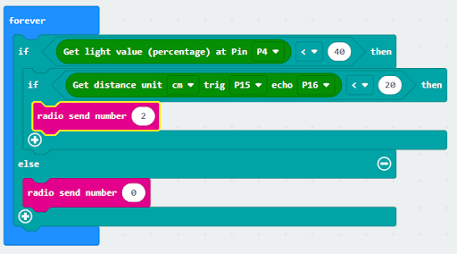
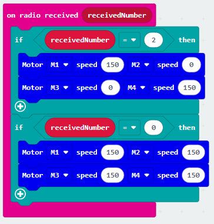

# Lesson 06: Broken Car 壞車

## 6.1 Goal 目標a

Make a smart traffic system which forces the car to go in another direction when there is a traffic jam in one of the roads.  

製作智能交通系統。當遇到交通事故時，車輛會向另一方向行駛以避開事故車輛。

## 6.2 Background 背景
### What is a smart traffic system ? 什麽是智能交通系統？

Smart traffic systems are used to prevent traffic jams. When a traffic jam occurs, the other cars are forced to go in another direction such that the normal traffic flow can be maintained. 

智能交通系統可以幫助避開交通事故。當遇上交通意外時，它會提醒後方車輛駛向另一方向，幫助避免交通擁塞。

### Smart traffic system Operation 智能交通系統運作

## 6.3 Part List 材料準備

Microbit （1） 
Expansion board 擴展板 （1） 
Light sensor 光敏傳感器 （1） 
Distance sensor 距離傳感器 （1） 
母對母杜邦綫 Female To Female Dupont Cable Jumper Wire Dupont Line （7） 
M3*8mm screw (1) 
M2*8mm screw(4) 
M3 nut （1） 
M2 nut（4） 
螺絲批 （1） 
Module E (1)  

## 6.4 Assembly step 組裝步驟
### Step 1 第一步

Attach the distance sensor to E1 model using M2*8mm screw. 使用M2 *8mm螺釘將距離傳感器安裝到E1模型上。

 

### Step 2 第二步

Put the E1 model on the E2 model. 把E1模型放在E2模型上。

 

### Step 3 第三步

Assembly completed! 組裝完成!

 

## 6.5 Hardware connect 硬件連接

Micorbit 1：

Connect light sensor to P4 port
Connect the Distance Sensor to P15 (trig)/ P16 (echo) port

將光敏傳感器連接到P4端口。
將距離傳感器連接到P14（Trig）/P15（echo）端口。

 

Microbit 2：

Car

## 6.6 Programming (MakeCode) 編程

### Sender：

### Step 1. Set radio set group at start position 在起始位置設置廣播群組
+ Drag radio set group 6 to on start  將廣播群組設爲6拖入當啓動時
 

### Step 2. Get light and distance value 獲得光及距離的數值
+ Snap if statement into forever, set get light value (percentage) at pin P4 < 40
+ 將如果語句放入重複無數次 ，設get light value (percentage) at pin P4 <40
+ If get light value (percentage) at pin P4 < 40, and else if get distance unit cm trig P15 echo 16 < 20
+ 如果get light value (percentage) at pin P4 < 40，再拖入 如果get distance unit cm trig P15 echo 16 < 20
 

### Step 3. Control the car by sending radio number發送廣播數字以控制車輛
+ Drag radio send number to 2 into if 將廣播發送數字2拖入 if 句式 
+ Drag radio send number to 0 into else 將廣播發送數字0拖入 else 句式 
 

Full solution： 
https://makecode.microbit.org/_PcaMb88sqMuF

### Receiver：
### Step 1. Set radio set group at start position 在起始位置設置廣播群組
+ Drag radio set group 6 to on start  將廣播群組設爲6拖入當啓動時
+ Initially, the car  moves forward by default
 

 

### Step 2. Control car by receiving different number 通過接收不同數字來控制車輛
+ Snap if statement into on radio received receivedNumber 將如果語句放入當收到廣播數字 receivedNumber 
+ Set receivedNumber =2 and make the car turn left 設receivedNumber =2，並讓車向左移動。
+ Set receivedNumber=0 and make the car move forward 設receivedNumber=0，並讓車向前移動。
 

Full solution： 
https://makecode.microbit.org/_4hW5yAXg8f5T 
https://makecode.microbit.org/_1o1iRhg3qfRF

## 6.7 Result 總結

Distance sensor is used to sense if there are cars passing by. Light sensor is used to detect the broken car. When the light sensor is covered (i.e., when an accident happens), it sends a signal to the passing cars to alert them to change direction so as to maintain normal traffic flow. 

距離傳感器是用作感應是否有車輛經過。光敏傳感器是用作感應事故車輛的。當光敏傳感器被遮擋（即有事故發生）時，會向經過的車輛發送信號，告知它們要改變方向，以避開事故車輛。

## 6.8 Think 思考

Other than turning, how can we control the passing cars to change direction so as to maintain normal traffic flow? 

除了轉彎，遇到交通事故時，還可以怎麽控制車輛避開事故？

