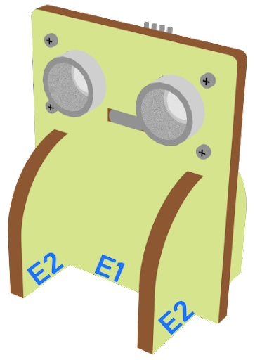

# Lesson 07: Crosswalk 

## 7.1 Goal 

Make a smart crosswalk system. When a pedestrian is detected crossing the road, within five seconds, if a car passes by, the car will be controlled to stop and let the pedestrian cross the road first.

 

## 7.2 Background 
### What is a smart crosswalk system? 

Smart crosswalk system is used to maintain normal operation of the crosswalk. When a person comes near the crosswalk and wants to cross the road, the cars coming through will automatically stop and let the pedestrians go first. Otherwise, the cars will keep going. 

### Smart crosswalk system operation 

## 7.3 Part List

Microbit （1） 
Expansion board  （1） 
Distance sensor (1) 
obstacle Infrared avoidance sensor  (1) 
Female To Female Dupont Cable Jumper Wire Dupont Line （7） 
M3*8mm screw (1) 
M2*8mm screw(4) 
M2 nut （1） 
M2 nut （4） 
Screwdriver（1） 
Module B (1) 
Module E(1)  

## 7.4 Assembly step 
### Step 1

Attach obstacle Infrared avoidance sensor to B1 model with M3 * 8mm screws and nuts. 

 

### Step 2 

Put the B1 model onto the B2 model. 

 

### Step 3 

Assembly completed! 

 

### Step 4 

Attach the distance sensor to E1 model using M2*8mm screw. 

 

### Step 5 

Put the E2 model on the E1 model. 

 

### Step 6 

Assembly completed! 

 

## 7.5 Hardware connect 

Microbit 1：

Connect obstacle Infrared avoidance sensor to P4 port
Connect the Distance Sensor to P15 (trig)/ P16 (echo) port

 

Microbit2： 

car

## 7.6  Programming (MakeCode) 
### Sender:
### Step 1. Set radio set group at start position 
+ Drag radio set group 6 to on start  

### Step 2. When trigger a motion 
+ Snap if statement into forever, set get motion (triggered or not) at pin P4 
+ Snap pause to the loop to wait for 0.1 second for next checking 
 

### Step 3. Keep the status for 5 second 
+ set variable second to 50 
+ While second > 0, snap pause to 0.1 second and change second by -1.
 

### Step 4. Get distance value
+ Snap if statement into while loop, set get distance unit cm trig P15 echo P16 < 20
 

### Step 5. Control the car by sending radio number發送廣播數字以控制車輛
+ Drag radio send number to 1 into if 將廣播發送數字1拖入 if 句式
 

Full solution: 
https://makecode.microbit.org/_hyo2D4FRJ7qM

 

### Receiver：
### Step 1. Set radio set group at start position 
+ Drag radio set group 6 to on start  
+ Initially, the car  moves forward by default
 

 
### Step 2. Control car by receiving different number 
+ Snap if statement into on radio received receivedNumber 
+ Set receivedNumber =1 and make the car stop 
+ Set receivedNumber=0 and make the car move forward 
 

Full solution： 
https://makecode.microbit.org/_4hW5yAXg8f5T 
https://makecode.microbit.org/_1o1iRhg3qfRF

## 7.7 Result 

Distance sensor is used to detect whether there are cars passing by. Obstacle Infrared avoidance sensor is used to sense whether there are pedestrians crossing the crosswalk. When the Infrared sensor is triggered (i.e., pedestrian crossing the road), it sends a signal to the passing cars to alert them to stop and let the pedestrians cross first. 

## 7.8 Think 

Q1: What will the program be like when there are pedestrians crossing from the other side of the crosswalk? 

