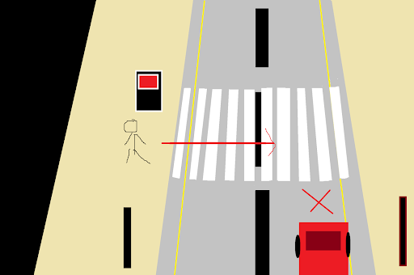
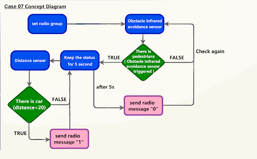
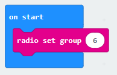

# Lesson 07: Crosswalk 斑馬綫

## Goal 目標

Make a smart crosswalk system. When a pedestrian is detected crossing the road, within five seconds, if a car passes by, the car will be controlled to stop and let the pedestrian cross the road first.

製作一個智能斑馬綫系統。當感應到有行人要過馬路，五秒範圍内，若有車輛經過，控制車輛刹車，讓行人先過馬路。

 

## Background 背景
### What is a smart crosswalk system? 什麽是智能斑馬綫系統？

Smart crosswalk system is used to maintain normal operation of the crosswalk. When a person comes near the crosswalk and wants to cross the road, the cars coming through will automatically stop and let the pedestrians go first. Otherwise, the cars will keep going. 

智能斑馬綫系統是用作管理斑馬綫附近的車輛控制。當有行人需要過馬路，車輛應該停車，讓行人優先通過。這樣一方面提高了斑馬綫的使用率也確保了行人的安全。

### Smart crosswalk system operation 智能斑馬綫運作

## Part List

Microbit （1） 
Expansion board 擴展板 （1） 
Distance sensor 距離傳感器(1) 
obstacle Infrared avoidance sensor  紅外路障傳感器(1) 
母對母杜邦綫 Female To Female Dupont Cable Jumper Wire Dupont Line （7） 
M3*8mm screw (1) 
M2*8mm screw(4) 
M2 nut （1） 
M2 nut （4） 
螺絲批（1） 
Module B (1) 
Module E(1)  

## Assembly step 組裝步驟
### Step 1 第一步

Attach obstacle Infrared avoidance sensor to B1 model with M3 * 8mm screws and nuts. 

將紅外路障傳感器安裝在模板B1上，並用M3*8mm螺絲及螺母固定。 

 

### Step 2 第三步

Put the B1 model onto the B2 model. 把B1模型放到B2模型上。

 

### Step 3 第三步

Assembly completed! 組裝完成!

 

### Step 4 第四步

Attach the distance sensor to E1 model using M2*8mm screw. 使用M2*8mm螺釘將距離傳感器安裝到E1模型上。

 

### Step 5 第五步

Put the E2 model on the E1 model. 把E2模型放在E1模型上。

 

### Step 6 第六步

Assembly completed! 組裝完成!

 

## Hardware connect 硬件連接

Microbit 1：

Connect obstacle Infrared avoidance sensor to P4 port
Connect the Distance Sensor to P15 (trig)/ P16 (echo) port

將紅外路障傳感器連接到P4端口。
將距離傳感器連接到P14（Trig）/P15（echo）端口。

 

Microbit2： 

car

## Programming (MakeCode) 編程
### Sender:
### Step 1. Set radio set group at start position 在起始位置設置 radio group
+ Drag radio set group 6 to on start   將廣播群組設爲6拖入當啓動時

### Step 2. When trigger a motion 當觸發紅外傳感器
+ Snap if statement into forever, set get motion (triggered or not) at pin P4 將get motion (triggered or not) at pin P4 的如果句式放入重複無限次
+ Snap pause to the loop to wait for 0.1 second for next checking 把暫停拖入循環，為下一次檢查等待0.1秒。
 

### Step 3. Keep the status for 5 second 保留觸發狀態五秒
+ set variable second to 50 設定變數second為50
+ While second > 0, snap pause to 0.1 second and change second by -1.當second大於0，停止0.1秒，並改變second減少1
 

### Step 4. Get distance value獲得距離數值
+ Snap if statement into while loop, set get distance unit cm trig P15 echo P16 < 20
+ 將get distance unit cm trig P15 echo P16 < 20的如果句式拖入循環中
 

### Step 5. Control the car by sending radio number發送廣播數字以控制車輛
+ Drag radio send number to 1 into if 將廣播發送數字1拖入 if 句式
+ Drag radio send number to 0 outside the while loop 將廣播發送數字0拖到循環外
 

Full solution: 
https://makecode.microbit.org/_hyo2D4FRJ7qM

 

### Receiver：
### Step 1. Set radio set group at start position 在起始位置設置廣播群組
+ Drag radio set group 6 to on start  將廣播群組設爲6拖入當啓動時
+ Initially, the car  moves forward by default
 

 
### Step 2. Control car by receiving different number 通過接收不同數字來控制車輛
+ Snap if statement into on radio received receivedNumber 將如果語句放入當收到廣播數字 receivedNumber 
+ Set receivedNumber =1 and make the car stop 設receivedNumber =1，並控制刹車。
+ Set receivedNumber=0 and make the car move forward 設receivedNumber=0，並讓車向前移動。
 

Full solution： 
https://makecode.microbit.org/_4hW5yAXg8f5T 
https://makecode.microbit.org/_1o1iRhg3qfRF

## Result 總結

Distance sensor is used to detect whether there are cars passing by. Obstacle Infrared avoidance sensor is used to sense whether there are pedestrians crossing the crosswalk. When the Infrared sensor is triggered (i.e., pedestrian crossing the road), it sends a signal to the passing cars to alert them to stop and let the pedestrians cross first. 

距離傳感器是用作感應是否有車輛經過。紅外障礙傳感器是用作感應是否有行人要過斑馬綫。當紅外障礙傳感器被觸發（即有行人要過斑馬綫）時，會向經過的車輛發送信號，告知它們要停車，讓行人先過馬路。

## Think 思考

Q1: What will the program be like when there are pedestrians crossing from the other side of the crosswalk? 

如果斑馬綫的另一邊也有行人要過馬路，新的程式將會是怎麽的？

