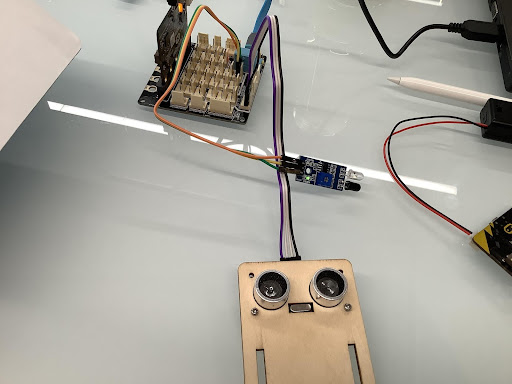

# 斑馬綫

## 目標

製作一個智能斑馬綫系統。當感應到有行人要過馬路，五秒範圍内，若有車輛經過，控制車輛刹車，讓行人先過馬路。

 

## 背景
### 什麽是智能斑馬綫系統？

智能斑馬綫系統是用作管理斑馬綫附近的車輛控制。當有行人需要過馬路，車輛應該停車，讓行人優先通過。這樣一方面提高了斑馬綫的使用率也確保了行人的安全。

### 智能斑馬綫運作

## 材料準備

Microbit （1） 
Expansion board 擴展板 （1） 
Distance sensor 距離傳感器(1) 
obstacle Infrared avoidance sensor  紅外路障傳感器(1) 
母對母杜邦綫 Female To Female Dupont Cable Jumper Wire Dupont Line （7） 
M3*8mm screw (1) 
M2*8mm screw(4) 
M2 nut （1） 
M2 nut （4） 
螺絲批（1） 
Module B (1) 
Module E(1)  

## 組裝步驟
### 第一步

將紅外路障傳感器安裝在模板B1上，並用M3*8mm螺絲及螺母固定。 

 

### 第三步

把B1模型放到B2模型上。

 

### 第三步

組裝完成!

 

### 第四步

使用M2*8mm螺釘將距離傳感器安裝到E1模型上。

 

### 第五步

把E2模型放在E1模型上。

 

### 第六步

組裝完成!

 

## 硬件連接

Microbit 1：

將紅外路障傳感器連接到P4端口。
將距離傳感器連接到P14（Trig）/P15（echo）端口。

 

 

Microbit2： 

car

## 編程
### Sender:
### 在起始位置設置 radio group
+ 將廣播群組設爲6拖入當啓動時

### 當觸發紅外傳感器
+ 將get motion (triggered or not) at pin P4 的如果句式放入重複無限次
+ 把暫停拖入循環，為下一次檢查等待0.1秒。
 

### 保留觸發狀態五秒
+ 設定變數second為50
+ 當second大於0，停止0.1秒，並改變second減少1
 

### 獲得距離數值
+ 將get distance unit cm trig P15 echo P16 < 20的如果句式拖入循環中
 

### 發送廣播數字以控制車輛
+ 將廣播發送數字1拖入 if 句式
+ 將廣播發送數字0拖到循環外
 

Full solution: 
<a href="https://makecode.microbit.org/_hyo2D4FRJ7qM">https://makecode.microbit.org/_hyo2D4FRJ7qM</a>

 

### Receiver：
### 起始位置設置廣播群組
+ 將廣播群組設爲6拖入當啓動時
+ 最初，汽車默認向前移動
 

 
### 通過接收不同數字來控制車輛
+ 將如果語句放入當收到廣播數字 receivedNumber 
+ 設receivedNumber =1，並控制刹車。
+ 設receivedNumber=0，並讓車向前移動。
 

Full solution： 
<a href="https://makecode.microbit.org/_4hW5yAXg8f5T">https://makecode.microbit.org/_4hW5yAXg8f5T</a> 
<a href="https://makecode.microbit.org/_1o1iRhg3qfRF">https://makecode.microbit.org/_1o1iRhg3qfRF</a>

## 總結

距離傳感器是用作感應是否有車輛經過。紅外障礙傳感器是用作感應是否有行人要過斑馬綫。當紅外障礙傳感器被觸發（即有行人要過斑馬綫）時，會向經過的車輛發送信號，告知它們要停車，讓行人先過馬路。

## 思考

如果斑馬綫的另一邊也有行人要過馬路，新的程式將會是怎麽的？

