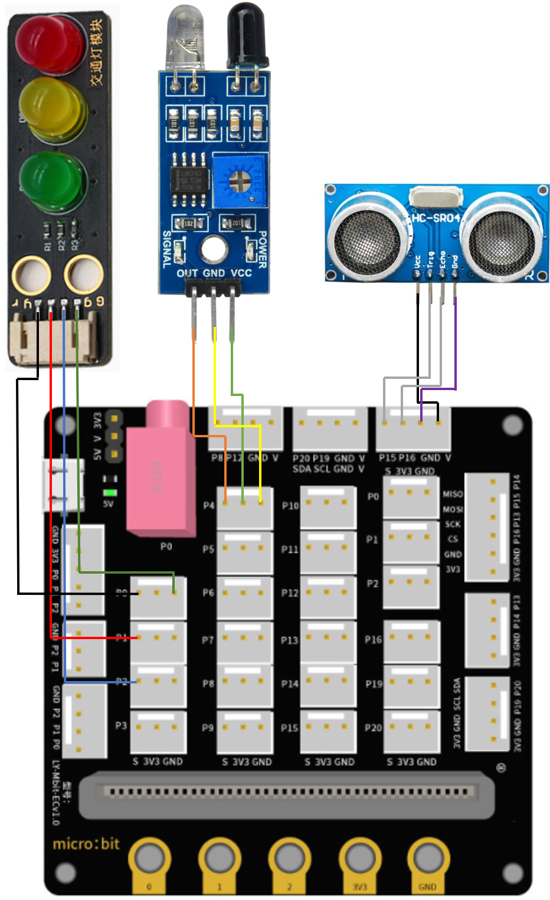
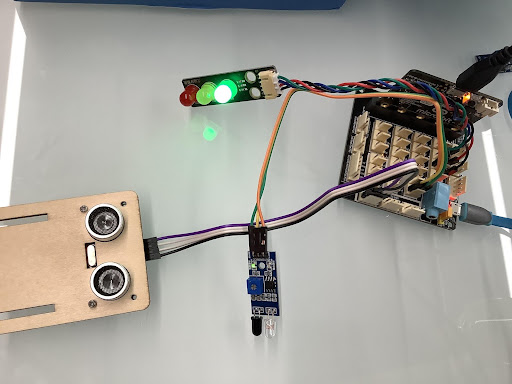

# 智能交通燈

## 目標

在上一課的基礎下，製作智能交通燈。會在刹車前及恢復正常行駛前，控制交通燈的燈光轉換，讓方便司機了解道路狀態。

## 背景

### 什麽是智能交通燈？

當行人路上的紅外路障傳感器被觸發（有行人經過），智能紅綠燈將會進行智能轉換至紅燈，並控制車輛刹車。5秒後，再轉換回綠燈，並讓車輛回復正常行駛。

### 智能交通燈運作
 

## 材料準備

Microbit （1） 
Expansion board 擴展板（1） 
Distance sensor(1) 
Obstacle Infrared avoidance sensor 紅外路障傳感器 (1) 
Traffic light 交通燈 (1) 
4-pin module wire PH2.0轉杜邦綫4P（1） 
母對母杜邦綫 Female To Female Dupont Cable Jumper Wire Dupont Line  （7） 
M3*8mm screw (1) 
M2*8mm screw (4) 
M3 nut （1） 
M2 nut （4） 
螺絲批（1） 
Module B (1) 
Module E (1) 
Module I（1） 

## 組裝步驟

### 第一步

在第七課的基礎下，用M3*8螺絲和螺母將交通燈模塊安裝到I1模型上。

 

### 第二步

把I1模型放到I2模型上。

 

### 第三步

組裝完成!

 

## 硬件連接

Microbit 1：

將交通LED模塊連接到 P1 P2 P3埠。 
將紅外路障傳感器連接到P4端口。 
將距離傳感器連接到P14（Trig）/P15（echo）端口。 

 
 

 

Microbit2： 
Car

## 編程
### Sender：
### 設置一個新的功能（TurnRed）。
+ 暫停一秒
+ 控制黃色交通燈亮起 
+ 暫停一秒
+ 控制紅色交通燈亮起
 

### 設置一个新的功能（TurnGreen）。
+ 暫停一秒
+ 控制黃色交通燈亮起 
+ 暫停一秒
+ 控制綠色交通燈亮起
 

### 第一步 停用 micro:bit LED。
+ 將積木啓用設爲false拖放到當啓動時
+ 注意，P3在默认设置中被用作LED，因此LED需要被禁用。
 

### 像上一課一樣初始化程序
+ 將 trafficLight to Traffic light pin setting Red P0 Yellow P1 Green P2 拖入 當啓動時
+ 控制綠色交通燈亮起
+ 將廣播群組設爲6拖入當啓動時
 

### 呼叫函數
+ 將呼叫TurnRed拖入get motion (triggered or not) at pin P4的如果句式中
+ 將呼叫TurnGreen 拖到循環后
 

Full solution 
<a href="https://makecode.microbit.org/_XEKU87ijgFY2">https://makecode.microbit.org/_XEKU87ijgFY2</a>

 
### Receiver：
### 在起始位置設置廣播群組
+ 將廣播群組設爲6拖入當啓動時
+ 最初，汽車默認向前移動
 

### 通過接收不同數字來控制車輛
+ 將如果語句放入當收到廣播數字 receivedNumber 
+ 設receivedNumber =1，並控制刹車。
+ 設receivedNumber=0，並讓車向前移動。

Full solution： 
<a href="https://makecode.microbit.org/_4hW5yAXg8f5T">https://makecode.microbit.org/_4hW5yAXg8f5T</a> 
<a href="https://makecode.microbit.org/_1o1iRhg3qfRF">https://makecode.microbit.org/_1o1iRhg3qfRF</a>

## 總結

在上一課的基礎下，增加一個紅綠燈模塊，當感應到有行人經過時，會先轉紅燈，再控制車輛刹車。之後，行人過完馬路，再控制交通燈轉綠燈及使車輛繼續向前行駛。

 
## 思考

我們怎樣才能根據相應的顏色為交通LED模塊添加聲音效果？

