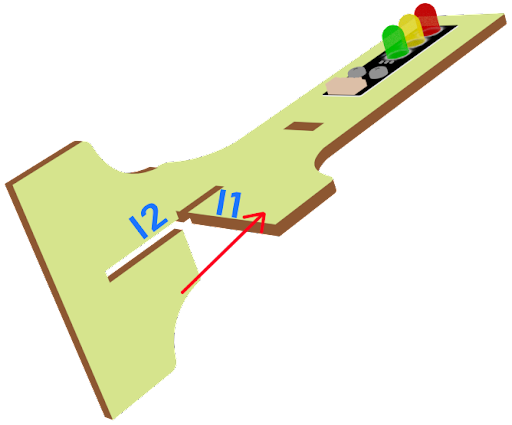
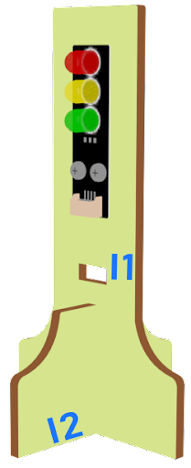

# 行人過路交通燈二

## 目標

在上一課的基礎之上，製作一個具提示聲的智能行人過路燈系統。

## 背景
### 什麽是智能行人過路燈？

智能行人過路燈系統可以更好地指導行人過馬路，提示聲亦方便視障人士了解道路情況。

### 智能交通燈運作

Traffic light 1:

 

 

Traffic light 2

 

## 材料準備

Microbit （1） 
Expansion board 擴展板 （1） 
Distance sensor 距離傳感器(1) 
Obstacle Infrared avoidance sensor  (1) 
Traffic light (2) 
Buzzer（1） 
3-pin module wire （1） 
4-pin module wire （2） 
母對母杜邦綫 Female To Female Dupont Cable Jumper Wire Dupont Line （7） 
M2*8mm screw (4) 
M3*8mm screw (5) 
M2 nut（4） 
M3 nut （5） 
螺絲批 
Module B(1) 
Module C (1) 
Module E (1)  
Module I（2） 

## 組裝步驟
### 第一步

在第八課的基礎下，用M3*8螺絲和螺母將交通燈模塊安裝到I1模型上。

 

### 第二步

把I1模型放到I2模型上。

 

### 第三步

組裝完成!

 

### 第四步

用M3*8毫米的螺釘和螺母將蜂鳴器安裝到C1模型上。

 

### 第五步

把C1模型放到C2模型上。

 

### 第六步

組裝完成!

 

## 硬件連接

Microbit 1：

將交通LED模塊連接到P0 P1 P2埠。 
將紅外路障傳感器連接到P4端口。 
將距離傳感器連接到P14（Trig）/P15（echo）端口。 

Microbit2:

將交通LED模塊連接到P0 P1 P2埠。 
將蜂鳴器連接到P0端口 

Microbit 3:

car

## 編程
### Traffic light 1：
### 設置一個新的功能（TurnRed）。
+ 暫停一秒
+ 控制交通燈亮黃燈
+ 暫停一秒
+ 控制交通燈亮紅燈
 

### 設置一个新的功能（TurnGreen）。
+ 暫停一秒
+ 控制交通燈亮黃燈
+ 暫停一秒
+ 控制交通燈亮綠燈
 

### 初始化程序
+ 將 trafficLight to Traffic light pin setting Red P0 Yellow P1 Green P2 拖入 當啓動時
+ 控制交通燈亮綠燈 
+ 將廣播群組設爲6拖入當啓動時
+ 在循環無數次中，將呼叫TurnRed拖入get motion (triggered or not) at pin P4的如果句式中
+ 將呼叫TurnGreen 拖到循環后
 

### 發送廣播字串以控制交通燈
+  將廣播發送字串“R”拖到TurnGreen前
+ 將廣播發送字串“G”拖到TurnRed前
 

Full solution 
<a href="https://makecode.microbit.org/_AwV0wo0bcc8j">https://makecode.microbit.org/_AwV0wo0bcc8j</a>

 

### Traffic light 2：
### 設置新的功能。
 

### 初始化程序
+ 將 trafficLight to Traffic light pin setting Red P0 Yellow P1 Green P2 拖入當啓動時
+ 將廣播群組設爲6拖入當啓動時
+ 控制交通燈亮綠燈
+ 設變數green=0
 

### 通過接收不同數字來控制交通燈及車輛
+ ng 將如果語句放入當收到廣播數字 receivedString 
+ 設receivedString=”R”，並呼叫TurnRed
+ 設receivedString=”G”，並呼叫TurnGreen
+ 根據燈光改變變數green的數值
 

### 根據燈光播放聲效
+ 將如果語句放入循環無數次
+ 彈奏不同節奏的旋律
 

Ful solution: 
<a href="https://makecode.microbit.org/_LmUhPRb0L0pE">https://makecode.microbit.org/_LmUhPRb0L0pE</a>

 

### Receiver：
### 在起始位置設置廣播群組
+ 將廣播群組設爲6拖入當啓動時
+ 最初，汽車默認向前移動
 

### 通過接收不同數字來控制車輛
+ 將如果語句放入當收到廣播數字 receivedNumber 
+ 設receivedNumber =1，並控制刹車。
+ 設receivedNumber=0，並讓車向前移動。

Full solution： 
<a href="https://makecode.microbit.org/_4hW5yAXg8f5T">https://makecode.microbit.org/_4hW5yAXg8f5T</a> 
<a href="https://makecode.microbit.org/_1o1iRhg3qfRF">https://makecode.microbit.org/_1o1iRhg3qfRF</a>

## 總結

在上一課的基礎下，為行人製作一個具提示聲的行人過路燈系統。

## 思考

試試看，在轉綠燈前讓綠燈閃爍，並配上適合的聲效。

