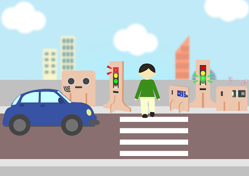
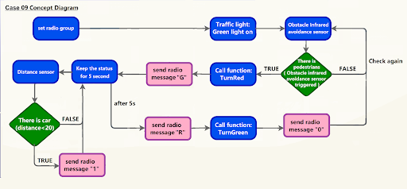
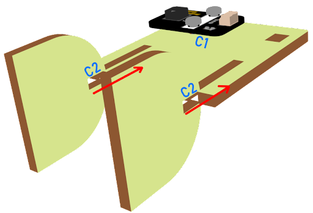
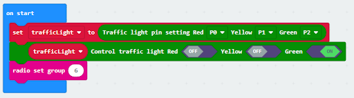
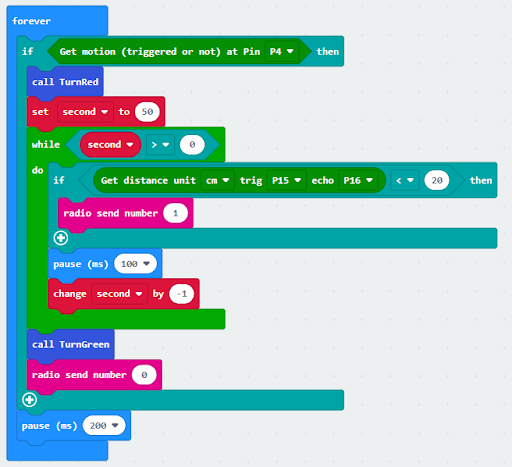
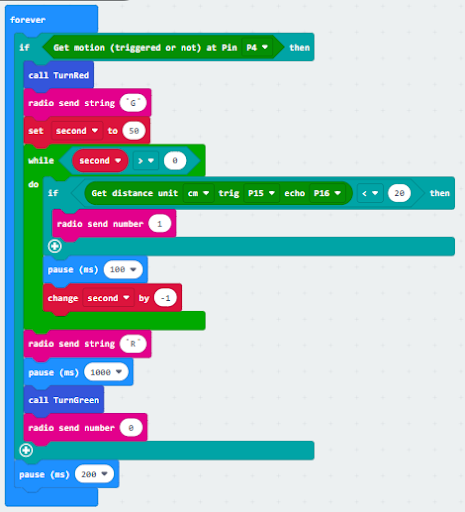
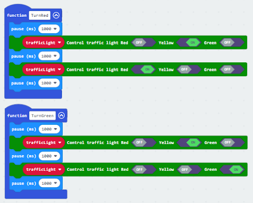
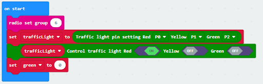
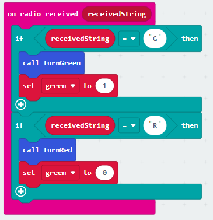
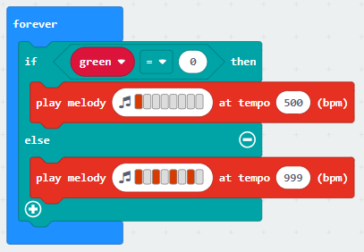

# Smart Pedestrian Lights 2 行人過路交通燈二

## Goal 目標

Make a smart pedestrian light system with an alerting sound on the basis of the last lesson. 

在上一課的基礎之上，製作一個具提示聲的智能行人過路燈系統。

## Background 背景
### What is a smart pedestrian light? 什麽是智能行人過路燈？

Smart pedestrian light systems are designed to maintain normal operation of the intersection. They automatically switch between red and green lights among different intersection traffic lights according to the road traffic situation.    

智能行人過路燈系統可以更好地指導行人過馬路，提示聲亦方便視障人士了解道路情況。

### Smart traffic light operation 智能交通燈運作

Traffic light 1:

 

 

Traffic light 2

 

## Part List 材料準備

Microbit （1） 
Expansion board 擴展板 （1） 
Distance sensor 距離傳感器(1) 
Obstacle Infrared avoidance sensor  (1) 
Traffic light (2) 
Buzzer（1） 
3-pin module wire （1） 
4-pin module wire （2） 
母對母杜邦綫 Female To Female Dupont Cable Jumper Wire Dupont Line （7） 
M2*8mm screw (4) 
M3*8mm screw (5) 
M2 nut（4） 
M3 nut （5） 
螺絲批 
Module B(1) 
Module C (1) 
Module E (1)  
Module I（2） 

## Assembly step 組裝步驟
### Step 1 第一步

On the basis of lesson 8, attach the Traffic light Module to G1 model using M3*8 screw and nut. Put together all the cardboard parts (I1-I2)

在第八課的基礎下，用M3*8螺絲和螺母將交通燈模塊安裝到I1模型上。

 

### Step 2 第二步

Put the I1 model onto the I2 model. 把I1模型放到I2模型上。

 

### Step 3 第三步

Assembly completed! 組裝完成!

 

### Step 4 第四步

Attach the buzzer to C1 model using M3 * 8mm screw and nut. 用M3*8毫米的螺釘和螺母將蜂鳴器安裝到C1模型上。

 

### Step 5 第五步

Put the C1 model onto the D2 model. 把C1模型放到C2模型上。

 

### Step 6 第六步

Assembly completed! 組裝完成!

 

## Hardware connect 硬件連接

Microbit 1：

Connect the Traffic light LED Module to P0 P1 P2 port 
Connect obstacle Infrared avoidance sensor to P4 port 
Connect the Distance Sensor to P15 (trig)/ P16 (echo) port 

將交通LED模塊連接到P0 P1 P2埠。 
將紅外路障傳感器連接到P4端口。 
將距離傳感器連接到P14（Trig）/P15（echo）端口。 

Microbit2:

Connect buzzer to P0 port  
Connect the Traffic light LED Module to P0 P1 P2 port 

將交通LED模塊連接到P0 P1 P2埠。 
將蜂鳴器連接到P0端口 

Microbit 3:

car

## Programming (MakeCode) 編程
### Traffic light 1：
### Step 1. Set up a new function (TurnRed) 設置一個新的功能（TurnRed）。
+ Snap pause to wait 1 second 暫停一秒
+ Control traffic light yellow on 控制交通燈亮黃燈
+ Snap pause to wait 1 second 暫停一秒
+ Control traffic light red on 控制交通燈亮紅燈
 

### Step 2. Set up a new function (TurnGreen) 設置一个新的功能（TurnGreen）。
+ Snap pause to wait 1 second 暫停一秒
+ Control traffic light yellow on 控制交通燈亮黃燈
+ Snap pause to wait 1 second 暫停一秒
+ Control traffic light green on 控制交通燈亮綠燈
 

### Step 3. Initialize the program 
+ Drag set variable trafficLight to Traffic light pin setting Red P0 Yellow P1 Green P2 to on start 將 trafficLight to Traffic light pin setting Red P0 Yellow P1 Green P2 拖入 當啓動時
+ Control traffic light green on 
+ Drag radio set group 6 to on start   將廣播群組設爲6拖入當啓動時
+ In forever, snap function TurnRed into if get motion (triggered or not) at pin P4 case 在循環無數次中，將呼叫TurnRed拖入get motion (triggered or not) at pin P4的如果句式中
+ Drag function TurnGreen after the while loop 將呼叫TurnGreen 拖到循環后
 

### Step 4. Control traffic light 2 by sending radio string發送廣播字串以控制交通燈
+ Drag radio send string “R”  before TurnGreen 將廣播發送字串“R”拖到TurnGreen前
+ Drag radio send string “G” after TurnRed 將廣播發送字串“G”拖到TurnRed前
 

Full solution 
https://makecode.microbit.org/_AwV0wo0bcc8j

 

### Traffic light 2：
### Step 1. Set up new functions  設置新的功能。
 

### Step 2. Initialize the program
+ Drag set variable trafficLight to Traffic light pin setting Red P0 Yellow P1 Green P2 to on start 將 trafficLight to Traffic light pin setting Red P0 Yellow P1 Green P2 拖入當啓動時
+ Drag radio set group 6 to on start   將廣播群組設爲6拖入當啓動時
+ Control traffic light green on 控制交通燈亮綠燈
+ Set a variable green=0 設變數green=0
 

### Step 3. Control traffic light by receiving different number 通過接收不同數字來控制交通燈及車輛
+ Snap if statement into on radio received receivedString 將如果語句放入當收到廣播數字 receivedString 
+ Set receivedString =“R” and call TurnRed 設receivedString=”R”，並呼叫TurnRed
+ Set receivedString =“G” and call TurnGreen 設receivedString=”G”，並呼叫TurnGreen
+ Change variable green depend on the light 根據燈光改變變數green的數值
 

### Step 4. Play sound effect depend on the light status 根據燈光播放聲效
+ Snap if statement into forever 將如果語句放入循環無數次
+ Play melody with different tempo
 

Ful solution: 
https://makecode.microbit.org/_LmUhPRb0L0pE

 

### Receiver：
### Step 1. Set radio set group at start position 在起始位置設置廣播群組
+ Drag radio set group 6 to on start  將廣播群組設爲6拖入當啓動時
+ Initially, the car  moves forward by default
 

### Step 2. Control car by receiving different number 通過接收不同數字來控制車輛
+ Snap if statement into on radio received receivedNumber 將如果語句放入當收到廣播數字 receivedNumber 
+ Set receivedNumber =1 and make the car stop 設receivedNumber =1，並控制刹車。
+ Set receivedNumber=0 and make the car move forward 設receivedNumber=0，並讓車向前移動。

Full solution： 
https://makecode.microbit.org/_4hW5yAXg8f5T 
https://makecode.microbit.org/_1o1iRhg3qfRF

## Result 總結

On the basis of the last lesson, a smart pedestrian light system with an alerting sound is added in this lesson. 

在上一課的基礎下，為行人製作一個具提示聲的行人過路燈系統。

## Think 思考

Try to let the green light blink before turning green, and match with a suitable sound effect.

試試看，在轉綠燈前讓綠燈閃爍，並配上適合的聲效。

