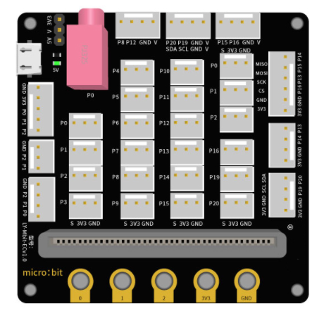
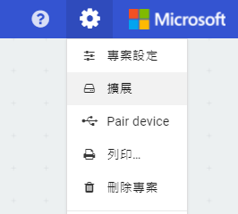
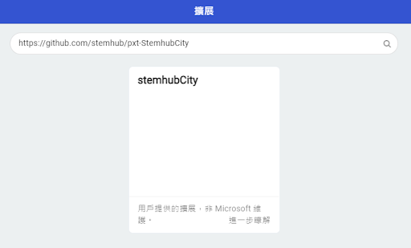
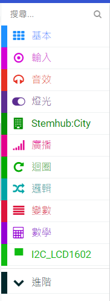

# 第一課  認識智能家居 

## 一、什麼是智能家居 

智能家居（smart home, home automation）是以住宅為平台，再利用綜合布線技術、網路通信技術、安全防範技術、自動控制技術及音視頻技術將家居生活有關的設備集成一體，然後構建高效的住宅設施與家庭日程事務的管理系統，從而提升家居安全性、便利性、舒適性和藝術性，並實現環保節能的居住條件。 

## 二、智能家居的優勢 

智能化：由原來的被動靜止結構轉變為具有能動智能的工具。 

信息化：提供全方位的訊息交換功能，幫助家庭與外部保持訊息交流暢通。 

人性化：強調人的主觀能動性，重視人與居住環境的協調，使用戶能隨心所欲地控制室內居住環境。 

節能化：關閉家用電器的睡眠模式，一鍵徹底斷電，從而節省了電能

本課程製作的智能家居是運用microbit 開源硬體、傳感器模塊、編程和激光切割等技術實現的作品。旨在使讀者通過動手搭建房子模型，了解傳感器的特點和原理，學習makecode編程，運用傳感器來實現家居設備的智能自動化。從中不僅更加深入瞭解智能家居的特點及場景應用，且融會貫通地運用各種傳感器將生活家居設備等實現智能化，讓人們生活更加安全和便捷

  
## 三、智能家居模型搭建步驟展示

1、前側和左側面組合在一起，如圖所示：

.jpg) 
.jpg) 
.jpg) 

2、組裝右側面，如圖所示：

  
.jpg) 
.jpg)   

3、拼裝後面，如圖所示：

  
.jpg) 
.jpg) 

4、把組合好的房子四面插在底板上，如圖所示：

  
.jpg) 
.jpg) 

5、將M3螺絲母嵌入房樑並使用M3*12螺絲拼裝，如圖所示：

  
.jpg) 
.jpg) 

6、最後把屋頂的木板合上，房子的模型即完成拼裝，如圖所示。

  
.jpg) 
.jpg) 

註：傳感器等硬體的組裝，在課程後面的章節中展現。

## 四、了解 micro:bit 拓展板

  
 

  
## 五、準備Micro:bit 編程程式 Makecode：添加擴展

1.在makecode新增專案 

 

2.為這個專案起名 

  
 

3.在設定中選擇擴展 

  
 

4.輸入 https://github.com/stemhub/pxt-StemhubCity 並選擇 stemhubCity 

  
 

5.擴展stemhub：city和I2C__LCD1602添加成功 

  
 

