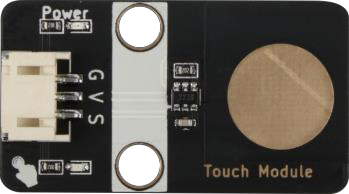
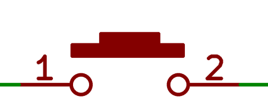
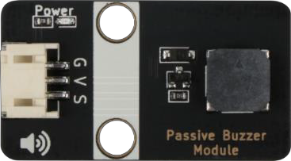
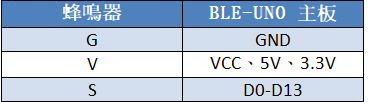
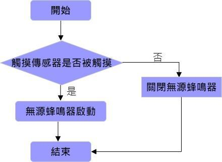

# 第三課  音樂門鈴 

## 任務背景： 

門鈴即門上的鈴，其作用是可以發出聲音提醒主人有客到訪。現在家居中比較常見的門鈴有普通無線門鈴、不用電池的無線門鈴和有線門鈴，其鈴聲也都十分平常。本節課我們將製作一種音樂門鈴，它是利用觸摸傳感器和無源蜂鳴器實現的，能讓客人在等待之時欣賞音樂的美感。 

## 器材準備： 

Micro:bit主板、擴展板、電池盒、 2 節 AAA 電池、無源蜂鳴器、觸摸傳感器模塊、連接線、USB 數據線。 

## 一、了解觸摸傳感器和無源蜂鳴器 

### 1.1 觸摸傳感器 

觸摸模塊是一個基於觸摸檢測 IC（TTP223B）的電容式點動型觸摸模塊， 類似於下面的示意圖，當模塊的金屬觸片被觸摸，相當於按鍵被按下。我們可以將該模塊安裝在非金屬材料如塑料、玻璃的表面，另外將薄薄的紙片（非金屬）覆蓋在模塊的表面，只要觸摸的位置正確，即可做成隱藏在墻壁、桌面等地方的按鍵。我們的模塊當被觸摸時，輸出高電平，否則輸出低電平。

   
    
 

   
    
 

 
### 1.2 無源蜂鳴器模塊 

    無源蜂鳴器，是沒有內部振盪器的蜂鳴器，在通電時，內部振盪器是不會發出嗡嗡聲的，它需要 2~5 kHz 的方波驅動，然後不同頻率的波形會驅動蜂鳴器發出相應頻率的聲音。 我們常見的一些賀卡裡面會帶一個音樂盒，打開後會播放生日快樂，聖誕歌這些曲調，就是通過無源蜂鳴器來實現的。 

   
    
 

    本課程使用的無源蜂鳴器模塊有三個引腳：G、V、S。G 表示 GND 接地，V 代表 VCC，可接主板的 5.5V 和 3.3V，S 是信號接口。 

   
    
 

 
## 二、門鈴安裝 

    
用M3*8 螺絲把觸摸傳感器安裝右側門左邊，無源蜂鳴器安裝在右側窗戶左邊，如圖所示：

   
    
 

   
    
 

 
## 三、程序設計 

### 3.1 算法設計 

音樂門鈴的原理是當觸摸傳感器被觸碰時，無源蜂鳴器發出聲響；觸摸傳感器沒被觸摸時，無源蜂鳴器不響。根據該原理，其程序流程如下： 

   
    
 

### 3.2 硬件連接： 

傳感器和執行器 | 主控板
:-- | :--
觸摸傳感器|P1
無源蜂鳴器|P0

   
    
 

    
### 3.3 程序示例： 

Makecode 程序 

 

   
    
 

 
https://makecode.microbit.org/_TPLMj6KzkVXb 

 
## 四、總結 

本節課我們學習了無源蜂鳴器和觸摸傳感器模塊的特點及原理，並通過製作音樂門鈴，掌握了無源蜂鳴器和觸摸傳感器的編程控制，從而加深無源蜂鳴器和觸摸傳感器的運用。 

