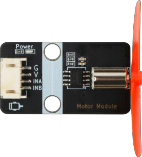

# 第四課 智能溫控風扇 

## 任務背景： 

    隨著全球暖化趨勢越來越嚴峻，風扇和空調成為人們生活必備的設施，但空調耗能大，空調病發病率逐年增高，因此很多人會選擇風扇這種低耗能的乘涼電器。當前，人們日常生活中使用的風扇都是通過按鈕或者旋鈕來調節轉速和風力，但有沒有可能根據室內環境的溫濕度信息來調節風力的大小呢？如果風扇可以根據室內的溫度來改變風力的大小，這樣無疑對人體的健康更有利，也節約能源。這節課我們就來製作一個智能溫控的風扇，看看它是如何達到溫度控風的功能。 

 
## 器材準備： 

Microbit 主板、擴展板、電池盒、2 節 AAA 電池、直流電動機風扇模塊、溫濕度傳感器、連接線、USB 數據線。 

 
## 一、了解溫濕度傳感器和直流電動機風扇模塊 

### 1.1 溫濕度傳感器模塊 

溫濕度傳感器模塊是一款含有已校準數字信號輸出的溫濕度覆合傳感器，它應用專用的數字模塊採集技術和溫濕度傳感技術，確保產品具有極高的可靠性和卓越的長期穩定性。 

    
 

溫濕度傳感器模塊是通過 DHT11 檢測周圍環境的溫濕度，DHT11 內部包括了一個電阻式感濕元件和一個 NTC 測溫元件，並與一個高性能 8 位單片機相連接，只需要一根線就可以與 microbit 完成數據傳輸。 

溫濕度傳感器模塊有三個引腳，G 為 GND 接地，V 為 VCC 接高電平或 5V，S 表示信號線。 

    
 

### 1.2 直流電動機風扇模塊  

直流電動機是將直流電能轉換為機械能的電動機。因其良好的調速性能而在電力拖動中得到廣泛應用。直流電動機按勵磁方式分為永磁、他勵和自勵 3 類，其中自勵又分為並勵、串勵和覆勵 3 種。 當直流電源通過電刷向電樞繞組供電時，電樞表面的 N 極下導體可以流過相同方向的電流，根據左手定則導體將受到逆時針方向的力矩作用；電樞表面 S 極下部分導體也流過相同方向的電流，同樣根據左手定則導體也將受到逆時針方向的力矩作用。這樣，整個電樞繞組即轉子將按逆時針旋轉，輸入的直流電能就轉換成轉子軸上輸出的機械能。由定子和轉子組成，定子：基座，主磁極，換向極，電刷裝置等；轉子（電樞）：電樞鐵心，電樞繞組，換向器，轉軸和風扇等。

    

    
 

    
 

    
 

 

    摩打風扇模塊有四個管腳接口，G 表示 GND 接地，V 表示 VCC 接高電平，INA 和 INB 為輸入管腳，可以接 microbit 控制板的數字端口。如果通過 microbit 開發板在電機 INA 和 INB 的管腳輸出不同的電壓信號，可以實現電機正轉和反轉；同時也可以控制電流的大小來控制導體在磁場中受到的力的大小，當電流越大時， 受到的力也越大，速度也就越快。 

 
## 二、溫控風扇安裝 

    
首先把屋頂木板取下，用 M3*8 的螺絲將摩打風扇模塊安裝在房樑上，溫濕度傳感器安裝在右邊窗戶內側右邊，如圖所示。

    
 

 
## 三、程序設計 

### 3.1 算法設計： 

溫控風扇原理是利用溫濕度傳感器來檢測風扇周圍的熱量的變化，來改變風扇自身的轉速，同時改變空氣的流動（排風量）的智能風。其程序原理是當溫度大於閾值時，風扇啟動；當溫度小於閾值時，風扇關閉。程序流程如下圖所示：

    
 

    
### 3.2 硬件連接： 

溫濕度傳感器連接在micro:bit 擴展板的 P1管腳，直流電機風扇模塊連接在 micro:bit 擴展板的 P15、P16管腳上。 

    
傳感器和執行器 | 主控板
:-- | :--
溫濕度傳感器 | P1 
直流電機風扇模塊 | P15、P16 

    
 

### 3.3 程序示例： 

Makecode程序 

    
 

https://makecode.microbit.org/_2hoHEgYyW4og 

## 四、總結 

本節課我們學習了溫控風扇的原理，了解溫濕度傳感器和直流電機的原理及使用，並通過製作溫控風扇，掌握溫濕度傳感器和直流電機的編程控制，實現利用溫度控制風扇自動啟動和關閉的功能。 

 
