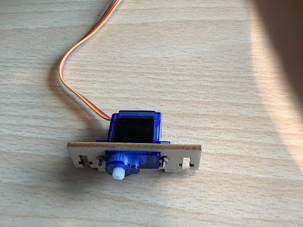

# 第五課 智能門禁 

## 任務背景 

人們為了保護自己的家居和私有財產安全，發明了門鎖。古時，人們鎖門都是用繩子捆綁或者木閂，再接著發展為使用鑰匙門鎖，而人們往往會把鑰匙遺忘在家裡或者丟失，造成了沒法開門的苦惱，且其安全性也不是很高。於是，指紋門鎖，密碼門鎖等更加智能化和安全便捷的門鎖應運而生。本節課的任務就是製作一款智能密碼自動門，讓我們來了解一下這項門禁運行的原理和操作。 

## 器材準備 

microbit 主板、擴展板、電池盒、2 節 AAA 電池、S90 舵機、矩陣鍵盤傳感器模塊、連接線、數據線。 

## 一、了解智能門鎖 

智能門鎖是指基於傳統機械鎖的基礎上改進的，在用戶安全性、識別、管理性方面更加智能化簡便化的鎖具。智能門鎖是門禁系統中鎖門的執行部件。 其使用非機械鑰匙作為用戶識別 ID 的成熟技術，如密碼鎖、指紋鎖、虹膜識別門禁等，主要應用於智能家居、智能旅店/酒店、智能建築等系統。 

本課程中製作的智能密碼自動門門禁是利用矩陣鍵盤傳感器模塊和 S90 舵機實現的一種密碼電子鎖，其功能是在矩陣鍵盤傳感器模塊上輸入正確的密碼，才能打開門。 

 
## 二、了解矩陣鍵盤傳感器模塊 

    矩陣鍵盤共包含 16 個鍵，4 行和 4 列。 每個原始的 4 個鍵連 接在一起形成一條線，每列也是如此，因此總共有 8 行，即 4 行和 4 列。每個鍵相當於一個觸摸模塊；我們的模塊使用了電容感應式觸摸芯片 TTP229 的 IIC 通訊模式，簡化了我們的接線方式。 

 
 

當觸碰到鍵盤對應的按鍵時，模塊會輸出對應的值，如下矩陣鍵盤鍵值對應表 

 
鍵盤值 | 十六進制值 | 鍵盤值 | 十六進制值 | 鍵盤值 | 十六進制值
:-- | :-- | :-- | :-- | :-- | :--
1|0xFFFE|7|0xFEFF|D|0x7FFF 
2|0xFFFD|8|0xFDFF|C|0xF7FF 
3|0xFFFB|9|0xFBFF|B|0xFF7F 
4|0xFFEF|*|0xEFFF|A|0xFFF7 
5|0xFFDF|0|0xDFFF|
6|0xFFBF|#|0xBFFF|
 

矩陣鍵盤傳感器模塊有 G、V、SDO、SCL 四個管腳，其可以接數字和模擬接口使用，一般我們連接 IIC接口使用。 

 
## 三、智能門禁安裝 

課程中門禁是利用 S90 舵機作為門開關的動力機構，因此在安裝舵機前，要先對舵機進行調零，明確舵機的擺動角度範圍，再安裝到房子上，其安裝步驟如下： 

1）調零舵機，確定舵臂的擺動方向 

2）用M2自攻螺絲把門杆和舵臂組裝固定，如圖所示 

 
 

 
 

3）用 M2*8 螺絲把舵機和舵機支架組裝連接，如圖所示。 

 
 

4）然後用M2自攻螺絲把門杆安裝在舵機上，如圖所示。 

 
 

5）先把M3螺母裝在門體裡，然後把門體安裝門杆上，並用 M3*12 螺絲固定， 如圖所示。 

 
 

 
 

6）用 M3*12 螺絲把組裝好的舵機支架和門體一起安裝左側門上，如圖所示。 

 
 

7）最後用 M3*8 螺絲把矩陣觸摸鍵盤安裝在門旁邊，如圖所示。 

 
 

## 四、程序設計 

### 4.1 算法設計： 

    該智能密碼自動門的原理是當矩陣鍵盤傳感器模塊輸入正確的密碼時，舵機擺動把門打開，否則，門一直關閉。其算法設計如下： 

第一步：首先創建一個數組，設定開門的密碼，比如是 123，然後把其存在數組裡； 

第二步：讀取矩陣鍵盤的輸入值並判斷，如果密碼正確，舵機擺動把門打開；否則，門關閉； 

第三步，結束算法 

### 4.2 硬件連接： 

矩陣鍵盤連接在 micro:bit 擴展板上的 P15、P16號管腳，固定門體的舵機連接 micro:bit擴展板上的 P2 號管腳。 

 
傳感器和執行器 | 主控板 
 :-- | :--
矩陣鍵盤傳感器模塊|P15(SCL)、P16(SDO) 
舵機|P2 

 
 

### 4.3 程序示例： 

Makecode 程序 

 
 

 
 

 
 

 
 

 
 

 
 

 
https://makecode.microbit.org/_3M8WbgE6PMz5 

 

## 五、總結 

    
本節課我們通過智能家居之智能門禁的製作，了解矩陣鍵盤的特點及原理，並掌握了密碼開門的編程邏輯，通過編程實現使用密碼開門的功能。 

 
