# 第六課 光控自動窗戶 

## 任務背景 

    
智能家居窗戶作為一種可實現智能操控的窗戶，比起傳統的窗戶來說操控更加的方便，也更加的安全。這節課我們就來製作一個光控的自動窗戶，它具有自動感應光照強度的功能，從而根據光線的變化自動調節窗戶開合。 

## 器材準備 

    
Microbit 主板、擴展板、電池盒、2 節 AAA 電池、S90 舵機、雨滴傳感器模塊、連接線、數據線。 

 

## 一、了解光控自動窗戶的原理

本課程製作的光控自動窗戶是利用光敏傳感器和舵機實現的，其原理是利用光敏傳感器感受外界的光照強度變化，並判斷光照強度是否適合開窗，如果光照強度合適時，那麽控制舵機把窗戶打開；反之，如果關照強度不適合開窗，那麽關閉窗戶。 

## 二、了解光敏傳感器和數碼管顯示器 

### 2.1 光敏傳感器 

光敏電阻是用硫化鎘或硒化鎘等半導體材料制成的特殊電阻器，其工作原理是基於內光電效應。光照愈強，阻值就愈低，隨著光照強度的升高，電阻值迅速降低，亮電阻值可小至 1KΩ 以下。光敏電阻對光線十分敏感，其在無光照時，呈高阻狀態，暗電阻一般可達 1.5MΩ。光敏電阻的特殊性能，隨著科技的發展將得到極其廣泛應用。光敏傳感器它也可廣泛應用於各種光控電路，比如控制和調節燈光。光敏電阻對環境光線最敏感，一般用來檢測周圍環境的光線亮度等 。 

  
 

本課程使用的光敏傳感器有 G、V、S 三個引腳。G 為 GND 接地，V 為 VCC 接高電平，S 為數據傳送管腳。 

  
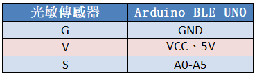 

## 三、光控自動窗戶安裝 

課程中的窗戶是利用 S90 舵機作為門開關的動力機構，因此在安裝舵機前，要先對舵機進行調零，明確舵機的擺動角度範圍，再安裝到房子上，其安裝步驟如下： 

1）調零舵機，確定舵臂的擺動方向 

2）用M2自攻螺絲把窗橫杆和舵臂組裝固定，如圖所示。 

  
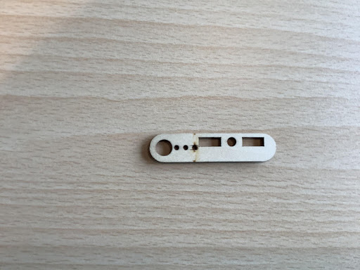 

  
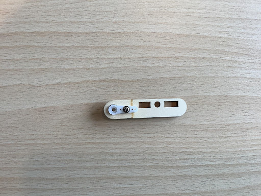 

3）用 M2*8 螺絲把舵機和舵機支架組裝連接，如圖所示。 

  
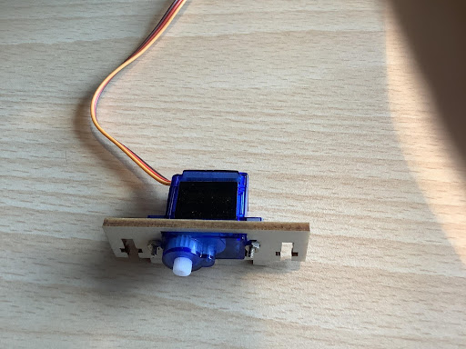 

4）然後用M2自攻螺絲把門杆安裝在舵機上，如圖所示。 

  
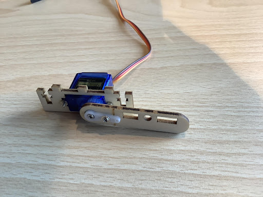 

5）把M3螺母裝在窗體上，然後用 M2*12 螺絲把窗橫杆安裝在舵機上，如圖所示。 

  
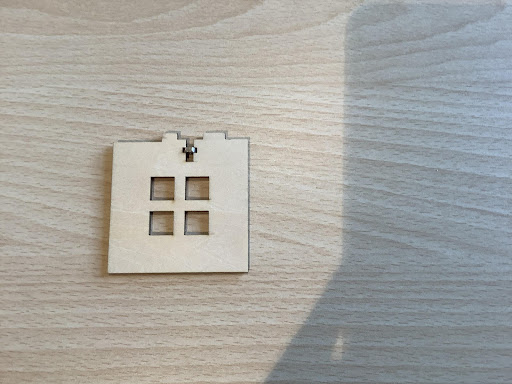 

  
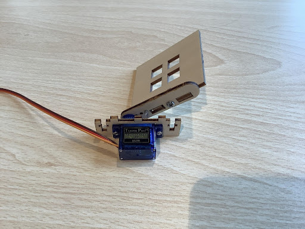 

6）把M3螺母裝在窗體上，然後用 M2*12 螺絲把窗橫杆安裝在舵機上，如圖所示。 

  
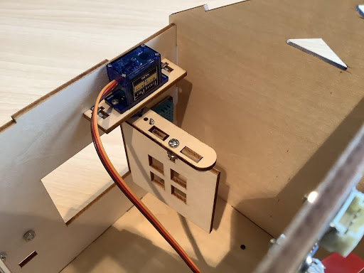 

7）接著用 M2*8 螺絲把光敏傳感器安裝在屋頂木板上，如圖所示。 

  
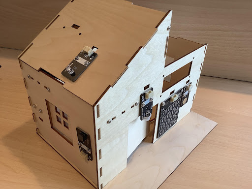 

## 四、程序設計 

### 4.1 算法設計 

根據光控自動窗戶的原理，其算法設計如下：  

第一步：設定光照強度的閾值 

第二步：如果大於光照強度閾值，窗戶打開；如果小於光照強度閾值，窗戶關閉 

第三步：結束算法 

  
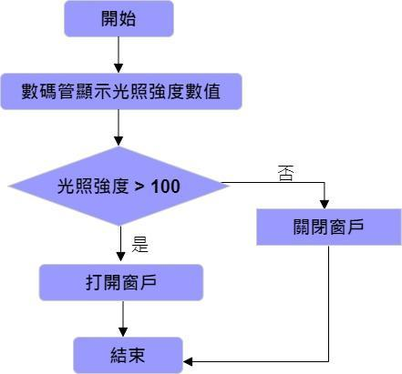 

### 4.2 硬件連接 

光敏傳感器接在 microbit 擴展板上的 P1 管腳，舵機接擴展板上的 P2 管腳。 

傳感器和執行器|主控板 
:--|:--
光敏傳感器|P1
舵機|P2 
  
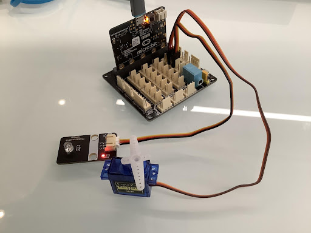 

### 4.3 示例程序 

Makecode 程序 

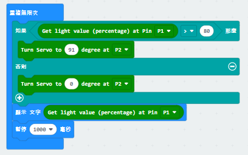 

  
https://makecode.microbit.org/_gbLKKLEeiCiH 

## 五、總結 

本節課我們學習了光敏傳感器的特點及其使用，並了解光控窗戶的原理，通過製作光控自動窗戶，實現了當光照強時，打開窗戶；反之，關閉窗戶的功能。 

 
