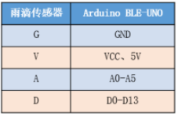
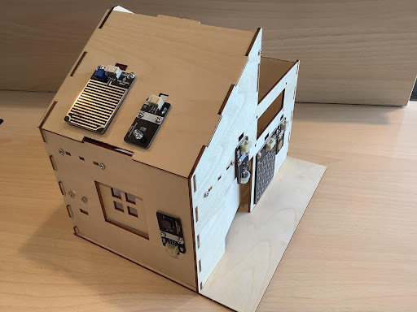
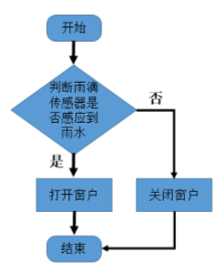
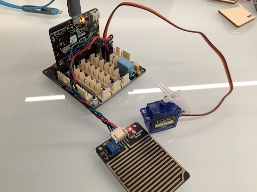
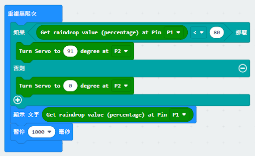

# 第七課  智能雨控窗戶 

## 任務背景 

    在上節課中，我們學習並且製作了智能的光控窗戶，既然窗戶的打開和關閉可以根據光線亮度來控制，那在刮風下雨時，沒人在家關窗戶，能不能也做 一個雨控的窗戶，這樣就不用擔心家裡沒人關窗，雨水打進室內，造成室內潮濕等麻煩。下面我們就來製作一個自動智能的雨控窗戶，看看其是運用了什麽原理來運行的。 

## 器材準備 

    microbit主板、擴展板、電池盒、2 節 AAA 電池、S90 舵機、雨滴傳感器模塊、連接線、數據線。 

## 一、智能雨控窗戶原理 

    本課程的自動智能窗戶是利用和雨滴傳感器和舵機作為這行機構實現的，其原理是當雨滴傳感器感應到雨水時，舵機執行擺動把窗體關閉起來。 

## 二、了解雨滴傳感器 

    雨滴傳感器要用於檢測是否下雨及雨量的大小，並廣泛應用於汽車自動刮水系統、智能燈光系統和智能天窗系統等。輸出形式：數字值輸出（0 和 1）和模擬值 A 電壓輸出, 使用 LM393 雙電壓比較器, 當傳感器連接到 5v 電源時，感應板上沒有水滴，D 輸出處於高電平。當滴下液滴時，D 輸出處於低電平。如果我們刷掉水滴，輸出將返回高水平狀態。 

    
  

    雨滴傳感器模塊有 G、V、A、D 四個管腳，A 模擬輸出 可以檢測上面雨滴的大小。D 數字輸出可以檢測是否有雨，通過調節閥值大小來調節 

    
  

## 三、自動智能窗戶搭建 

    在上節課我們已經組裝好窗戶，在本節課中就不在重覆。只需把雨滴傳感器安裝在屋頂木板上即可，如圖所示 

    
  

## 四、程序設計 

### 4.1 算法設計 

根據自動智能窗戶的原理，其算法設計如下：  

第一步：聲明雨滴傳感器的狀態變量； 

第二步：判斷雨滴傳感器的返回值。如果為 0，即下雨，則舵機關閉窗戶；如果為 1，則舵機打開窗戶； 

第三步：結束算法。 

    
  

### 4.2 硬件連接： 

舵機連接在 P2 管腳，雨滴傳感器模塊連接擴展板P1管腳，並讀取數據。 

傳感器和執行器|主控板 
:--|:--
雨滴傳感器模塊|P1（A） 
舵機|P2 

    
  

### 4.3 程序示例： 

Makecode程序 

    
  

https://makecode.microbit.org/_C8D9WfJPt9P7 

## 五、總結 

本節課我們學習了雨滴傳感器的特點及其原理，並了解雨控窗戶的原理， 通過編程控制雨滴傳感器和舵機的運動，實現窗戶感應到天氣的變化實現開啟或關閉。 

 
